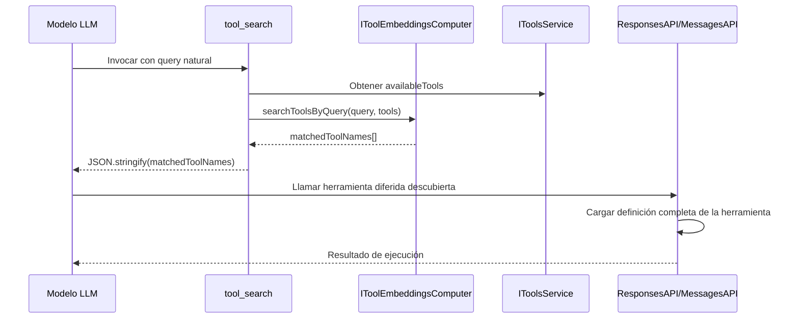
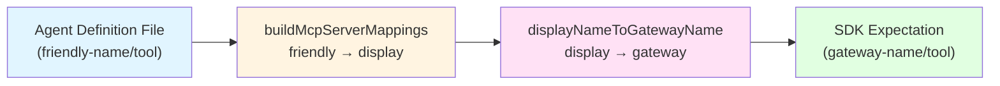

# DeepWiki Q&A with Code Context for Repository: microsoft/vscode
## Q1
copilot dispone de una optimización de tools mcp que no expone todas las tools al agente, sino solo aquellas que estén configuradas, y de éstas, sólo aquellas que puedan ser útiles, cómo funciona el mecanismo?
### Answer
Copilot utiliza varios mecanismos para optimizar las herramientas MCP expuestas al agente:

## Mecanismos de Optimización

### 1. Filtrado de Herramientas por Configuración
El sistema controla qué herramientas están disponibles mediante el objeto `allowTools` en `agentIntent.ts`, que habilita/deshabilita herramientas basándose en configuración y experimentos vscode:222-251 .

### 2. Herramientas Diferidas (Deferred Tools)
Las herramientas MCP no se cargan todas inicialmente. El agente debe usar la herramienta `tool_search` para descubrir y cargar herramientas diferidas antes de poder usarlas vscode:44-82 . Esto es un requisito obligatorio en el prompt del agente.

### 3. Herramientas Virtuales
Cuando el número de herramientas excede el límite (128), VS Code agrupa herramientas automáticamente y el modelo puede activar grupos de herramientas en lugar de individuales vscode:871-877 . Este comportamiento es configurable via `github.copilot.chat.virtualTools.threshold`.

### 4. Mapeo de Servidores MCP
La función `buildMcpServerMappings` crea mapeos entre nombres amigables de servidores MCP y etiquetas de VS Code, mientras que `remapCustomAgentTools` reasigna referencias de herramientas en agentes personalizados vscode:194-266 .

### 5. Selección Basada en Embeddings
Para usuarios con 100+ herramientas, VS Code usa selección basada en embeddings para filtrar herramientas más rápido y con mayor precisión vscode:267-268 .

### 6. Tool Sets
Los usuarios pueden definir conjuntos de herramientas (tool sets) que agrupan herramientas relacionadas, facilitando habilitar/deshabilitar grupos completos vscode:1417-1441 .

## Notes
El mecanismo combina filtrado estático (configuración), descubrimiento dinámico (tool_search), y agrupación inteligente (virtual tools, tool sets) para optimizar qué herramientas MCP se exponen al agente en cada contexto.

Wiki pages you might want to explore:
- [AI and Copilot Features (microsoft/vscode)](/wiki/microsoft/vscode#7)
### Citations
**File:** extensions/copilot/src/extension/intents/node/agentIntent.ts (L222-251)
```typescript
	const skillToolEnabled = configurationService.getExperimentBasedConfig(ConfigKey.Advanced.SkillToolEnabled, experimentationService);
	allowTools[ToolName.Skill] = skillToolEnabled;

	const getSCMChangesEnabled = configurationService.getExperimentBasedConfig(ConfigKey.Advanced.GetChangedFilesToolEnabled, experimentationService);
	allowTools[ToolName.GetScmChanges] = getSCMChangesEnabled;

	allowTools[ToolName.SessionStoreSql] = true;

	allowTools[CUSTOM_TOOL_SEARCH_NAME] = !!model.supportsToolSearch;

	if (model.family.includes('grok-code')) {
		allowTools[ToolName.CoreManageTodoList] = false;
	}

	if (isBackgroundTodoAgentEnabled(model, configurationService, experimentationService, authenticationService, request)) {
		allowTools[ToolName.CoreManageTodoList] = false;
	}

	// Enable task_complete in autopilot mode so the model can signal task completion.
	// The tool is registered in core as a built-in but needs explicit opt-in here.
	allowTools['task_complete'] = request.permissionLevel === 'autopilot';

	allowTools[ToolName.EditFilesPlaceholder] = false;
	// todo@connor4312: string check here is for back-compat for 1.109 Insiders
	if (Iterable.some(request.tools, ([t, enabled]) => (typeof t === 'string' ? t : t.name) === ContributedToolName.EditFilesPlaceholder && enabled === false)) {
		allowTools[ToolName.ApplyPatch] = false;
		allowTools[ToolName.EditFile] = false;
		allowTools[ToolName.ReplaceString] = false;
		allowTools[ToolName.MultiReplaceString] = false;
	}
```
**File:** extensions/copilot/src/extension/prompts/node/agent/test/__snapshots__/agentPrompts-claude-sonnet-4.5/all_non_edit_tools.spec.snap (L44-82)
```text
<toolSearchInstructions>
Use the tool_search tool to search for deferred tools before calling them.

<mandatory>
You MUST use the tool_search tool to load deferred tools BEFORE calling them directly.
This is a BLOCKING REQUIREMENT - deferred tools are NOT available until you load them using the tool_search tool. Once a tool appears in the results, it is immediately available to call.

Why this is required:
- Deferred tools are not loaded until discovered via tool_search
- Calling a deferred tool without first loading it will fail

</mandatory>

<searchQueryGuidance>
Describe what capability you need in natural language. The search uses semantic similarity to find the most relevant tools.

Examples:
- "create a new file" - finds file creation tools
- "run jupyter notebook cell" - finds notebook execution tools
- "fetch a web page" - finds web fetching tools
- "github pull request" - finds GitHub PR tools

Prefer broad queries that cover all related tools in a single search. For example, search "github" to find all GitHub tools at once rather than making separate searches for issues and pull requests. Consult the availableDeferredTools list (provided in the initial conversation context) and use it to inform your query.

</searchQueryGuidance>

<incorrectUsagePatterns>
NEVER do these:
- Calling a deferred tool directly without loading it first with tool_search
- Calling tool_search again for a tool that was already returned by a previous search
- Retrying tool_search repeatedly if it fails or returns no results. If a search returns no matching tools, the tool is not available. Do not retry with different patterns.

</incorrectUsagePatterns>

<dynamicToolDiscovery>
MCP servers may add or remove tools dynamically during a conversation via tools/list_changed notifications. If you called a tool that may have enabled new tools on an MCP server, search for the new tools — they may now be discoverable even if not listed in the latest availableDeferredTools list.

</dynamicToolDiscovery>

```
**File:** extensions/copilot/CHANGELOG.md (L267-268)
```markdown
- **Embeddings-based tool selection** — Improved tool filtering for users with 100+ tools; faster and more accurate tool selection.
- **Tool approvals and trust** — Post-approval for external data (prompt injection protection), trust all tools from a server/extension at once, updated tool approval management.
```
**File:** extensions/copilot/CHANGELOG.md (L871-877)
```markdown
**Setting**: `github.copilot.chat.virtualTools.threshold`

The maximum number of tools that you can use for a single chat request is currently 128. Previously, you could quickly reach this limit by installing MCP servers with many tools, requiring you to deselect some tools in order to proceed.

In this release of VS Code, we have enabled an experimental tool-calling mode for when the number of tools exceeds the maximum limit. Tools are automatically grouped and the model is given the ability to activate and call groups of tools.

This behavior, including the threshold, is configurable via the setting `github.copilot.chat.virtualTools.threshold`.
```
**File:** extensions/copilot/CHANGELOG.md (L1417-1441)
```markdown
#### Chat tool sets

VS Code now enables you to define tool sets, either through a proposed API or through the UI. A tool set is a collection of different tools that can be used just like individual tools. Tool sets make it easier to group related tools together, and quickly enable or disable them in agent mode. For instance, the tool set below is for managing GitHub notifications (using the [GitHub MCP server](https://github.com/github/github-mcp-server)).

```json
{
  "gh-news": {
    "tools": [
      "list_notifications",
      "dismiss_notification",
      "get_notification_details",
    ],
    "description": "Manage GH notification",
    "icon": "github-project"
  }
}
```

To create a tool set, run the **Configure Tool Sets** > **Create new tool sets file** command from the Command Palette. You can then select the tools you want to include in the tool set, and provide a description and icon.

To use a tool set in a chat query, reference it by #-mentioning its name, like `#gh-news`. You can also choose it from the tool picker in the chat input box.


Learn more about [tools sets](https://code.visualstudio.com/docs/copilot/chat/chat-agent-mode#_define-tool-sets) in our documentation.
```
**File:** extensions/copilot/src/extension/chatSessions/copilotcli/node/mcpHandler.ts (L194-266)
```typescript
export function buildMcpServerMappings(tools: ReadonlyMap<LanguageModelToolInformation, boolean>): McpServerMappings {
	const mappings = new Map<string, string>();
	for (const [tool] of tools) {
		if (!tool.source || !hasKey(tool.source, { name: true }) || !tool.fullReferenceName) {
			continue;
		}
		const slashIndex = tool.fullReferenceName.lastIndexOf('/');
		if (slashIndex > 0) {
			const serverName = tool.fullReferenceName.substring(0, slashIndex);
			if (serverName && !mappings.has(serverName) && tool.source.label) {
				mappings.set(serverName, tool.source.label);
			}
		}
	}
	return mappings;
}

/**
 * Remaps tool references in custom agents from friendly MCP server names to gateway names.
 *
 * Agent definition files reference tools as `<friendly server name>/<tool name>`, but the SDK
 * expects `<gateway name>/<tool name>` where gateway names are the Record keys in the MCP
 * server config.
 *
 * @param customAgents The list of custom agents whose tools will be remapped in place.
 * @param mcpServerMappings Maps friendly server names (from agent files) → VS Code MCP display labels.
 * @param mcpServers The MCP server config, keyed by gateway name.
 * @param selectedAgent Optional selected agent to also remap.
 */
export function remapCustomAgentTools(
	customAgents: SweCustomAgent[],
	mcpServerMappings: McpServerMappings,
	mcpServers: SessionOptions['mcpServers'],
	selectedAgent: SweCustomAgent | undefined,
): void {
	if (!mcpServerMappings.size || !mcpServers) {
		return;
	}
	// Build a map from display name → gateway name (the Record key in mcpServers).
	const displayNameToGatewayName = new Map<string, string>();
	for (const [gatewayName, config] of Object.entries(mcpServers)) {
		if (config.displayName) {
			displayNameToGatewayName.set(config.displayName, gatewayName);
		}
	}

	const agentsToRemap = selectedAgent ? [...customAgents, selectedAgent] : customAgents;
	for (const agent of agentsToRemap) {
		if (!agent.tools?.length) {
			continue;
		}
		for (let i = 0; i < agent.tools.length; i++) {
			const tool = agent.tools[i];
			const slashIndex = tool.lastIndexOf('/'); // Tool names cannot contain '/', so the last slash separates server from tool
			if (slashIndex < 1) {
				continue;
			}
			const serverName = tool.substring(0, slashIndex);
			const toolName = tool.substring(slashIndex + 1);
			if (!serverName || !toolName) {
				continue;
			}
			// First try: map through mcpServerMappings (friendly name → display name) then to gateway name.
			const displayName = mcpServerMappings.get(serverName);
			// Also try to look up the server name directly as a display name in the gateway map.
			const gatewayName = displayName ? displayNameToGatewayName.get(displayName) : displayNameToGatewayName.get(serverName);

			if (gatewayName) {
				agent.tools[i] = `${gatewayName}/${toolName}`;
			}
		}
	}
}
```
## Q2
genera un análisis completo de cómo funciona el sistema de descubrimiento dinámico de tool_search, y las deferred tools así como el mapeo con nombres amigables
### Answer
# Análisis del Sistema de Descubrimiento Dinámico tool_search y Deferred Tools

## Resumen Ejecutivo

El sistema de descubrimiento dinámico de Copilot utiliza `tool_search` para cargar herramientas diferidas (deferred tools) bajo demanda, optimizando el uso de tokens y permitiendo manejar grandes conjuntos de herramientas MCP. El mapeo de nombres amigables convierte nombres legibles por humanos en identificadores internos del SDK.

---

## Arquitectura del Sistema

### 1. Herramienta tool_search

La herramienta `tool_search` está implementada en `ToolSearchTool` y utiliza embeddings semánticos para buscar herramientas relevantes vscode:22-54 .

```typescript
export class ToolSearchTool implements ICopilotModelSpecificTool<IToolSearchParams> {
	async invoke(options: vscode.LanguageModelToolInvocationOptions<IToolSearchParams>, token: vscode.CancellationToken) {
		const { query, limit } = options.input;
		const availableTools = this._toolsService.tools;
		const matchedToolNames = await this._toolEmbeddingsComputer.searchToolsByQuery(
			query,
			availableTools,
			limit ?? DEFAULT_SEARCH_LIMIT,
			token,
		);
		return new LanguageModelToolResult([
			new LanguageModelTextPart(JSON.stringify(matchedToolNames)),
		]);
	}
}
```

**Características clave:**
- Usa `IToolEmbeddingsComputer` para búsqueda semántica
- Retorna nombres de herramientas como JSON
- Límite predeterminado de 5 resultados

### 2. Deferred Tools

Las herramientas se marcan como diferidas mediante la propiedad `nonDeferred` en el registro de herramientas vscode:91-101 .

```typescript
export interface ICopilotToolCtor {
	readonly toolName: ToolName;
	/**
	 * If true, this tool should always be immediately available (non-deferred)
	 * when Anthropic tool search is enabled. Non-deferred tools are sent without
	 * `defer_loading: true` and can receive cache_control breakpoints.
	 * Defaults to false (deferred) when not set.
	 */
	readonly nonDeferred?: boolean;
	new(...args: never[]): ICopilotTool<unknown>;
}
```

**Herramientas no diferidas (core):**
- `read_file`, `list_dir`, `grep_search`, `semantic_search`, `file_search`
- `replace_string_in_file`, `create_file`, `run_in_terminal`
- `get_terminal_output`, `get_errors`, `manage_todo_list`
- `runSubagent`, `search_subagent`, `execution_subagent`
- `runTests`, `tool_search`, `view_image`, `fetch_webpage` vscode:85-89 

### 3. Instrucciones al Modelo

El prompt del agente incluye instrucciones obligatorias sobre el uso de `tool_search` vscode:29-81 .

```tsx
class ToolSearchToolPrompt extends PromptElement<ToolSearchToolPromptProps> {
	async render(state: void, sizing: PromptSizing) {
		const endpoint = sizing.endpoint as IChatEndpoint | undefined;
		if (!endpoint?.supportsToolSearch || !hasDeferredTool(this.props.availableTools, this.toolDeferralService)) {
			return;
		}
		return <Tag name='toolSearchInstructions'>
			Use the {searchToolName} tool to search for deferred tools before calling them.
			<Tag name='mandatory'>
				You MUST use the {searchToolName} tool to load deferred tools BEFORE calling them directly.
				This is a BLOCKING REQUIREMENT - deferred tools are NOT available until you load them using the {searchToolName} tool.
			</Tag>
		</Tag>;
	}
}
```

---

## Flujo de Descubrimiento Dinámico

### Diagrama de Secuencia



### Proceso Paso a Paso

1. **Inicialización**: Solo herramientas `nonDeferred` se envían inicialmente al modelo con sus esquemas completos vscode:126-148 .

2. **Búsqueda**: El modelo invoca `tool_search` con una consulta en lenguaje natural cuando necesita una capacidad específica vscode:29-44 .

3. **Descubrimiento**: `tool_search` usa embeddings semánticos para encontrar herramientas coincidentes y retorna sus nombres vscode:38-53 .

4. **Carga**: Las herramientas descubiertas se cargan dinámicamente y sus esquemas se envían al modelo en la siguiente interacción vscode:366-424 .

5. **Ejecución**: El modelo puede entonces invocar las herramientas recién cargadas.

---

## Mapeo de Nombres Amigables

### buildMcpServerMappings

Esta función crea un mapeo desde nombres de servidores MCP (extraídos de `fullReferenceName`) a etiquetas de visualización de VS Code vscode:194-209 .

```typescript
export function buildMcpServerMappings(tools: ReadonlyMap<LanguageModelToolInformation, boolean>): McpServerMappings {
	const mappings = new Map<string, string>();
	for (const [tool] of tools) {
		if (!tool.source || !hasKey(tool.source, { name: true }) || !tool.fullReferenceName) {
			continue;
		}
		const slashIndex = tool.fullReferenceName.lastIndexOf('/');
		if (slashIndex > 0) {
			const serverName = tool.fullReferenceName.substring(0, slashIndex);
			if (serverName && !mappings.has(serverName) && tool.source.label) {
				mappings.set(serverName, tool.source.label);
			}
		}
	}
	return mappings;
}
```

**Formato de referencia:** `<server name>/<tool name>`

### remapCustomAgentTools

Esta función reasigna referencias de herramientas en agentes personalizados desde nombres amigables a nombres de gateway del SDK vscode:223-266 .

```typescript
export function remapCustomAgentTools(
	customAgents: SweCustomAgent[],
	mcpServerMappings: McpServerMappings,
	mcpServers: SessionOptions['mcpServers'],
	selectedAgent: SweCustomAgent | undefined,
): void {
	// Build a map from display name → gateway name
	const displayNameToGatewayName = new Map<string, string>();
	for (const [gatewayName, config] of Object.entries(mcpServers)) {
		if (config.displayName) {
			displayNameToGatewayName.set(config.displayName, gatewayName);
		}
	}

	for (const agent of agentsToRemap) {
		for (let i = 0; i < agent.tools.length; i++) {
			const tool = agent.tools[i];
			const slashIndex = tool.lastIndexOf('/');
			const serverName = tool.substring(0, slashIndex);
			const toolName = tool.substring(slashIndex + 1);
			
			const displayName = mcpServerMappings.get(serverName);
			const gatewayName = displayName ? displayNameToGatewayName.get(displayName) : displayNameToGatewayName.get(serverName);
			
			if (gatewayName) {
				agent.tools[i] = `${gatewayName}/${toolName}`;
			}
		}
	}
}
```

### Cadena de Mapeo



---

## Comportamiento con Modelos Soportados

### Modelos con tool_search

Para modelos que soportan `tool_search` (GPT-5.4, Claude Sonnet 4.5+, etc.), el sistema:
1. Agrega `tool_search` como herramienta ejecutada por el cliente (`execution: 'client'`) vscode:126-148 
2. Marca herramientas diferidas con `defer_loading: true`
3. Excluye herramientas diferidas del request inicial

### Modelos sin soporte

Para modelos sin soporte (GPT-4o, etc.):
- No se agrega `tool_search` vscode:113-124 
- Todas las herramientas se envían sin `defer_loading`
- Comportamiento tradicional sin descubrimiento dinámico

---

## Descubrimiento Dinámico de Herramientas MCP

Los servidores MCP pueden agregar o remover herramientas dinámicamente durante una conversación mediante notificaciones `tools/list_changed` vscode:76-78 .

```tsx
<Tag name='dynamicToolDiscovery'>
	MCP servers may add or remove tools dynamically during a conversation via tools/list_changed notifications. If you called a tool that may have enabled new tools on an MCP server, search for the new tools — they may now be discoverable even if not listed in the latest availableDeferredTools list.
</Tag>
```

Esto permite que el modelo descubra nuevas herramientas que se habilitan después de llamar a ciertas herramientas MCP.

---

## Notes

El sistema de descubrimiento dinámico optimiza el uso de tokens al no enviar esquemas de todas las herramientas MCP inicialmente. El mapeo de nombres amigables abstrae la complejidad de los identificadores internos del SDK, permitiendo que los archivos de definición de agentes usen nombres legibles por humanos. La integración con embeddings semánticos permite búsquedas contextuales más inteligentes que coincidencias exactas de nombres.

Wiki pages you might want to explore:
- [AI and Copilot Features (microsoft/vscode)](/wiki/microsoft/vscode#7)
- [Copilot Extension: Agent Orchestration (microsoft/vscode)](/wiki/microsoft/vscode#7.4)
### Citations
**File:** extensions/copilot/src/extension/tools/node/toolSearchTool.ts (L22-54)
```typescript
export class ToolSearchTool implements ICopilotModelSpecificTool<IToolSearchParams> {
	constructor(
		@IToolEmbeddingsComputer private readonly _toolEmbeddingsComputer: IToolEmbeddingsComputer,
		@IToolsService private readonly _toolsService: IToolsService,
		@ILogService private readonly _logService: ILogService,
	) { }

	async invoke(options: vscode.LanguageModelToolInvocationOptions<IToolSearchParams>, token: vscode.CancellationToken) {
		const { query, limit } = options.input;

		if (!query) {
			return new LanguageModelToolResult([
				new LanguageModelTextPart('Error: query parameter is required'),
			]);
		}

		const availableTools = this._toolsService.tools;
		const matchedToolNames = await this._toolEmbeddingsComputer.searchToolsByQuery(
			query,
			availableTools,
			limit ?? DEFAULT_SEARCH_LIMIT,
			token,
		);

		this._logService.trace(`[custom-tool-search] Query "${query}" matched ${matchedToolNames.length} tools: ${JSON.stringify(matchedToolNames)}`);

		// Return matched tool names as a JSON array. messagesApi.ts identifies results
		// from this tool via the toolCallId→name map and converts them into
		// tool_reference content blocks for the Anthropic API.
		return new LanguageModelToolResult([
			new LanguageModelTextPart(JSON.stringify(matchedToolNames)),
		]);
	}
```
**File:** extensions/copilot/src/extension/tools/common/toolsRegistry.ts (L91-101)
```typescript
export interface ICopilotToolCtor {
	readonly toolName: ToolName;
	/**
	 * If true, this tool should always be immediately available (non-deferred)
	 * when Anthropic tool search is enabled. Non-deferred tools are sent without
	 * `defer_loading: true` and can receive cache_control breakpoints.
	 * Defaults to false (deferred) when not set.
	 */
	readonly nonDeferred?: boolean;
	new(...args: never[]): ICopilotTool<unknown>;
}
```
**File:** extensions/copilot/src/platform/endpoint/node/test/responsesApiToolSearch.spec.ts (L85-89)
```typescript
		const coreNonDeferred = new Set(['read_file', 'list_dir', 'grep_search', 'semantic_search', 'file_search',
			'replace_string_in_file', 'create_file', 'run_in_terminal', 'get_terminal_output',
			'get_errors', 'manage_todo_list', 'runSubagent', 'search_subagent', 'execution_subagent',
			'runTests', 'tool_search', 'view_image', 'fetch_webpage']);
		services.define(IToolDeferralService, { _serviceBrand: undefined, isNonDeferredTool: (name: string) => coreNonDeferred.has(name) });
```
**File:** extensions/copilot/src/platform/endpoint/node/test/responsesApiToolSearch.spec.ts (L113-124)
```typescript
	it('passes tools through without defer_loading for unsupported models', () => {
		const endpoint = createMockEndpoint('gpt-4o');

		const body = accessor.get(IInstantiationService).invokeFunction(
			createResponsesRequestBody, createMockOptions(), endpoint.model, endpoint
		);

		const tools = body.tools as any[];
		expect(tools).toBeDefined();
		expect(tools.find(t => t.type === 'tool_search')).toBeUndefined();
		expect(tools.every(t => !t.defer_loading)).toBe(true);
	});
```
**File:** extensions/copilot/src/platform/endpoint/node/test/responsesApiToolSearch.spec.ts (L126-148)
```typescript
	it('adds client tool_search and defer_loading for supported models', () => {
		const endpoint = createMockEndpoint('gpt-5.4');

		const body = accessor.get(IInstantiationService).invokeFunction(
			createResponsesRequestBody, createMockOptions(), endpoint.model, endpoint
		);

		const tools = body.tools as any[];
		expect(tools).toBeDefined();

		// Should have client-executed tool_search
		const toolSearchTool = tools.find(t => t.type === 'tool_search');
		expect(toolSearchTool).toBeDefined();
		expect(toolSearchTool.execution).toBe('client');

		// Non-deferred tools should be present without defer_loading
		expect(tools.find(t => t.name === 'read_file')?.defer_loading).toBeUndefined();
		expect(tools.find(t => t.name === 'grep_search')?.defer_loading).toBeUndefined();

		// Deferred tools should NOT be in the request (client-executed mode excludes them entirely)
		expect(tools.find(t => t.name === 'some_mcp_tool')).toBeUndefined();
		expect(tools.find(t => t.name === 'another_deferred_tool')).toBeUndefined();
	});
```
**File:** extensions/copilot/src/platform/endpoint/node/test/responsesApiToolSearch.spec.ts (L366-424)
```typescript
	it('still emits tool_search_output and namespaces deferred-tool calls when the stateful marker drops the tool_search_call from the post-marker slice (issue #313899)', () => {
		// Repro for https://github.com/microsoft/vscode/issues/313899: when the Responses API
		// resumes from a previous_response_id, the assistant message carrying the marker (and
		// the tool_search_call it emitted) is sliced out of the input. Without scanning the
		// full history first, the tool_search bookkeeping would be empty and the subsequent
		// tool result would be incorrectly serialized as `function_call_output` instead of
		// `tool_search_output`, leaving the deferred MCP tool definitions unloaded on the
		// server and the model unable to invoke the tool it just discovered.
		const modelId = 'gpt-5.4';
		const statefulMarker = 'marker-abc';
		const messages: Raw.ChatMessage[] = [
			{ role: Raw.ChatRole.User, content: [{ type: Raw.ChatCompletionContentPartKind.Text, text: 'Use the MCP tool' }] },
			{
				role: Raw.ChatRole.Assistant,
				// Marker lives on the same assistant turn that emitted the tool_search call.
				content: [{
					type: Raw.ChatCompletionContentPartKind.Opaque,
					value: { type: 'stateful_marker', value: { modelId, marker: statefulMarker } },
				}],
				toolCalls: [{ id: 'call_ts_resume', type: 'function', function: { name: 'tool_search', arguments: '{"query":"mcp"}' } }],
			},
			{
				role: Raw.ChatRole.Tool,
				toolCallId: 'call_ts_resume',
				content: [{ type: Raw.ChatCompletionContentPartKind.Text, text: '["some_mcp_tool"]' }],
			},
			{
				role: Raw.ChatRole.Assistant,
				content: [],
				toolCalls: [{ id: 'call_mcp_resume', type: 'function', function: { name: 'some_mcp_tool', arguments: '{"input":"x"}' } }],
			},
		];

		const body = createToolSearchScenario(messages);

		const input = body.input as Array<{ type?: string; name?: string; namespace?: string; call_id?: string; tools?: Array<{ name: string }> }>;

		expect({
			previous_response_id: body.previous_response_id,
			// The tool result must round-trip as a tool_search_output (not function_call_output)
			toolSearchOutput: input.find(i => i.type === 'tool_search_output'),
			// Any function_call_output for the tool_search call_id would be the bug
			badFunctionCallOutput: input.find((i: any) => i.type === 'function_call_output' && i.call_id === 'call_ts_resume'),
			// The follow-up MCP tool call must carry the namespace so the server can match
			// it against the deferred tool loaded via tool_search_output.
			mcpToolNamespace: input.find(i => i.type === 'function_call' && i.name === 'some_mcp_tool')?.namespace,
		}).toEqual({
			previous_response_id: statefulMarker,
			toolSearchOutput: {
				type: 'tool_search_output',
				execution: 'client',
				call_id: 'call_ts_resume',
				status: 'completed',
				tools: [expect.objectContaining({ name: 'some_mcp_tool', defer_loading: true })],
			},
			badFunctionCallOutput: undefined,
			mcpToolNamespace: 'some_mcp_tool',
		});
	});
```
**File:** extensions/copilot/src/extension/prompts/node/agent/anthropicPrompts.tsx (L29-81)
```typescript
class ToolSearchToolPrompt extends PromptElement<ToolSearchToolPromptProps> {
	constructor(
		props: PromptElementProps<ToolSearchToolPromptProps>,
		@IToolDeferralService private readonly toolDeferralService: IToolDeferralService,
	) {
		super(props);
	}

	async render(state: void, sizing: PromptSizing) {
		const endpoint = sizing.endpoint as IChatEndpoint | undefined;
		if (!endpoint?.supportsToolSearch || !hasDeferredTool(this.props.availableTools, this.toolDeferralService)) {
			return;
		}

		const searchToolName = CUSTOM_TOOL_SEARCH_NAME;

		return <Tag name='toolSearchInstructions'>
			Use the {searchToolName} tool to search for deferred tools before calling them.<br />
			<br />
			<Tag name='mandatory'>
				You MUST use the {searchToolName} tool to load deferred tools BEFORE calling them directly.<br />
				This is a BLOCKING REQUIREMENT - deferred tools are NOT available until you load them using the {searchToolName} tool. Once a tool appears in the results, it is immediately available to call.<br />
				<br />
				Why this is required:<br />
				- Deferred tools are not loaded until discovered via {searchToolName}<br />
				- Calling a deferred tool without first loading it will fail<br />
			</Tag>
			<br />
			<Tag name='searchQueryGuidance'>
				Describe what capability you need in natural language. The search uses semantic similarity to find the most relevant tools.<br />
				<br />
				Examples:<br />
				- "create a new file" - finds file creation tools<br />
				- "run jupyter notebook cell" - finds notebook execution tools<br />
				- "fetch a web page" - finds web fetching tools<br />
				- "github pull request" - finds GitHub PR tools<br />
				<br />
				Prefer broad queries that cover all related tools in a single search. For example, search "github" to find all GitHub tools at once rather than making separate searches for issues and pull requests. Consult the availableDeferredTools list (provided in the initial conversation context) and use it to inform your query.<br />
			</Tag>
			<br />
			<Tag name='incorrectUsagePatterns'>
				NEVER do these:<br />
				- Calling a deferred tool directly without loading it first with {searchToolName}<br />
				- Calling {searchToolName} again for a tool that was already returned by a previous search<br />
				- Retrying {searchToolName} repeatedly if it fails or returns no results. If a search returns no matching tools, the tool is not available. Do not retry with different patterns.<br />
			</Tag>
			<br />
			<Tag name='dynamicToolDiscovery'>
				MCP servers may add or remove tools dynamically during a conversation via tools/list_changed notifications. If you called a tool that may have enabled new tools on an MCP server, search for the new tools — they may now be discoverable even if not listed in the latest availableDeferredTools list.<br />
			</Tag>
		</Tag>;
	}
}
```
**File:** extensions/copilot/src/extension/chatSessions/copilotcli/node/mcpHandler.ts (L194-209)
```typescript
export function buildMcpServerMappings(tools: ReadonlyMap<LanguageModelToolInformation, boolean>): McpServerMappings {
	const mappings = new Map<string, string>();
	for (const [tool] of tools) {
		if (!tool.source || !hasKey(tool.source, { name: true }) || !tool.fullReferenceName) {
			continue;
		}
		const slashIndex = tool.fullReferenceName.lastIndexOf('/');
		if (slashIndex > 0) {
			const serverName = tool.fullReferenceName.substring(0, slashIndex);
			if (serverName && !mappings.has(serverName) && tool.source.label) {
				mappings.set(serverName, tool.source.label);
			}
		}
	}
	return mappings;
}
```
**File:** extensions/copilot/src/extension/chatSessions/copilotcli/node/mcpHandler.ts (L223-266)
```typescript
export function remapCustomAgentTools(
	customAgents: SweCustomAgent[],
	mcpServerMappings: McpServerMappings,
	mcpServers: SessionOptions['mcpServers'],
	selectedAgent: SweCustomAgent | undefined,
): void {
	if (!mcpServerMappings.size || !mcpServers) {
		return;
	}
	// Build a map from display name → gateway name (the Record key in mcpServers).
	const displayNameToGatewayName = new Map<string, string>();
	for (const [gatewayName, config] of Object.entries(mcpServers)) {
		if (config.displayName) {
			displayNameToGatewayName.set(config.displayName, gatewayName);
		}
	}

	const agentsToRemap = selectedAgent ? [...customAgents, selectedAgent] : customAgents;
	for (const agent of agentsToRemap) {
		if (!agent.tools?.length) {
			continue;
		}
		for (let i = 0; i < agent.tools.length; i++) {
			const tool = agent.tools[i];
			const slashIndex = tool.lastIndexOf('/'); // Tool names cannot contain '/', so the last slash separates server from tool
			if (slashIndex < 1) {
				continue;
			}
			const serverName = tool.substring(0, slashIndex);
			const toolName = tool.substring(slashIndex + 1);
			if (!serverName || !toolName) {
				continue;
			}
			// First try: map through mcpServerMappings (friendly name → display name) then to gateway name.
			const displayName = mcpServerMappings.get(serverName);
			// Also try to look up the server name directly as a display name in the gateway map.
			const gatewayName = displayName ? displayNameToGatewayName.get(displayName) : displayNameToGatewayName.get(serverName);

			if (gatewayName) {
				agent.tools[i] = `${gatewayName}/${toolName}`;
			}
		}
	}
}
```
## Q3
Revisa sobre los prompts específico por modelo y el mecanismo de tools, parece que hay renombre o alias de tools para modelos que están entrenados especificamente para el uso de ciertas tools de una forma determinada, hazme un análisis detallado
### Answer
# Análisis de Prompts Específicos por Modelo y Sistema de Alias/Overrides de Tools

## Resumen Ejecutivo

VS Code Copilot implementa un sistema multicapa para adaptar tools y prompts a diferentes modelos: prompts específicos por modelo (VSCModelPromptA-D), tools específicas por modelo con `overridesTool`, definiciones alternativas por modelo, y aliases semánticos que mapean herramientas entre diferentes ecosistemas (Claude vs Copilot).

---

## Prompts Específicos por Modelo

### VSCModelPrompts

El sistema define prompts específicos para diferentes modelos VSC (Model A, B, C, D) con instrucciones especializadas vscode:16-66 .

```typescript
class VSCModelPromptA extends PromptElement<DefaultAgentPromptProps> {
	async render(state: void, sizing: PromptSizing) {
		const tools = detectToolCapabilities(this.props.availableTools);
		return <InstructionMessage>
			<Tag name='parallel_tool_use_instructions'>
				Using `multi_tool_use` to call multiple tools in parallel is ENCOURAGED...
				// Instrucciones detalladas sobre paralelización
			</Tag>
```

**Características del VSCModelPromptA:**
- Instrucciones explícitas sobre uso paralelo de tools
- Reglas de dependencia para operaciones secuenciales vs paralelas
- Límite máximo de 5 tool calls en un solo `multi_tool_use`
- Ejemplos de buenos y malos patrones de uso

---

## Sistema de Tools Específicas por Modelo

### ICopilotModelSpecificTool y overridesTool

Las herramientas pueden implementar `ICopilotModelSpecificTool` con la propiedad `overridesTool` para reemplazar herramientas base en modelos específicos vscode:75-85 .

```typescript
export interface ICopilotModelSpecificTool<T> extends ICopilotTool<T> {
	/**
	 * If present, this tool should be used instead of the base tool for the given tool name.
	 * Note that this will require the base tool be registered and enabled in the request,
	 * effectively 'overlaying' it.
	 */
	overridesTool?: ToolName;
}
```

**Comportamiento de overridesTool:**
- La herramienta específica no es seleccionable individualmente en la UI
- Reemplaza automáticamente la herramienta base cuando el modelo coincide
- La herramienta base debe estar registrada y habilitada

### Registro de Tools Específicas

El `ToolRegistry` permite registrar herramientas específicas por modelo con selectores vscode:141-153 .

```typescript
public registerModelSpecificTool(definition: vscode.LanguageModelToolDefinition, tool: IModelSpecificToolCtor): IDisposable {
	if (this._modelSpecificTools.has(definition.name)) {
		throw new Error(`Model specific tool for ${definition.name} is already registered`);
	}
	this._modelSpecificTools.set(definition.name, { definition, tool });
	return { dispose: () => { this._modelSpecificTools.delete(definition.name); } };
}
```

### Selección de Modelo

La función `modelSpecificToolApplies` determina si una herramienta específica aplica a un endpoint dado vscode:160-180 .

```typescript
export function modelSpecificToolApplies(tool: vscode.LanguageModelToolDefinition, endpoint: IChatEndpoint) {
	if (!tool.models) {
		return true;
	}
	return tool.models.some(m => {
		if (m.id !== undefined && m.id === endpoint.model) return true;
		if (m.version !== undefined && m.version === endpoint.version) return true;
		if (m.family !== undefined && m.family === endpoint.family) return true;
		if (m.vendor !== undefined && m.vendor === endpoint.version) return true;
	});
}
```

---

## Definiciones Alternativas por Modelo

### alternativeDefinition

Las herramientas pueden proporcionar definiciones alternativas basadas en el endpoint mediante `alternativeDefinition` vscode:19-29 .

```typescript
class ManageTodoListTool implements ICopilotTool<unknown> {
	alternativeDefinition(tool: vscode.LanguageModelToolInformation, endpoint?: IChatEndpoint): vscode.LanguageModelToolInformation {
		if (!isGpt5PlusFamily(endpoint)) {
			return tool;
		}
		return {
			...tool,
			description: 'Updates the task plan.\nProvide an optional explanation and a list of plan items, each with a step and status.\nAt most one step can be in_progress at a time.',
		};
	}
}
```

**Ejemplo de uso:**
- `ManageTodoListTool` cambia su descripción para modelos GPT-5+
- La descripción optimizada menciona restricciones específicas (solo un step in_progress)

### Aplicación de Overrides en ToolsService

El `ToolsService` aplica overrides de herramientas específicas en `getEnabledTools` vscode:284-381 .

```typescript
getEnabledTools(request: vscode.ChatRequest, endpoint: IChatEndpoint, filter?: (tool: vscode.LanguageModelToolInformation) => boolean | undefined): vscode.LanguageModelToolInformation[] {
	// ...
	const modelSpecificOverrides = new Map(this.getToolOverridesForEndpoint(endpoint, tools));
	
	return tools
		.filter(tool => {
			// Si la tool tiene override, se mezcla en el 'map' posterior
			if (modelSpecificTools.get(tool.name)?.tool.overridesTool) {
				return false;
			}
			// ... otros filtros
		})
		.map(tool => {
			// Aplicar alternativa específica del modelo si está disponible
			const toolName = getToolName(tool.name) as ToolName;
			const override = modelSpecificOverrides.get(toolName);
			let resultTool = tool;
			if (override?.tool) {
				resultTool = { ...override.info, name: resultTool.name };
			}
			// Aplicar alternativeDefinition si existe
			const owned = override?.tool || this.getCopilotTool(toolName);
			if (owned?.alternativeDefinition) {
				resultTool = owned.alternativeDefinition(resultTool, endpoint);
			}
			return resultTool;
		});
}
```

---

## Preferencias de Tools por Familia de Modelo

### Selección de Tools de Edición

El sistema tiene preferencias hardcoded para diferentes familias de modelos en cuanto a tools de edición vscode:96-138 .

```typescript
it('should return ApplyPatch for GPT family models', async () => {
	const model = createMockModel('gpt-4');
	const result = await service.getPreferredEditTool(model);
	expect(result).toEqual([ToolName.ApplyPatch]);
});

it('should return ReplaceString tools for Sonnet family models', async () => {
	const model = createMockModel('claude-3-sonnet');
	const result = await service.getPreferredEditTool(model);
	expect(result).toEqual([ToolName.ReplaceString, ToolName.MultiReplaceString]);
});
```

**Preferencias por familia:**
- **GPT/OpenAI**: `ApplyPatch`
- **Claude Sonnet**: `ReplaceString`, `MultiReplaceString`
- **Modelos desconocidos**: `EditFile`, `ReplaceString`

### Configuración Experimental por Modelo

Algunas tools se habilitan/deshabilitan experimentalmente por modelo específico vscode:300-326 .

```typescript
// Para changed_files_tool, deshabilitar experimentalmente para gpt-5.5
if (tool.name === ToolName.GetScmChanges
	&& isGpt55(endpoint)
	&& !this._configurationService.getExperimentBasedConfig(ConfigKey.EnableGpt55GetChangedFilesTool, this._experimentationService)) {
	return false;
}

// Para read_file_tool, deshabilitar experimentalmente para gpt-5.5
if (tool.name === ToolName.ReadFile
	&& isGpt55(endpoint)
	&& !this._configurationService.getExperimentBasedConfig(ConfigKey.EnableGpt55ReadFileTool, this._experimentationService)) {
	return false;
}
```

---

## Aliases Semánticos de Tools

### knownGithubCopilotTools y knownClaudeTools

El sistema define aliases para herramientas entre diferentes ecosistemas vscode:1059-1087 .

```typescript
export const knownGithubCopilotTools = [
	{ name: SpecedToolAliases.execute, description: localize('githubCopilot.execute', 'Execute commands') },
	{ name: SpecedToolAliases.read, description: localize('githubCopilot.read', 'Read files') },
	{ name: SpecedToolAliases.edit, description: localize('githubCopilot.edit', 'Edit files') },
	{ name: SpecedToolAliases.search, description: localize('githubCopilot.search', 'Search files') },
	{ name: SpecedToolAliases.agent, description: localize('githubCopilot.agent', 'Use subagents') },
];

export const knownClaudeTools = [
	{ name: 'Bash', description: localize('claude.bash', 'Execute shell commands'), toolEquivalent: [SpecedToolAliases.execute] },
	{ name: 'Edit', description: localize('claude.edit', 'Make targeted file edits'), toolEquivalent: ['edit/editNotebook', 'edit/editFiles'] },
	{ name: 'Glob', description: localize('claude.glob', 'Find files by pattern'), toolEquivalent: ['search/fileSearch'] },
	{ name: 'Grep', description: localize('claude.grep', 'Search file contents with regex'), toolEquivalent: ['search/textSearch'] },
	{ name: 'Read', description: localize('claude.read', 'Read file contents'), toolEquivalent: ['read/readFile', 'read/getNotebookSummary'] },
	{ name: 'Write', description: localize('claude.write', 'Create/overwrite files'), toolEquivalent: ['edit/createDirectory', 'edit/createFile', 'edit/createJupyterNotebook'] },
	{ name: 'WebFetch', description: localize('claude.webFetch', 'Fetch URL content'), toolEquivalent: [SpecedToolAliases.web] },
	{ name: 'WebSearch', description: localize('claude.webSearch', 'Perform web searches'), toolEquivalent: [SpecedToolAliases.web] },
	{ name: 'Task', description: localize('claude.task', 'Run subagents for complex tasks'), toolEquivalent: [SpecedToolAliases.agent] },
];
```

**Mapeo de aliases:**
- Claude `Bash` → Copilot `execute`
- Claude `Edit` → Copilot `edit/editNotebook`, `edit/editFiles`
- Claude `Glob` → Copilot `search/fileSearch`
- Claude `Grep` → Copilot `search/textSearch`
- Claude `Read` → Copilot `read/readFile`, `read/getNotebookSummary`

### Tool Aliases en Agentes Personalizados

Los agentes personalizados pueden usar aliases de tools en su configuración vscode:54-73 .

```yaml
### Tool Aliases

| Alias | Purpose |
|-------|---------|
| `execute` | Run shell commands |
| `read` | Read file contents |
| `edit` | Edit files |
| `search` | Search files or text |
| `agent` | Invoke custom agents as subagents |
| `web` | Fetch URLs and web search |
| `todo` | Manage task lists |

### Common Patterns

tools: [read, search]             # Read-only research
tools: [myserver/*]               # MCP server only
tools: [read, edit, search]       # No terminal access
tools: []                         # Conversational only
```

---

## Selector de Modelo en Tools

### ILanguageModelChatSelector

Las herramientas pueden definir selectores de modelo para estar disponibles solo en ciertos modelos vscode:33-95 .

```typescript
export interface ILanguageModelChatSelector {
	readonly vendor?: string;
	readonly family?: string;
	readonly version?: string;
	readonly id?: string;
}

export interface IToolData {
	// ...
	/**
	 * Model selectors that this tool is available for.
	 * If defined, the tool is only available when the selected model matches one of the selectors.
	 */
	readonly models?: readonly ILanguageModelChatSelector[];
}

export function toolMatchesModel(toolData: IToolData, model: ILanguageModelChatMetadata | undefined): boolean {
	if (!toolData.models || toolData.models.length === 0) {
		return true;
	}
	if (!model) {
		return true;
	}
	return toolData.models.some(selector =>
		(!selector.id || selector.id === model.id) &&
		(!selector.vendor || selector.vendor === model.vendor) &&
		(!selector.family || selector.family === model.family) &&
		(!selector.version || selector.version === model.version)
	);
}
```

### API Propuesta para Tools con Selector de Modelo

La API propuesta `registerToolDefinition` permite registrar tools con selectores de modelo vscode:10-55 .

```typescript
export interface LanguageModelToolDefinition extends LanguageModelToolInformation {
	/**
	 * If defined, the tool will only be available for language models that match
	 * the selector.
	 */
	models?: LanguageModelChatSelector[];
	/**
	 * Name of the toolset the tool should be contributed to, as defined in your
	 * extension's `package.json`.
	 */
	toolSet?: string;
}

export namespace lm {
	export function registerToolDefinition<T>(
		definition: LanguageModelToolDefinition,
		tool: LanguageModelTool<T>,
	): Disposable;
}
```

---

## Ejemplo: Tool Search Específico por Modelo

La herramienta `tool_search` está registrada solo para modelos específicos vscode:77-90 .

```typescript
ToolRegistry.registerModelSpecificTool(
	{
		name: CUSTOM_TOOL_SEARCH_NAME,
		displayName: l10n.t('Search Tools'),
		toolReferenceName: 'toolSearch',
		userDescription: l10n.t('Search for relevant tools by describing what you need'),
		description: 'Search for relevant tools...',
		inputSchema: { /* ... */ },
		models: [
			{ family: 'gpt-5.4' },
			{ family: 'gpt-5.5' },
			{ family: 'claude-sonnet-4.5' },
			{ family: 'claude-sonnet-4.6' },
			{ family: 'claude-opus-

Wiki pages you might want to explore:
- [AI and Copilot Features (microsoft/vscode)](/wiki/microsoft/vscode#7)
- [Copilot Extension: Agent Orchestration (microsoft/vscode)](/wiki/microsoft/vscode#7.4)
- [Prompt Syntax and Custom Instructions (microsoft/vscode)](/wiki/microsoft/vscode#7.6)
```
### Citations
**File:** extensions/copilot/src/extension/prompts/node/agent/vscModelPrompts.tsx (L16-66)
```typescript
class VSCModelPromptA extends PromptElement<DefaultAgentPromptProps> {
	async render(state: void, sizing: PromptSizing) {
		const tools = detectToolCapabilities(this.props.availableTools);
		return <InstructionMessage>
			<Tag name='parallel_tool_use_instructions'>
				Using `multi_tool_use` to call multiple tools in parallel is ENCOURAGED. If you think running multiple tools can answer the user's question, prefer calling them in parallel whenever possible, but do not call semantic_search in parallel.<br />
				Don't call the run_in_terminal tool multiple times in parallel. Instead, run one command and wait for the output before running the next command.<br />
				In some cases, like creating multiple files, read multiple files, or doing apply patch for multiple files, you are encouraged to do them in parallel.<br />
				<br />
				You are encouraged to call functions in parallel if you think running multiple tools can answer the user's question to maximize efficiency by parallelizing independent operations. This reduces latency and provides faster responses to users.<br />
				<br />
				Cases encouraged to parallelize tool calls when no other tool calls interrupt in the middle:<br />
				- Reading multiple files for context gathering instead of sequential reads<br />
				- Creating multiple independent files (e.g., source file + test file + config)<br />
				- Applying patches to multiple unrelated files<br />
				<br />
				Cases NOT to parallelize:<br />
				- `semantic_search` - NEVER run in parallel with `semantic_search`; always run alone<br />
				- `run_in_terminal` - NEVER run multiple terminal commands in parallel; wait for each to complete<br />
				<br />
				DEPENDENCY RULES:<br />
				- Read-only + independent → parallelize encouraged<br />
				- Write operations on different files → safe to parallelize<br />
				- Read then write same file → must be sequential<br />
				- Any operation depending on prior output → must be sequential<br />
				<br />
				MAXIMUM CALLS:<br />
				- in one `multi_tool_use`: Up to 5 tool calls can be made in a single `multi_tool_use` invocation.<br />
				<br />
				EXAMPLES:<br />
				<br />
				✅ GOOD - Parallel context gathering:<br />
				- Read `auth.py`, `config.json`, and `README.md` simultaneously<br />
				- Create `handler.py`, `test_handler.py`, and `requirements.txt` together<br />
				<br />
				❌ BAD - Sequential when unnecessary:<br />
				- Reading files one by one when all are needed for the same task<br />
				- Creating multiple independent files in separate tool calls<br />
				<br />
				✅ GOOD - Sequential when required:<br />
				- Run `npm install` → wait → then run `npm test`<br />
				- Read file content → analyze → then edit based on content<br />
				- Semantic search for context → wait → then read specific files<br />
				<br />
				❌ BAD<br />
				- Running too many calls in parallel (over 5 in one batch)<br />
				<br />
				Optimization tip:<br />
				Before making tool calls, identify which operations are truly independent and can run concurrently. Group them into a single parallel batch to minimize user wait time.<br />
			</Tag>
			{tools[ToolName.ReplaceString] && <Tag name='replaceStringInstructions'>
```
**File:** extensions/copilot/src/extension/tools/common/toolsRegistry.ts (L75-85)
```typescript
export interface ICopilotModelSpecificTool<T> extends ICopilotTool<T> {
	/**
	 * If present, this tool should be used instead of the base tool for the given tool name.
	 * Note that this will require the base tool be registered and enabled in the request,
	 * effectively 'overlaying' it.
	 *
	 * Defining `overridesTool` makes the model-specific tool behave substantially different from
	 * normal model specific tools, since it is not individually selectable in the UI.
	 */
	overridesTool?: ToolName;
}
```
**File:** extensions/copilot/src/extension/tools/common/toolsRegistry.ts (L141-153)
```typescript
	public registerModelSpecificTool(definition: vscode.LanguageModelToolDefinition, tool: IModelSpecificToolCtor): IDisposable {
		if (this._modelSpecificTools.has(definition.name)) {
			throw new Error(`Model specific tool for ${definition.name} is already registered`);
		}

		this._modelSpecificTools.set(definition.name, { definition, tool });

		return {
			dispose: () => {
				this._modelSpecificTools.delete(definition.name);
			}
		};
	}
```
**File:** extensions/copilot/src/extension/tools/common/toolsRegistry.ts (L160-180)
```typescript
export function modelSpecificToolApplies(tool: vscode.LanguageModelToolDefinition, endpoint: IChatEndpoint) {
	if (!tool.models) {
		return true;
	}

	return tool.models.some(m => {
		if (m.id !== undefined && m.id === endpoint.model) {
			return true;
		}
		if (m.version !== undefined && m.version === endpoint.version) {
			return true;
		}
		if (m.family !== undefined && m.family === endpoint.family) {
			return true;
		}

		if (m.vendor !== undefined && m.vendor === endpoint.version) {
			return true;
		}
	});
}
```
**File:** extensions/copilot/src/extension/tools/node/manageTodoListTool.tsx (L19-29)
```typescript
	alternativeDefinition(tool: vscode.LanguageModelToolInformation, endpoint?: IChatEndpoint): vscode.LanguageModelToolInformation {
		if (!isGpt5PlusFamily(endpoint)) {
			return tool;
		}

		return {
			...tool,
			// name: 'update_plan', // Can't update this in a model-specific way yet
			description: 'Updates the task plan.\nProvide an optional explanation and a list of plan items, each with a step and status.\nAt most one step can be in_progress at a time.',
		};
	}
```
**File:** extensions/copilot/src/extension/tools/vscode-node/toolsService.ts (L284-381)
```typescript
	getEnabledTools(request: vscode.ChatRequest, endpoint: IChatEndpoint, filter?: (tool: vscode.LanguageModelToolInformation) => boolean | undefined): vscode.LanguageModelToolInformation[] {
		const tools = this.tools;
		const toolMap = new Map(tools.map(t => [t.name, t]));
		// todo@connor4312: string check here is for back-compat for 1.109 Insiders
		const requestToolsByName = new Map(Iterable.map(request.tools, ([t, enabled]) => [typeof t === 'string' ? t : t.name, enabled]));

		const modelSpecificOverrides = new Map(this.getToolOverridesForEndpoint(endpoint, tools));
		const modelSpecificTools = this.getModelSpecificTools();

		return tools
			.filter(tool => {
				// 0. If the tool was a model specific tool with an override, it'll be mixed in in the 'map' later.
				if (modelSpecificTools.get(tool.name)?.tool.overridesTool) {
					return false;
				}

				// For changed_files_tool, disable experimentally for gpt-5.5.
				if (
					tool.name === ToolName.GetScmChanges
					&& isGpt55(endpoint)
					&& !this._configurationService.getExperimentBasedConfig(ConfigKey.EnableGpt55GetChangedFilesTool, this._experimentationService)
				) {
					return false;
				}

				// For changed_files_tool, disable experimentally for gemini-3.
				if (
					tool.name === ToolName.GetScmChanges
					&& endpoint.family.toLowerCase().includes('gemini-3')
					&& !this._configurationService.getExperimentBasedConfig(ConfigKey.EnableGemini3GetChangedFilesTool, this._experimentationService)
				) {
					return false;
				}

				// For read_file_tool, disable experimentally for gpt-5.5.
				if (
					tool.name === ToolName.ReadFile
					&& isGpt55(endpoint)
					&& !this._configurationService.getExperimentBasedConfig(ConfigKey.EnableGpt55ReadFileTool, this._experimentationService)
				) {
					return false;
				}

				// 0. Check if the tool was disabled via the tool picker. If so, it must be disabled here
				const toolPickerSelection = requestToolsByName.get(getContributedToolName(tool.name));
				if (toolPickerSelection === false) {
					return false;
				}

				// 1. Check for what the consumer wants explicitly
				const explicit = filter?.(tool);
				if (explicit !== undefined) {
					return explicit;
				}

				// 2. Check if the request's tools explicitly asked for this tool to be enabled
				for (const ref of request.toolReferences) {
					const usedTool = toolMap.get(ref.name);
					if (usedTool?.tags.includes(`enable_other_tool_${tool.name}`)) {
						return true;
					}
				}

				// 3. If this tool is neither enabled nor disabled, then consumer didn't have opportunity to enable/disable it.
				// This can happen when a tool is added during another tool call (e.g. installExt tool installs an extension that contributes tools).
				if (toolPickerSelection === undefined && tool.tags.includes('extension_installed_by_tool')) {
					return true;
				}

				// Tool was enabled via tool picker
				if (toolPickerSelection === true) {
					return true;
				}

				return false;
			})
			.map(tool => {
				// Apply model-specific alternative if available via alternativeDefinition
				const toolName = getToolName(tool.name) as ToolName;
				const override = modelSpecificOverrides.get(toolName);
				let resultTool = tool;
				if (override?.tool) {
					resultTool = { ...override.info, name: resultTool.name };
				}

				const owned = override?.tool || this.getCopilotTool(toolName);
				if (owned?.alternativeDefinition) {
					resultTool = owned.alternativeDefinition(resultTool, endpoint);
				}

				const extension = this._toolExtensions.value.get(toolName);
				if (extension?.alternativeDefinition) {
					resultTool = extension.alternativeDefinition(resultTool, endpoint);
				}

				return resultTool;
			});
	}
```
**File:** extensions/copilot/src/extension/tools/node/test/editToolLearningService.spec.ts (L96-138)
```typescript
		it('should return ApplyPatch for GPT family models', async () => {
			const model = createMockModel('gpt-4');
			vi.mocked(mockEndpointProvider.getChatEndpoint).mockResolvedValue(
				createMockEndpoint(true, 'gpt', model)
			);

			const result = await service.getPreferredEditTool(model);

			expect(result).toEqual([ToolName.ApplyPatch]);
		});

		it('should return ApplyPatch for OpenAI family models', async () => {
			const model = createMockModel('openai-gpt-3.5');
			vi.mocked(mockEndpointProvider.getChatEndpoint).mockResolvedValue(
				createMockEndpoint(true, 'openai', model)
			);

			const result = await service.getPreferredEditTool(model);

			expect(result).toEqual([ToolName.ApplyPatch]);
		});

		it('should return ReplaceString tools for Sonnet family models', async () => {
			const model = createMockModel('claude-3-sonnet');
			vi.mocked(mockEndpointProvider.getChatEndpoint).mockResolvedValue(
				createMockEndpoint(true, 'claude', model)
			);

			const result = await service.getPreferredEditTool(model);

			expect(result).toEqual([ToolName.ReplaceString, ToolName.MultiReplaceString]);
		});

		it('should return initial state tools for unknown extension-contributed models', async () => {
			const model = createMockModel();
			vi.mocked(mockEndpointProvider.getChatEndpoint).mockResolvedValue(
				createMockEndpoint(true, 'unknown-model', model)
			);

			const result = await service.getPreferredEditTool(model);

			expect(result).toEqual([ToolName.EditFile, ToolName.ReplaceString]);
		});
```
**File:** src/vs/workbench/contrib/chat/common/promptSyntax/languageProviders/promptValidator.ts (L1059-1087)
```typescript
export const knownGithubCopilotTools = [
	{ name: SpecedToolAliases.execute, description: localize('githubCopilot.execute', 'Execute commands') },
	{ name: SpecedToolAliases.read, description: localize('githubCopilot.read', 'Read files') },
	{ name: SpecedToolAliases.edit, description: localize('githubCopilot.edit', 'Edit files') },
	{ name: SpecedToolAliases.search, description: localize('githubCopilot.search', 'Search files') },
	{ name: SpecedToolAliases.agent, description: localize('githubCopilot.agent', 'Use subagents') },
];

export interface IValueEntry {
	readonly name: string;
	readonly description?: string;
}

export const knownClaudeTools = [
	{ name: 'Bash', description: localize('claude.bash', 'Execute shell commands'), toolEquivalent: [SpecedToolAliases.execute] },
	{ name: 'Edit', description: localize('claude.edit', 'Make targeted file edits'), toolEquivalent: ['edit/editNotebook', 'edit/editFiles'] },
	{ name: 'Glob', description: localize('claude.glob', 'Find files by pattern'), toolEquivalent: ['search/fileSearch'] },
	{ name: 'Grep', description: localize('claude.grep', 'Search file contents with regex'), toolEquivalent: ['search/textSearch'] },
	{ name: 'Read', description: localize('claude.read', 'Read file contents'), toolEquivalent: ['read/readFile', 'read/getNotebookSummary'] },
	{ name: 'Write', description: localize('claude.write', 'Create/overwrite files'), toolEquivalent: ['edit/createDirectory', 'edit/createFile', 'edit/createJupyterNotebook'] },
	{ name: 'WebFetch', description: localize('claude.webFetch', 'Fetch URL content'), toolEquivalent: [SpecedToolAliases.web] },
	{ name: 'WebSearch', description: localize('claude.webSearch', 'Perform web searches'), toolEquivalent: [SpecedToolAliases.web] },
	{ name: 'Task', description: localize('claude.task', 'Run subagents for complex tasks'), toolEquivalent: [SpecedToolAliases.agent] },
	{ name: 'Skill', description: localize('claude.skill', 'Execute skills'), toolEquivalent: [] },
	{ name: 'LSP', description: localize('claude.lsp', 'Code intelligence (requires plugin)'), toolEquivalent: [] },
	{ name: 'NotebookEdit', description: localize('claude.notebookEdit', 'Modify Jupyter notebooks'), toolEquivalent: ['edit/editNotebook'] },
	{ name: 'AskUserQuestion', description: localize('claude.askUserQuestion', 'Ask multiple-choice questions'), toolEquivalent: ['vscode/askQuestions'] },
	{ name: 'MCPSearch', description: localize('claude.mcpSearch', 'Searches for MCP tools when tool search is enabled'), toolEquivalent: [] }
];
```
**File:** extensions/copilot/assets/prompts/skills/agent-customization/references/agents.md (L54-73)
```markdown
### Tool Aliases

| Alias | Purpose |
|-------|---------|
| `execute` | Run shell commands |
| `read` | Read file contents |
| `edit` | Edit files |
| `search` | Search files or text |
| `agent` | Invoke custom agents as subagents |
| `web` | Fetch URLs and web search |
| `todo` | Manage task lists |

### Common Patterns

```yaml
tools: [read, search]             # Read-only research
tools: [myserver/*]               # MCP server only
tools: [read, edit, search]       # No terminal access
tools: []                         # Conversational only
```
```
**File:** src/vs/workbench/contrib/chat/common/tools/languageModelToolsService.ts (L33-95)
```typescript
/**
 * Selector for matching language models by vendor, family, version, or id.
 * Used to filter tools to specific models or model families.
 */
export interface ILanguageModelChatSelector {
	readonly vendor?: string;
	readonly family?: string;
	readonly version?: string;
	readonly id?: string;
}

export interface IToolData {
	readonly id: string;
	readonly source: ToolDataSource;
	readonly toolReferenceName?: string;
	readonly legacyToolReferenceFullNames?: readonly string[];
	readonly icon?: { dark: URI; light?: URI } | ThemeIcon;
	readonly when?: ContextKeyExpression;
	readonly tags?: readonly string[];
	readonly displayName: string;
	readonly userDescription?: string;
	readonly modelDescription: string;
	readonly inputSchema?: IJSONSchema;
	readonly canBeReferencedInPrompt?: boolean;
	/**
	 * True if the tool runs in the (possibly remote) workspace, false if it runs
	 * on the host, undefined if known.
	 */
	readonly runsInWorkspace?: boolean;
	readonly alwaysDisplayInputOutput?: boolean;
	/** True if this tool might ask for pre-approval */
	readonly canRequestPreApproval?: boolean;
	/** True if this tool might ask for post-approval */
	readonly canRequestPostApproval?: boolean;
	/**
	 * Model selectors that this tool is available for.
	 * If defined, the tool is only available when the selected model matches one of the selectors.
	 */
	readonly models?: readonly ILanguageModelChatSelector[];
}

/**
 * Check if a tool matches the given model metadata based on the tool's `models` selectors.
 * If the tool has no `models` defined, it matches all models.
 * If model is undefined, model-specific filtering is skipped (tool is included).
 */
export function toolMatchesModel(toolData: IToolData, model: ILanguageModelChatMetadata | undefined): boolean {
	// If no model selectors are defined, the tool is available for all models
	if (!toolData.models || toolData.models.length === 0) {
		return true;
	}
	// If model is undefined, skip model-specific filtering
	if (!model) {
		return true;
	}
	// Check if any selector matches the model (OR logic)
	return toolData.models.some(selector =>
		(!selector.id || selector.id === model.id) &&
		(!selector.vendor || selector.vendor === model.vendor) &&
		(!selector.family || selector.family === model.family) &&
		(!selector.version || selector.version === model.version)
	);
}
```
**File:** src/vscode-dts/vscode.proposed.languageModelToolSupportsModel.d.ts (L10-55)
```typescript
	export interface LanguageModelToolDefinition extends LanguageModelToolInformation {
		/**
		 * Display name for the tool.
		 */
		displayName: string;
		/**
		 * Name of the tools that can users can reference in the prompt. If not
		 * provided, the tool will not be able to be referenced. Must not contain whitespace.
		 */
		toolReferenceName?: string;
		/**
		 * Description for the tool shown to the user.
		 */
		userDescription?: string;
		/**
		 * Icon for the tool shown to the user.
		 */
		icon?: IconPath;
		/**
		 * If defined, the tool will only be available for language models that match
		 * the selector.
		 */
		models?: LanguageModelChatSelector[];
		/**
		 * Name of the toolset the tool should be contributed to, as defined in your
		 * extension's `package.json`.
		 */
		toolSet?: string;
	}

	export namespace lm {
		/**
		 * Registers a language model tool along with its definition. Unlike {@link lm.registerTool},
		 * this does not require the tool to be present first in the extension's `package.json` contributions.
		 *
		 * Multiple tools may be registered with the same name using the API. In any given context,
		 * the most specific tool (based on the {@link LanguageModelToolDefinition.models}) will be used.
		 *
		 * @param definition The definition of the tool to register.
		 * @param tool The implementation of the tool.
		 * @returns A disposable that unregisters the tool when disposed.
		 */
		export function registerToolDefinition<T>(
			definition: LanguageModelToolDefinition,
			tool: LanguageModelTool<T>,
		): Disposable;
```
**File:** extensions/copilot/src/extension/tools/node/toolSearchTool.ts (L77-90)
```typescript
		models: [
			{ family: 'gpt-5.4' },
			{ family: 'gpt-5.5' },
			{ family: 'claude-sonnet-4.5' },
			{ family: 'claude-sonnet-4.6' },
			{ family: 'claude-opus-4.5' },
			{ family: 'claude-opus-4.6' },
			{ family: 'claude-opus-4.6-1m' },
			{ family: 'claude-opus-4.7' },
			{ family: 'claude-opus-4.7-1m' },
			{ family: 'claude-opus-4.7-1m-internal' },
			{ family: 'claude-opus-4.7-high' },
			{ family: 'claude-opus-4.7-xhigh' },
		],
```
