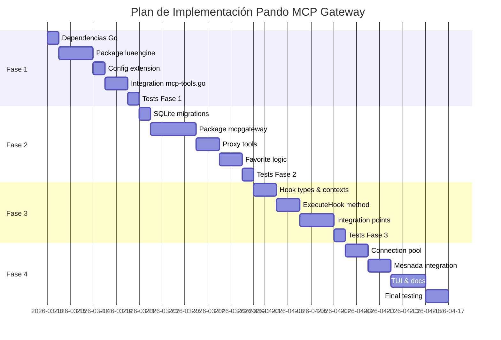

# Plan de Implementación: Pando MCP Gateway, Lua Hooks & Tool Favorites

> **Proyecto**: Pando (fork de OpenCode/Crush)
> **Basado en**: Análisis completo de [Panorganon](file:///www/MCP/panorganon) — MCP Gateway con Lua hooks via gopherlua
> **Fecha**: 2026-03-12
> **Fact IDs en Remembrances**: `pando_mcp_gateway_phase1`, `pando_mcp_gateway_phase2`, `pando_mcp_gateway_phase3`, `pando_mcp_gateway_phase4`

---

## Resumen Ejecutivo

Este plan integra de forma nativa en Pando la funcionalidad de **MCP Gateway** que actualmente implementa Panorganon como proyecto independiente. Los objetivos son:

1. **Centralizar** todos los servidores MCP configurados bajo un gateway interno que expone al LLM únicamente herramientas proxy genéricas (`mcp_query_catalog`, `mcp_call_tool`) en lugar de exponer directamente todas las tools.
2. **Sistema de Favoritos**: Rastrear estadísticas de uso de cada tool en SQLite. Las tools más usadas se exponen directamente al LLM (bypass del catálogo), logrando un equilibrio entre velocidad y reducción de ruido en el contexto.
3. **Lua Hooks**: Implementar extensibilidad via scripts Lua (`github.com/yuin/gopher-lua`) para interceptar y modificar datos en múltiples puntos del ciclo de vida del agente.

---

## Análisis de Panorganon (Proyecto Base)

### Arquitectura

Panorganon es un servidor MCP intermediario escrito en Go que orquesta múltiples servidores MCP downstream:

```
┌─────────────────────────────────────────────────────────┐
│                    PANORGANON                            │
│                                                          │
│  ┌──────────────┐  ┌──────────────┐  ┌───────────────┐  │
│  │  MCP Server   │  │ Lua Filters  │  │   SQLite DB    │  │
│  │  (handler.go) │  │ (luafilters/)│  │  (database/)   │  │
│  └──────┬───────┘  └──────┬───────┘  └───────┬───────┘  │
│         │                  │                   │          │
│  ┌──────┴──────────────────┴───────────────────┴───────┐ │
│  │              Tools Layer (tools/)                     │ │
│  │  DiscoveryService │ SearchService │ ExecutorService   │ │
│  └──────────────────────────┬───────────────────────────┘ │
│                              │                             │
│  ┌──────────────────────────┴───────────────────────────┐ │
│  │          Downstream Manager (downstream/)              │ │
│  │  StdioClient │ HTTPClient │ SSEClient                  │ │
│  └────────────────────────────────────────────────────────┘ │
└─────────────────────────────────────────────────────────┘
         │                │                │
    ┌────┴───┐      ┌────┴───┐      ┌────┴───┐
    │ MCP    │      │ MCP    │      │ MCP    │
    │ Server │      │ Server │      │ Server │
    │ (stdio)│      │ (HTTP) │      │ (SSE)  │
    └────────┘      └────────┘      └────────┘
```

### Componentes clave analizados

| Archivo | Propósito | Líneas | Adaptación para Pando |
|---------|-----------|--------|----------------------|
| `luafilters/lua.go` | Inicializa LState con módulos preloaded | 79 | Portar directamente |
| `luafilters/types.go` | HookContext, HookResult, FilterType | 145 | Extender con HookType |
| `luafilters/helpers.go` | Converters Go↔Lua bidireccionales | 197 | Portar directamente |
| `luafilters/manager.go` | FilterManager con timeout, strict mode | 376 | Adaptar para hooks |
| `tools/discovery.go` | Descubrimiento periódico de tools | 225 | Simplificar para Pando |
| `tools/executor.go` | Ejecución con hook points input/output | 490 | Integrar en mcpTool.Run() |
| `tools/search.go` | Búsqueda con LLM sampling + keyword | 341 | Simplificar (keyword only) |
| `database/schema.go` | Schema SQLite (servers, tools) | 31 | Adaptar a sqlc migrations |
| `database/queries.go` | CRUD operations para tools/servers | 287 | Reescribir como sqlc |
| `server/handler.go` | 4 tools MCP: search, exec, list, refresh | 236 | Adaptar a 2: query_catalog, call_tool |
| `downstream/manager.go` | Pool de clientes downstream | 225 | Opcional (connection pool) |
| `config/config.go` | Config YAML con filtros y servers | 203 | Extender config existente |

### Flujo de ejecución en Panorganon

```
LLM → search_tools(task_description)
    → SearchService.SearchTools() → DB.GetAllTools() → LLM Sampling/Keyword
    → Returns matched tools as JSON

LLM → exec_tool(tool_name, parameters)
    → ExecutorService.ExecTool()
        → lookupTool() in DB
        → validateParameters() against schema
        → 🔵 HOOK 1: ApplyInputFilter() → Lua <server>-input(ctx)
        → executeTool() → downstream.GetOrStart() → client.CallTool()
        → 🔵 HOOK 2: ApplyOutputFilter() → Lua <server>-output(ctx)
    → Returns result to LLM
```

---

## Arquitectura Actual de Pando (Puntos de Integración)

### Cómo Pando gestiona MCP tools actualmente

En `internal/llm/agent/mcp-tools.go`:

1. `GetMcpTools()` itera `config.MCPServers`, crea un cliente MCP por servidor, llama `ListTools()`, y wrappea cada tool en un `mcpTool` struct.
2. **Todas las tools** se exponen directamente al LLM — no hay catálogo ni proxy.
3. Cada llamada a `mcpTool.Run()` crea un **nuevo cliente MCP** (no hay pooling).
4. No hay filtros Lua ni hooks en el ciclo de vida.

### Puntos de integración identificados

| Componente | Archivo | Función | Tipo de hook |
|-----------|---------|---------|-------------|
| System Prompt | `internal/llm/prompt/prompt.go` | `GetAgentPrompt()` | `hook_system_prompt` |
| Session Create | `internal/session/session.go` | `service.Create()` | `hook_session_start` |
| Session Load | `internal/session/session.go` | `service.Get()` | `hook_session_restore` |
| Conversation Start | `internal/llm/agent/agent.go` | `processGeneration()` | `hook_conversation_start` |
| User Message | `internal/llm/agent/agent.go` | `createUserMessage()` | `hook_user_prompt` |
| Response Complete | `internal/llm/agent/agent.go` | `processEvent()` EventComplete | `hook_agent_response_finish` |
| Tool Input | `internal/llm/agent/mcp-tools.go` | `runTool()` before CallTool | `<server>-input` filter |
| Tool Output | `internal/llm/agent/mcp-tools.go` | `runTool()` after CallTool | `<server>-output` filter |

---

## Fase 1: Core MCP Gateway & Infraestructura Lua

**Fact ID**: `pando_mcp_gateway_phase1`

### Dependencias Go

```bash
go get github.com/yuin/gopher-lua
go get github.com/layeh/gopher-json
go get github.com/vadv/gopher-lua-libs
```

### Nuevo paquete: `internal/luaengine/`

#### `lua.go` — Estado Lua Sandboxed
Crea un `*lua.LState` configurado con:
- `CallStackSize: 120`, `RegistrySize: 1024`
- Módulos preloaded: `strings`, `http`, `time`, `regexp`, `yaml`, `template`, `json`
- **Shell excluido** intencionalmente por seguridad
- Funciones: `InitLuaState()`, `ResetLuaState()`, `CloseLuaState()`

#### `types.go` — Tipos del Motor
```go
type FilterType string  // "input" | "output"
type HookType string    // "system-prompt" | "session-start" | etc.

type HookContext struct {
    ServerName string                 // Para filtros tool
    ToolName   string                 // Para filtros tool  
    HookType   HookType              // Para hooks lifecycle
    Parameters map[string]interface{} // Input data
    Result     map[string]interface{} // Output data
    RequestID  string
    SessionID  string                 // Para hooks lifecycle
    // ... más campos según hook type
}

type HookResult struct {
    Modified      bool
    Data          map[string]interface{}
    Error         error
    ExecutionTime time.Duration
    Logs          []string
}
```

#### `helpers.go` — Conversores Bidireccionales Go ↔ Lua
Port directo de panorganon. Soporta: nil, bool, string, int, int64, float32, float64, map, slice. Detección automática de arrays vs maps en tablas Lua.

#### `manager.go` — FilterManager
```go
type FilterManager struct {
    scriptPath      string
    L               *lua.LState
    enabled         bool
    timeout         time.Duration
    strictMode      bool
    logger          *zap.Logger
    mu              sync.RWMutex
    scriptLoaded    bool
}
```

Métodos principales:
- `ApplyInputFilter(ctx, hookCtx)` → Busca `<server>-input`, fallback `global-input`
- `ApplyOutputFilter(ctx, hookCtx)` → Busca `<server>-output`, fallback `global-output`
- `ExecuteHook(ctx, hookType, data)` → Busca `hook_<type>`, fallback `hook_global`
- Ejecución con goroutine + timeout + context cancelation
- En modo no-strict: errors se logean pero se devuelven datos originales

### Configuración

Nuevo bloque en `internal/config/config.go`:
```go
type LuaConfig struct {
    Enabled         bool          `yaml:"enabled"`
    ScriptPath      string        `yaml:"script_path"`
    Timeout         time.Duration `yaml:"timeout"`
    StrictMode      bool          `yaml:"strict_mode"`
    HotReload       bool          `yaml:"hot_reload"`
    LogFilteredData bool          `yaml:"log_filtered_data"`
}
```

### Integración inicial en tool execution

Modificar `runTool()` en `mcp-tools.go`:
```go
// ANTES de c.CallTool():
if filterManager != nil && filterManager.IsEnabled() {
    hookCtx := NewInputContext(serverName, toolName, args, requestID)
    result, err := filterManager.ApplyInputFilter(ctx, hookCtx)
    if result.Modified { args = result.Data }
}

// DESPUÉS de c.CallTool():
if filterManager != nil && filterManager.IsEnabled() {
    hookCtx := NewOutputContext(serverName, toolName, resultMap, requestID, duration)
    result, err := filterManager.ApplyOutputFilter(ctx, hookCtx)
    if result.Modified { output = result.Data }
}
```

---

## Fase 2: Tool Catalog, Estadísticas de Uso & Sistema de Favoritos

**Fact ID**: `pando_mcp_gateway_phase2`

### Nuevas tablas SQLite

```sql
CREATE TABLE IF NOT EXISTS mcp_tool_registry (
    id TEXT PRIMARY KEY,
    server_name TEXT NOT NULL,
    tool_name TEXT NOT NULL,
    description TEXT,
    input_schema TEXT,
    last_discovered TIMESTAMP DEFAULT CURRENT_TIMESTAMP,
    UNIQUE(server_name, tool_name)
);

CREATE TABLE IF NOT EXISTS mcp_tool_usage_stats (
    id INTEGER PRIMARY KEY AUTOINCREMENT,
    tool_id TEXT NOT NULL,
    session_id TEXT,
    called_at TIMESTAMP DEFAULT CURRENT_TIMESTAMP,
    duration_ms INTEGER,
    success BOOLEAN DEFAULT TRUE,
    FOREIGN KEY(tool_id) REFERENCES mcp_tool_registry(id) ON DELETE CASCADE
);
```

### Nuevo paquete: `internal/mcpgateway/`

#### `registry.go` — Catálogo de Tools
- `DiscoverAll(ctx)`: Descubre tools de todos los servidores MCP configurados
- `SearchTools(query, maxResults)`: Búsqueda por keyword en nombre + descripción
- `GetTool(name)`: Obtiene tool por nombre exacto
- `GetAllTools()`: Lista completa

#### `stats.go` — Estadísticas de Uso
- `RecordUsage(toolID, sessionID, durationMs, success)`: Registra cada invocación
- `GetTopTools(limit, daysWindow)`: Top N tools por frecuencia en ventana temporal
- `GetFavorites()`: Calcula set actual de favoritos
- Parámetros configurables: `favorite_threshold=5`, `max_favorites=15`, `favorite_window_days=30`, `decay_days=14`

#### `gateway.go` — Orquestador
Coordina registry + stats + favorite rotation. Se inicializa en `app.go`.

### Tools proxy expuestas al LLM

| Tool | Descripción | Parámetros |
|------|------------|-----------|
| `mcp_query_catalog` | Busca tools disponibles por descripción | `query: string`, `max_results?: int` |
| `mcp_call_tool` | Ejecuta cualquier tool del catálogo | `tool_name: string`, `parameters: object`, `server_name?: string` |

Plus: Las **top N favoritas** se exponen directamente con su schema original.

### Cambio clave en `GetMcpTools()`

```go
// ANTES: Expone TODAS las tools directamente
func GetMcpTools(ctx, permissions) []BaseTool {
    // Itera todos los servers, lista todas las tools
}

// DESPUÉS: Expone proxy + favoritas
func GetMcpTools(ctx, permissions, gateway) []BaseTool {
    tools := []BaseTool{
        NewCatalogTool(gateway),    // mcp_query_catalog
        NewCallToolProxy(gateway),  // mcp_call_tool
    }
    for _, fav := range gateway.GetFavorites() {
        tools = append(tools, NewMcpTool(fav.ServerName, fav.Tool, permissions, mcpConfig))
    }
    return tools
}
```

---

## Fase 3: Lua Hooks para el Ciclo de Vida del Agente

**Fact ID**: `pando_mcp_gateway_phase3`

### Hooks Disponibles

| Hook | Cuándo se ejecuta | Datos de entrada | Puede modificar |
|------|-------------------|-----------------|----------------|
| `hook_system_prompt` | Al construir el system prompt | system_prompt, agent_name, model_id, provider, skills | Sí (system_prompt) |
| `hook_session_start` | Al crear una nueva sesión | session_id, title, created_at | No (informativo) |
| `hook_session_restore` | Al cargar una sesión existente | session_id, title, message_count, tokens, cost | No (informativo) |
| `hook_conversation_start` | Al inicio de processGeneration | session_id, is_new, message_count | Sí (injected_context) |
| `hook_user_prompt` | Antes de crear el mensaje de usuario | session_id, user_content, attachments, model_id | Sí (modified_content) |
| `hook_agent_response_finish` | Al completarse la respuesta | session_id, content, finish_reason, tokens, cost | No (informativo) |

### Integración

**`GetAgentPrompt()` en prompt.go**:
```go
func GetAgentPrompt(agentName, provider, luaManager) string {
    basePrompt := CoderPrompt(provider)
    // ... existing context logic ...
    
    if luaManager != nil && luaManager.IsEnabled() {
        hookData := map[string]interface{}{
            "system_prompt": finalPrompt,
            "agent_name":    string(agentName),
            "model_id":      string(provider.ID),
        }
        result, err := luaManager.ExecuteHook(ctx, HookSystemPrompt, hookData)
        if err == nil && result.Modified {
            if modifiedPrompt, ok := result.Data["system_prompt"].(string); ok {
                finalPrompt = modifiedPrompt
            }
        }
    }
    return finalPrompt
}
```

**`processGeneration()` en agent.go** (conversation-start):
```go
func (a *agent) processGeneration(ctx, sessionID, content, attachments) AgentEvent {
    msgs, _ := a.messages.List(ctx, sessionID)
    
    // Hook: conversation-start
    if a.luaManager != nil {
        hookData := map[string]interface{}{
            "session_id":     sessionID,
            "is_new_session": len(msgs) == 0,
            "message_count":  len(msgs),
        }
        result, _ := a.luaManager.ExecuteHook(ctx, HookConversationStart, hookData)
        if result != nil && result.Modified {
            if injected, ok := result.Data["injected_context"].(string); ok {
                content = injected + "\n\n" + content
            }
        }
    }
    // ... rest of processGeneration
}
```

### Ejemplo de script Lua completo

```lua
-- pando-hooks.lua

-- Personalizar el system prompt
function hook_system_prompt(ctx)
    local prompt = ctx.system_prompt
    prompt = prompt .. "\n\n## Custom Rules\n"
    prompt = prompt .. "- Always use Spanish for error messages\n"
    prompt = prompt .. "- Prefer functional programming patterns\n"
    ctx.system_prompt = prompt
    return ctx
end

-- Inyectar contexto al inicio de conversación
function hook_conversation_start(ctx)
    if ctx.is_new_session then
        ctx.injected_context = "Remember: This project uses Go 1.24 and follows the Pando coding standards."
    end
    return ctx
end

-- Filtro de entrada para tools MCP
_G["remembrances-input"] = function(ctx)
    -- Sanitizar queries
    local params = ctx.parameters
    if params.query then
        params.query = string.gsub(params.query, "password", "[FILTERED]")
    end
    return params
end

-- Auditoría de respuestas costosas
function hook_agent_response_finish(ctx)
    if ctx.cost and ctx.cost > 0.05 then
        print("[COST ALERT] Session " .. ctx.session_id .. " cost: $" .. ctx.cost)
    end
    return nil
end
```

---

## Fase 4: Integración Final, Testing & Documentación

**Fact ID**: `pando_mcp_gateway_phase4`

### 4.1 Connection Pool (opcional)
Adaptar panorganon's `downstream/manager.go` para reutilizar clientes MCP:
- `internal/mcpgateway/clientpool.go`: Pool con `GetOrStart()`, `Stop()`, `StopAll()`
- Reduce latencia en tools frecuentes (actualmente se crea y destruye un cliente por cada invocación)

### 4.2 Integración con Mesnada (subagentes)
- Los subagentes heredan la config del gateway
- Las llamadas de subagentes cuentan para las estadísticas de favoritos
- `mcp_call_tool` disponible para subagentes

### 4.3 TUI
- Indicador de tools favoritas en la barra de estado
- Modo debug: mostrar ejecución de hooks Lua con timing
- Mostrar estadísticas de uso con comando dedicado

### 4.4 Testing
- Tests unitarios en `internal/luaengine/*_test.go`
- Tests unitarios en `internal/mcpgateway/*_test.go`
- Tests de integración en `tests/`
- Scripts Lua de test en `tests/lua/`

### 4.5 Feature Flags
```yaml
# Habilitar por separado o juntos
lua_filters:
  enabled: true     # Hooks + filtros Lua
mcp_gateway:
  enabled: true     # Catálogo + favoritos
  max_favorites: 15
  favorite_threshold: 5
  favorite_window_days: 30
  decay_days: 14
```

---

## Orden de Implementación Recomendado



---

## Referencias

- **Panorganon source code**: `/www/MCP/panorganon/` (indexado en remembrances como `www_MCP_panorganon`)
- **Pando source code**: `/www/MCP/Pando/pando/` (indexado en remembrances como `www_MCP_Pando_pando`)
- **gopherlua**: https://github.com/yuin/gopher-lua
- **gopher-lua-libs**: https://github.com/vadv/gopher-lua-libs
- **mcp-go**: https://github.com/mark3labs/mcp-go