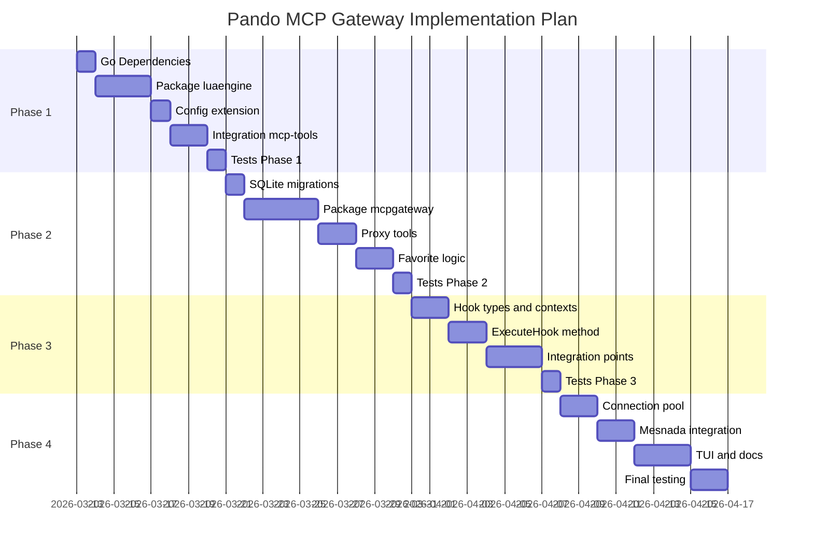

# Implementation Plan: Pando MCP Gateway, Lua Hooks & Tool Favorites

> **Project**: Pando (fork of OpenCode/Crush)
> **Based on**: Comprehensive analysis of Panorganon — MCP Gateway with Lua hooks via gopherlua
> **Date**: 2026-03-12
> **Fact IDs in Remembrances**: `pando_mcp_gateway_phase1`, `pando_mcp_gateway_phase2`, `pando_mcp_gateway_phase3`, `pando_mcp_gateway_phase4`

---

## Executive Summary

This plan natively integrates into Pando the **MCP Gateway** functionality currently implemented by Panorganon as a standalone project. The objectives are:

1. **Centralize** all configured MCP servers under an internal gateway that exposes to the LLM only generic proxy tools (`mcp_query_catalog`, `mcp_call_tool`) instead of directly exposing all tools.
2. **Favorites System**: Track usage statistics of each tool in SQLite. The most used tools are exposed directly to the LLM (bypassing the catalog), achieving a balance between speed and noise reduction in context.
3. **Lua Hooks**: Implement extensibility via Lua scripts (`github.com/yuin/gopher-lua`) to intercept and modify data at multiple points in the agent's lifecycle.

---

## Panorganon Analysis (Base Project)

### Architecture

Panorganon is an intermediary MCP server written in Go that orchestrates multiple downstream MCP servers:

```
┌─────────────────────────────────────────────────────────┐
│                    PANORGANON                            │
│                                                          │
│  ┌──────────────┐  ┌──────────────┐  ┌───────────────┐  │
│  │  MCP Server   │  │ Lua Filters  │  │   SQLite DB    │  │
│  │  (handler.go) │  │ (luafilters/)│  │  (database/)   │  │
│  └──────┬───────┘  └──────┬───────┘  └───────┬───────┘  │
│         │                  │                   │          │
│  ┌──────┴──────────────────┴───────────────────┴───────┐ │
│  │              Tools Layer (tools/)                     │ │
│  │  DiscoveryService │ SearchService │ ExecutorService   │ │
│  └──────────────────────────┬───────────────────────────┘ │
│                              │                             │
│  ┌──────────────────────────┴───────────────────────────┐ │
│  │          Downstream Manager (downstream/)              │ │
│  │  StdioClient │ HTTPClient │ SSEClient                  │ │
│  └────────────────────────────────────────────────────────┘ │
└─────────────────────────────────────────────────────────┘
         │                │                │
    ┌────┴───┐      ┌────┴───┐      ┌────┴───┐
    │ MCP    │      │ MCP    │      │ MCP    │
    │ Server │      │ Server │      │ Server │
    │ (stdio)│      │ (HTTP) │      │ (SSE)  │
    └────────┘      └────────┘      └────────┘
```

### Key Components Analyzed

| File | Purpose | Lines | Adaptation for Pando |
|------|---------|-------|----------------------|
| `luafilters/lua.go` | Initializes LState with preloaded modules | 79 | Port directly |
| `luafilters/types.go` | HookContext, HookResult, FilterType | 145 | Extend with HookType |
| `luafilters/helpers.go` | Bidirectional Go↔Lua converters | 197 | Port directly |
| `luafilters/manager.go` | FilterManager with timeout, strict mode | 376 | Adapt for hooks |
| `tools/discovery.go` | Periodic tool discovery | 225 | Simplify for Pando |
| `tools/executor.go` | Execution with input/output hook points | 490 | Integrate into mcpTool.Run() |
| `tools/search.go` | Search with LLM sampling + keyword | 341 | Simplify (keyword only) |
| `database/schema.go` | SQLite schema (servers, tools) | 31 | Adapt to sqlc migrations |
| `database/queries.go` | CRUD operations for tools/servers | 287 | Rewrite as sqlc |
| `server/handler.go` | 4 MCP tools: search, exec, list, refresh | 236 | Adapt to 2: query_catalog, call_tool |
| `downstream/manager.go` | Downstream client pool | 225 | Optional (connection pool) |
| `config/config.go` | YAML config with filters and servers | 203 | Extend existing config |

### Execution Flow in Panorganon

```
LLM → search_tools(task_description)
    → SearchService.SearchTools() → DB.GetAllTools() → LLM Sampling/Keyword
    → Returns matched tools as JSON

LLM → exec_tool(tool_name, parameters)
    → ExecutorService.ExecTool()
        → lookupTool() in DB
        → validateParameters() against schema
        → 🔵 HOOK 1: ApplyInputFilter() → Lua <server>-input(ctx)
        → executeTool() → downstream.GetOrStart() → client.CallTool()
        → 🔵 HOOK 2: ApplyOutputFilter() → Lua <server>-output(ctx)
    → Returns result to LLM
```

---

## Pando's Current Architecture (Integration Points)

### How Pando currently manages MCP tools

In `internal/llm/agent/mcp-tools.go`:

1. `GetMcpTools()` iterates `config.MCPServers`, creates an MCP client per server, calls `ListTools()`, and wraps each tool in an `mcpTool` struct.
2. **All tools** are directly exposed to the LLM — no catalog or proxy.
3. Each call to `mcpTool.Run()` creates a **new MCP client** (no pooling).
4. No Lua filters or lifecycle hooks exist.

### Identified Integration Points

| Component | File | Function | Hook Type |
|-----------|------|----------|-----------|
| System Prompt | `internal/llm/prompt/prompt.go` | `GetAgentPrompt()` | `hook_system_prompt` |
| Session Create | `internal/session/session.go` | `service.Create()` | `hook_session_start` |
| Session Load | `internal/session/session.go` | `service.Get()` | `hook_session_restore` |
| Conversation Start | `internal/llm/agent/agent.go` | `processGeneration()` | `hook_conversation_start` |
| User Message | `internal/llm/agent/agent.go` | `createUserMessage()` | `hook_user_prompt` |
| Response Complete | `internal/llm/agent/agent.go` | `processEvent()` EventComplete | `hook_agent_response_finish` |
| Tool Input | `internal/llm/agent/mcp-tools.go` | `runTool()` before CallTool | `<server>-input` filter |
| Tool Output | `internal/llm/agent/mcp-tools.go` | `runTool()` after CallTool | `<server>-output` filter |

---

## Phase 1: Core MCP Gateway & Lua Infrastructure

**Fact ID**: `pando_mcp_gateway_phase1`

### Go Dependencies

```bash
go get github.com/yuin/gopher-lua
go get github.com/layeh/gopher-json
go get github.com/vadv/gopher-lua-libs
```

### New Package: `internal/luaengine/`

#### `lua.go` — Sandboxed Lua State
Creates a `*lua.LState` configured with:
- `CallStackSize: 120`, `RegistrySize: 1024`
- Preloaded modules: `strings`, `http`, `time`, `regexp`, `yaml`, `template`, `json`
- **Shell intentionally excluded** for security
- Functions: `InitLuaState()`, `ResetLuaState()`, `CloseLuaState()`

#### `types.go` — Engine Types
```go
type FilterType string  // "input" | "output"
type HookType string    // "system-prompt" | "session-start" | etc.

type HookContext struct {
    ServerName string                 // For tool filters
    ToolName   string                 // For tool filters
    HookType   HookType              // For lifecycle hooks
    Parameters map[string]interface{} // Input data
    Result     map[string]interface{} // Output data
    RequestID  string
    SessionID  string                 // For lifecycle hooks
    // ... more fields depending on hook type
}

type HookResult struct {
    Modified      bool
    Data          map[string]interface{}
    Error         error
    ExecutionTime time.Duration
    Logs          []string
}
```

#### `helpers.go` — Bidirectional Go ↔ Lua Converters
Direct port from Panorganon. Supports: nil, bool, string, int, int64, float32, float64, map, slice. Automatic array vs map detection in Lua tables.

#### `manager.go` — FilterManager
```go
type FilterManager struct {
    scriptPath      string
    L               *lua.LState
    enabled         bool
    timeout         time.Duration
    strictMode      bool
    logger          *zap.Logger
    mu              sync.RWMutex
    scriptLoaded    bool
}
```

Main methods:
- `ApplyInputFilter(ctx, hookCtx)` → Looks up `<server>-input`, falls back to `global-input`
- `ApplyOutputFilter(ctx, hookCtx)` → Looks up `<server>-output`, falls back to `global-output`
- `ExecuteHook(ctx, hookType, data)` → Looks up `hook_<type>`, falls back to `hook_global`
- Execution with goroutine + timeout + context cancellation
- In non-strict mode: errors are logged but original data is returned

### Configuration

New block in `internal/config/config.go`:
```go
type LuaConfig struct {
    Enabled         bool          `yaml:"enabled"`
    ScriptPath      string        `yaml:"script_path"`
    Timeout         time.Duration `yaml:"timeout"`
    StrictMode      bool          `yaml:"strict_mode"`
    HotReload       bool          `yaml:"hot_reload"`
    LogFilteredData bool          `yaml:"log_filtered_data"`
}
```

### Initial Tool Execution Integration

Modify `runTool()` in `mcp-tools.go`:
```go
// BEFORE c.CallTool():
if filterManager != nil && filterManager.IsEnabled() {
    hookCtx := NewInputContext(serverName, toolName, args, requestID)
    result, err := filterManager.ApplyInputFilter(ctx, hookCtx)
    if result.Modified { args = result.Data }
}

// AFTER c.CallTool():
if filterManager != nil && filterManager.IsEnabled() {
    hookCtx := NewOutputContext(serverName, toolName, resultMap, requestID, duration)
    result, err := filterManager.ApplyOutputFilter(ctx, hookCtx)
    if result.Modified { output = result.Data }
}
```

---

## Phase 2: Tool Catalog, Usage Statistics & Favorites System

**Fact ID**: `pando_mcp_gateway_phase2`

### New SQLite Tables

```sql
CREATE TABLE IF NOT EXISTS mcp_tool_registry (
    id TEXT PRIMARY KEY,
    server_name TEXT NOT NULL,
    tool_name TEXT NOT NULL,
    description TEXT,
    input_schema TEXT,
    last_discovered TIMESTAMP DEFAULT CURRENT_TIMESTAMP,
    UNIQUE(server_name, tool_name)
);

CREATE TABLE IF NOT EXISTS mcp_tool_usage_stats (
    id INTEGER PRIMARY KEY AUTOINCREMENT,
    tool_id TEXT NOT NULL,
    session_id TEXT,
    called_at TIMESTAMP DEFAULT CURRENT_TIMESTAMP,
    duration_ms INTEGER,
    success BOOLEAN DEFAULT TRUE,
    FOREIGN KEY(tool_id) REFERENCES mcp_tool_registry(id) ON DELETE CASCADE
);
```

### New Package: `internal/mcpgateway/`

#### `registry.go` — Tool Catalog
- `DiscoverAll(ctx)`: Discovers tools from all configured MCP servers
- `SearchTools(query, maxResults)`: Keyword search in name + description
- `GetTool(name)`: Gets tool by exact name
- `GetAllTools()`: Full list

#### `stats.go` — Usage Statistics
- `RecordUsage(toolID, sessionID, durationMs, success)`: Records each invocation
- `GetTopTools(limit, daysWindow)`: Top N tools by frequency in time window
- `GetFavorites()`: Computes the current favorites set
- Configurable parameters: `favorite_threshold=5`, `max_favorites=15`, `favorite_window_days=30`, `decay_days=14`

#### `gateway.go` — Orchestrator
Coordinates registry + stats + favorite rotation. Initialized in `app.go`.

### Proxy Tools Exposed to LLM

| Tool | Description | Parameters |
|------|-------------|-----------|
| `mcp_query_catalog` | Searches or lists available tools (paginated). Omit `query` to list the whole catalog; response includes `total`, `has_more`, `next_offset` | `query?: string`, `max_results?: int`, `offset?: int` |
| `mcp_call_tool` | Executes any tool from the catalog | `tool_name: string`, `parameters: object`, `server_name?: string` |

Plus: The **top N favorites** are exposed directly with their original schema.

### Key Change in `GetMcpTools()`

```go
// BEFORE: Exposes ALL tools directly
func GetMcpTools(ctx, permissions) []BaseTool {
    // Iterates all servers, lists all tools
}

// AFTER: Exposes proxy + favorites
func GetMcpTools(ctx, permissions, gateway) []BaseTool {
    tools := []BaseTool{
        NewCatalogTool(gateway),    // mcp_query_catalog
        NewCallToolProxy(gateway),  // mcp_call_tool
    }
    for _, fav := range gateway.GetFavorites() {
        tools = append(tools, NewMcpTool(fav.ServerName, fav.Tool, permissions, mcpConfig))
    }
    return tools
}
```

---

## Phase 3: Lua Hooks for the Agent Lifecycle

**Fact ID**: `pando_mcp_gateway_phase3`

### Available Hooks

| Hook | When it executes | Input Data | Can Modify |
|------|-----------------|------------|------------|
| `hook_system_prompt` | When building the system prompt | system_prompt, agent_name, model_id, provider, skills | Yes (system_prompt) |
| `hook_session_start` | When creating a new session | session_id, title, created_at | No (informational) |
| `hook_session_restore` | When loading an existing session | session_id, title, message_count, tokens, cost | No (informational) |
| `hook_conversation_start` | At the start of processGeneration | session_id, is_new, message_count | Yes (injected_context) |
| `hook_user_prompt` | Before creating the user message | session_id, user_content, attachments, model_id | Yes (modified_content) |
| `hook_agent_response_finish` | When the response completes | session_id, content, finish_reason, tokens, cost | No (informational) |

### Integration

**`GetAgentPrompt()` in prompt.go**:
```go
func GetAgentPrompt(agentName, provider, luaManager) string {
    basePrompt := CoderPrompt(provider)
    // ... existing context logic ...

    if luaManager != nil && luaManager.IsEnabled() {
        hookData := map[string]interface{}{
            "system_prompt": finalPrompt,
            "agent_name":    string(agentName),
            "model_id":      string(provider.ID),
        }
        result, err := luaManager.ExecuteHook(ctx, HookSystemPrompt, hookData)
        if err == nil && result.Modified {
            if modifiedPrompt, ok := result.Data["system_prompt"].(string); ok {
                finalPrompt = modifiedPrompt
            }
        }
    }
    return finalPrompt
}
```

**`processGeneration()` in agent.go** (conversation-start):
```go
func (a *agent) processGeneration(ctx, sessionID, content, attachments) AgentEvent {
    msgs, _ := a.messages.List(ctx, sessionID)

    // Hook: conversation-start
    if a.luaManager != nil {
        hookData := map[string]interface{}{
            "session_id":     sessionID,
            "is_new_session": len(msgs) == 0,
            "message_count":  len(msgs),
        }
        result, _ := a.luaManager.ExecuteHook(ctx, HookConversationStart, hookData)
        if result != nil && result.Modified {
            if injected, ok := result.Data["injected_context"].(string); ok {
                content = injected + "\n\n" + content
            }
        }
    }
    // ... rest of processGeneration
}
```

### Complete Lua Script Example

```lua
-- pando-hooks.lua

-- Customize the system prompt
function hook_system_prompt(ctx)
    local prompt = ctx.system_prompt
    prompt = prompt .. "\n\n## Custom Rules\n"
    prompt = prompt .. "- Always use Spanish for error messages\n"
    prompt = prompt .. "- Prefer functional programming patterns\n"
    ctx.system_prompt = prompt
    return ctx
end

-- Inject context at conversation start
function hook_conversation_start(ctx)
    if ctx.is_new_session then
        ctx.injected_context = "Remember: This project uses Go 1.24 and follows the Pando coding standards."
    end
    return ctx
end

-- Input filter for MCP tools
_G["remembrances-input"] = function(ctx)
    -- Sanitize queries
    local params = ctx.parameters
    if params.query then
        params.query = string.gsub(params.query, "password", "[FILTERED]")
    end
    return params
end

-- Audit expensive responses
function hook_agent_response_finish(ctx)
    if ctx.cost and ctx.cost > 0.05 then
        print("[COST ALERT] Session " .. ctx.session_id .. " cost: $" .. ctx.cost)
    end
    return nil
end
```

---

## Phase 4: Final Integration, Testing & Documentation

**Fact ID**: `pando_mcp_gateway_phase4`

### 4.1 Connection Pool (optional)
Adapt Panorganon's `downstream/manager.go` to reuse MCP clients:
- `internal/mcpgateway/clientpool.go`: Pool with `GetOrStart()`, `Stop()`, `StopAll()`
- Reduces latency for frequent tools (currently a client is created and destroyed for each invocation)

### 4.2 Integration with Mesnada (subagents)
- Subagents inherit the gateway config
- Subagent calls count toward favorites statistics
- `mcp_call_tool` available for subagents

### 4.3 TUI
- Favorites tool indicator in the status bar
- Debug mode: show Lua hook execution with timing
- Show usage statistics with a dedicated command

### 4.4 Testing
- Unit tests in `internal/luaengine/*_test.go`
- Unit tests in `internal/mcpgateway/*_test.go`
- Integration tests in `tests/`
- Lua test scripts in `tests/lua/`

### 4.5 Feature Flags
```yaml
# Enable separately or together
lua_filters:
  enabled: true     # Hooks + Lua filters
mcp_gateway:
  enabled: true     # Catalog + favorites
  max_favorites: 15
  favorite_threshold: 5
  favorite_window_days: 30
  decay_days: 14
```

---

## Recommended Implementation Order


```mermaid
gantt
    title Pando MCP Gateway Implementation Plan
    dateFormat  YYYY-MM-DD
    section Phase 1
    Go Dependencies           :f1a, 2026-03-13, 1d
    Package luaengine         :f1b, after f1a, 3d
    Config extension          :f1c, after f1b, 1d
    Integration mcp-tools     :f1d, after f1c, 2d
    Tests Phase 1             :f1e, after f1d, 1d
    section Phase 2
    SQLite migrations         :f2a, after f1e, 1d
    Package mcpgateway        :f2b, after f2a, 4d
    Proxy tools               :f2c, after f2b, 2d
    Favorite logic            :f2d, after f2c, 2d
    Tests Phase 2             :f2e, after f2d, 1d
    section Phase 3
    Hook types and contexts   :f3a, after f2e, 2d
    ExecuteHook method        :f3b, after f3a, 2d
    Integration points        :f3c, after f3b, 3d
    Tests Phase 3             :f3d, after f3c, 1d
    section Phase 4
    Connection pool           :f4a, after f3d, 2d
    Mesnada integration       :f4b, after f4a, 2d
    TUI and docs              :f4c, after f4b, 3d
    Final testing             :f4d, after f4c, 2d
```

---

## References

- **Panorganon source code**: `/www/MCP/panorganon/` (indexed in remembrances as `www_MCP_panorganon`)
- **Pando source code**: `/www/MCP/Pando/pando/` (indexed in remembrances as `www_MCP_Pando_pando`)
- **gopherlua**: https://github.com/yuin/gopher-lua
- **gopher-lua-libs**: https://github.com/vadv/gopher-lua-libs
- **mcp-go**: https://github.com/mark3labs/mcp-go
