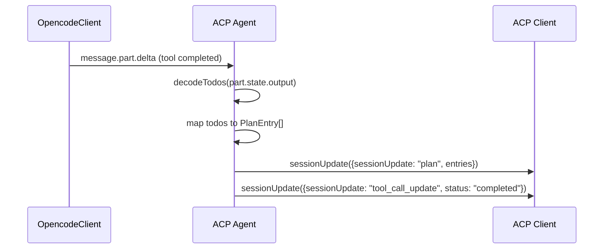
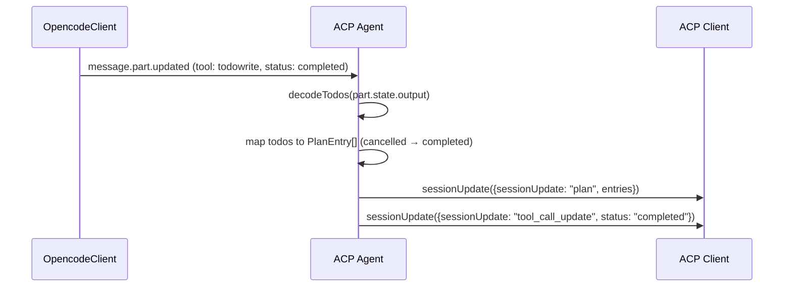

# DeepWiki Q&A with Code Context for Repository: sst/opencode
## Q1
Soporta opencode una tool todo write y visualización de un plan con tareas a través de ACP?
### Answer
Sí, OpenCode soporta la herramienta `todowrite` y la visualización de planes con tareas a través de ACP. opencode:349-374 

## Detalles de la implementación

### Herramienta TodoWrite
La herramienta `todowrite` está disponible en el sistema de herramientas de OpenCode y se usa para gestionar listas de tareas durante sesiones de codificación. opencode:1-57 

### Integración con ACP
Cuando la herramienta `todowrite` se completa a través de ACP, el sistema:

1. **Parsea la salida** del tool `todowrite` usando `decodeTodos()` opencode:350-351 
2. **Envía una actualización de sesión** al cliente ACP con `sessionUpdate: "plan"` opencode:352-367 
3. **Transforma los todos** en entradas de plan con:
   - `priority`: "medium"
   - `status`: mapeado desde el estado del todo (cancelled → completed)
   - `content`: el contenido del todo opencode:357-365 

### Soporte ACP
OpenCode funciona igual a través de ACP que en la terminal, incluyendo todas las herramientas integradas como `todowrite`. opencode:145-156 

## Notes
La implementación de ACP para `todowrite` se encuentra en dos lugares del archivo `agent.ts` (líneas 349-374 y 833-858), lo que sugiere que el manejo de planes se realiza tanto en el procesamiento de mensajes como en el procesamiento de partes de herramientas.

Wiki pages you might want to explore:
- [Tool System (sst/opencode)](/wiki/sst/opencode#5)
- [Command-Line Interface (CLI) (sst/opencode)](/wiki/sst/opencode#6.1)
### Citations
**File:** packages/opencode/src/acp/agent.ts (L349-374)
```typescript
              if (part.tool === "todowrite") {
                const parsedTodos = decodeTodos(part.state.output)
                if (Result.isSuccess(parsedTodos)) {
                  await this.connection
                    .sessionUpdate({
                      sessionId,
                      update: {
                        sessionUpdate: "plan",
                        entries: parsedTodos.success.map((todo) => {
                          const status: PlanEntry["status"] =
                            todo.status === "cancelled" ? "completed" : (todo.status as PlanEntry["status"])
                          return {
                            priority: "medium",
                            status,
                            content: todo.content,
                          }
                        }),
                      },
                    })
                    .catch((error) => {
                      log.error("failed to send session update for todo", { error })
                    })
                } else {
                  log.error("failed to parse todo output", { error: parsedTodos.failure })
                }
              }
```
**File:** packages/opencode/src/tool/registry.ts (L1-57)
```typescript
import { PlanExitTool } from "./plan"
import { Session } from "@/session/session"
import { QuestionTool } from "./question"
import { ShellTool } from "./shell"
import { EditTool } from "./edit"
import { GlobTool } from "./glob"
import { GrepTool } from "./grep"
import { ReadTool } from "./read"
import { TaskTool } from "./task"
import { TaskStatusTool } from "./task_status"
import { TodoWriteTool } from "./todo"
import { WebFetchTool } from "./webfetch"
import { WriteTool } from "./write"
import { InvalidTool } from "./invalid"
import { SkillTool } from "./skill"
import * as Tool from "./tool"
import { Config } from "@/config/config"
import { type ToolContext as PluginToolContext, type ToolDefinition } from "@opencode-ai/plugin"
import type { JSONSchema7, JSONSchema7Definition } from "@ai-sdk/provider"
import { Schema } from "effect"
import z from "zod"
import { Plugin } from "../plugin"
import { Provider } from "@/provider/provider"
import { ProviderID, type ModelID } from "../provider/schema"
import { WebSearchTool } from "./websearch"
import { RepoCloneTool } from "./repo_clone"
import { RepoOverviewTool } from "./repo_overview"
import { RepositoryCache } from "@/reference/repository-cache"
import * as Log from "@opencode-ai/core/util/log"
import { LspTool } from "./lsp"
import * as Truncate from "./truncate"
import { ApplyPatchTool } from "./apply_patch"
import { Glob } from "@opencode-ai/core/util/glob"
import path from "path"
import { pathToFileURL } from "url"
import { Effect, Layer, Context } from "effect"
import { FetchHttpClient, HttpClient } from "effect/unstable/http"
import { ChildProcessSpawner } from "effect/unstable/process/ChildProcessSpawner"
import { CrossSpawnSpawner } from "@opencode-ai/core/cross-spawn-spawner"
import { Ripgrep } from "../file/ripgrep"
import { Format } from "../format"
import { InstanceState } from "@/effect/instance-state"
import { EffectBridge } from "@/effect/bridge"
import { Question } from "../question"
import { Todo } from "../session/todo"
import { LSP } from "@/lsp/lsp"
import { Instruction } from "../session/instruction"
import { AppFileSystem } from "@opencode-ai/core/filesystem"
import { Bus } from "../bus"
import { Agent } from "../agent/agent"
import { Git } from "@/git"
import { Skill } from "../skill"
import { Permission } from "@/permission"
import { Reference } from "@/reference/reference"
import { BackgroundJob } from "@/background/job"
import { SessionStatus } from "@/session/status"
import { RuntimeFlags } from "@/effect/runtime-flags"
```
**File:** packages/web/src/content/docs/es/acp.mdx (L145-156)
```text
OpenCode funciona igual a través de ACP que en la terminal. Todas las funciones son compatibles:

:::note
Algunos comandos de barra integrados como `/undo` y `/redo` no son compatibles actualmente.
:::

- Herramientas integradas (operaciones de archivos, comandos de terminal, etc.)
- Herramientas personalizadas y comandos de barra
- Servidores MCP configurados en su configuración OpenCode
- Reglas específicas del proyecto de `AGENTS.md`
- Formateadores y linters personalizados
- Sistema de agentes y permisos.
```
## Q2
Quiero que analices el formato de los mensajes que se envían por ACP para informar del plan y sus actualizaciones a un cliente ACP. Mensaje a mensaje, muéstrame el flujo
### Answer
El flujo de mensajes ACP para informar del plan y sus actualizaciones se centra en el uso de `sessionUpdate` con el tipo `"plan"` cuando la herramienta `todowrite` se completa. opencode:349-374 

## Flujo de mensajes ACP para planes

### 1. Detección de herramienta todowrite completada
Cuando una herramienta `todowrite` alcanza el estado `"completed"`, el sistema detecta esto y procesa la salida. opencode:343-374 

### 2. Parseo de la salida
La salida de la herramienta se parsea usando `decodeTodos()` que convierte el JSON string en un array de objetos Todo.Info. opencode:349-351 

### 3. Envío de actualización de plan
Se envía un mensaje `sessionUpdate` al cliente ACP con la siguiente estructura: opencode:352-367 

```typescript
{
  sessionId: string,
  update: {
    sessionUpdate: "plan",
    entries: [
      {
        priority: "medium",
        status: "pending" | "in_progress" | "completed",
        content: string
      }
    ]
  }
}
```

### 4. Transformación de estados
Los estados de los todos se mapean: `cancelled` → `completed`, otros estados se mantienen como están. opencode:357-365 

## Flujo completo de actualizaciones



## Otros tipos de actualizaciones relacionadas
Además de `"plan"`, el sistema envía otros tipos de `sessionUpdate`: opencode:324-340 

- `"tool_call_update"`: para progreso de herramientas (in_progress, completed, failed) opencode:324-340 
- `"agent_message_chunk"`: para chunks de texto del asistente opencode:464-480 
- `"agent_thought_chunk"`: para razonamiento del agente opencode:483-499 

## Notes
El manejo de planes se implementa en dos lugares del archivo `agent.ts` (líneas 349-374 para eventos delta y 833-858 para procesamiento de mensajes completos), lo que permite actualizaciones en tiempo real y replay de historial. opencode:833-858 

Wiki pages you might want to explore:
- [Configuration System (sst/opencode)](/wiki/sst/opencode#3)
- [Command-Line Interface (CLI) (sst/opencode)](/wiki/sst/opencode#6.1)
### Citations
**File:** packages/opencode/src/acp/agent.ts (L324-340)
```typescript
              await this.connection
                .sessionUpdate({
                  sessionId,
                  update: {
                    sessionUpdate: "tool_call_update",
                    toolCallId: part.callID,
                    status: "in_progress",
                    kind: toToolKind(part.tool),
                    title: part.tool,
                    locations: toLocations(part.tool, part.state.input),
                    rawInput: part.state.input,
                    ...(content.length > 0 && { content }),
                  },
                })
                .catch((error) => {
                  log.error("failed to send tool in_progress to ACP", { error })
                })
```
**File:** packages/opencode/src/acp/agent.ts (L343-374)
```typescript
            case "completed": {
              this.toolStarts.delete(part.callID)
              this.shellSnapshots.delete(part.callID)
              const kind = toToolKind(part.tool)
              const content = completedToolContent(part, kind)

              if (part.tool === "todowrite") {
                const parsedTodos = decodeTodos(part.state.output)
                if (Result.isSuccess(parsedTodos)) {
                  await this.connection
                    .sessionUpdate({
                      sessionId,
                      update: {
                        sessionUpdate: "plan",
                        entries: parsedTodos.success.map((todo) => {
                          const status: PlanEntry["status"] =
                            todo.status === "cancelled" ? "completed" : (todo.status as PlanEntry["status"])
                          return {
                            priority: "medium",
                            status,
                            content: todo.content,
                          }
                        }),
                      },
                    })
                    .catch((error) => {
                      log.error("failed to send session update for todo", { error })
                    })
                } else {
                  log.error("failed to parse todo output", { error: parsedTodos.failure })
                }
              }
```
**File:** packages/opencode/src/acp/agent.ts (L464-480)
```typescript
        if (part.type === "text" && props.field === "text" && part.ignored !== true) {
          await this.connection
            .sessionUpdate({
              sessionId,
              update: {
                sessionUpdate: "agent_message_chunk",
                messageId: props.messageID,
                content: {
                  type: "text",
                  text: props.delta,
                },
              },
            })
            .catch((error) => {
              log.error("failed to send text delta to ACP", { error })
            })
          return
```
**File:** packages/opencode/src/acp/agent.ts (L483-499)
```typescript
        if (part.type === "reasoning" && props.field === "text") {
          await this.connection
            .sessionUpdate({
              sessionId,
              update: {
                sessionUpdate: "agent_thought_chunk",
                messageId: props.messageID,
                content: {
                  type: "text",
                  text: props.delta,
                },
              },
            })
            .catch((error) => {
              log.error("failed to send reasoning delta to ACP", { error })
            })
        }
```
**File:** packages/opencode/src/acp/agent.ts (L833-858)
```typescript
            if (part.tool === "todowrite") {
              const parsedTodos = decodeTodos(part.state.output)
              if (Result.isSuccess(parsedTodos)) {
                await this.connection
                  .sessionUpdate({
                    sessionId,
                    update: {
                      sessionUpdate: "plan",
                      entries: parsedTodos.success.map((todo) => {
                        const status: PlanEntry["status"] =
                          todo.status === "cancelled" ? "completed" : (todo.status as PlanEntry["status"])
                        return {
                          priority: "medium",
                          status,
                          content: todo.content,
                        }
                      }),
                    },
                  })
                  .catch((err) => {
                    log.error("failed to send session update for todo", { error: err })
                  })
              } else {
                log.error("failed to parse todo output", { error: parsedTodos.failure })
              }
            }
```
## Q3
Me interesa también el formato de los mensajes que se usan para que se proporcione al cliente información del uso de la tool, parametros de entrada, ruta del fichero en las tools que de read, write, grep title de los mismos, en la tool de edit las líneas que se editan...
### Answer
El formato de mensajes ACP para información de herramientas se centra en `sessionUpdate` con tipo `"tool_call_update"`, que incluye parámetros de entrada, rutas de archivos y contenido específico según el tipo de herramienta. opencode:324-340 

---

## Formato general de tool_call_update

### Estado in_progress
Cuando una herramienta está en ejecución, se envía: opencode:324-340 

```typescript
{
  sessionId: string,
  update: {
    sessionUpdate: "tool_call_update",
    toolCallId: string,
    status: "in_progress",
    kind: string,  // tipo de herramienta
    title: string,  // nombre de la herramienta
    locations: [{ path: string }],  // rutas de archivos
    rawInput: Record<string, any>,  // parámetros de entrada
    content?: ToolCallContent[]  // contenido opcional
  }
}
```

### Estado completed
Cuando una herramienta termina, se envía: opencode:376-392 

```typescript
{
  sessionId: string,
  update: {
    sessionUpdate: "tool_call_update",
    toolCallId: string,
    status: "completed",
    kind: string,
    title: string,  // título descriptivo de la herramienta
    content: ToolCallContent[],  // incluye diff para edit
    rawInput: Record<string, any>,
    rawOutput: any  // salida cruda de la herramienta
  }
}
```

## Extracción de ubicaciones (toLocations)

La función `toLocations` extrae rutas de archivos según el tipo de herramienta: opencode:1575-1595 

| Herramienta | Campo usado | Ejemplo |
|-------------|-------------|---------|
| `read`, `edit`, `write` | `input.filePath` | `[{ path: "/tmp/example.txt" }]` |
| `glob`, `grep` | `input.path` | `[{ path: "/src" }]` |
| `repo_clone`, `repo_overview` | `input.path` | `[{ path: "/repo" }]` |
| `bash` | - | `[]` (sin ubicaciones) |

## Contenido específico por herramienta

### Herramienta edit
Para `edit`, `completedToolContent` añade un bloque `diff` con información de líneas editadas: opencode:1597-1630 

```typescript
content.push({
  type: "diff",
  path: filePath,  // ruta del archivo
  oldText: input.oldString,  // texto original
  newText: input.newString || input.content  // texto nuevo
})
```

### Otras herramientas
Para herramientas que no son `edit`, el contenido es solo texto: opencode:1600-1608 

```typescript
{
  type: "content",
  content: {
    type: "text",
    text: part.state.output  // salida de la herramienta
  }
}
```

## Ejemplos por tipo de herramienta

### read
```typescript
{
  sessionUpdate: "tool_call_update",
  toolCallId: "call_read",
  status: "in_progress",
  kind: "read",
  title: "read",
  locations: [{ path: input.filePath }],
  rawInput: { filePath: "/tmp/example.txt", offset: 0, limit: 100 }
}
```

### write
```typescript
{
  sessionUpdate: "tool_call_update",
  toolCallId: "call_write",
  status: "completed",
  kind: "write",
  title: "src/main.ts",  // ruta relativa del archivo
  locations: [{ path: input.filePath }],
  rawInput: { filePath: "/src/main.ts", content: "..." },
  rawOutput: { title: "src/main.ts", metadata: { filepath, diagnostics } }
}
```

### grep
```typescript
{
  sessionUpdate: "tool_call_update",
  toolCallId: "call_grep",
  status: "in_progress",
  kind: "grep",
  title: "grep",
  locations: [{ path: input.path }],
  rawInput: { path: "/src", pattern: "function", include: "*.ts" }
}
```

### edit
```typescript
{
  sessionUpdate: "tool_call_update",
  toolCallId: "call_edit",
  status: "completed",
  kind: "edit",
  title: "src/utils.ts",
  locations: [{ path: input.filePath }],
  rawInput: { filePath: "/src/utils.ts", oldString: "...", newString: "..." },
  content: [
    { type: "content", content: { type: "text", text: "Edit successful" } },
    { type: "diff", path: "/src/utils.ts", oldText: "...", newText: "..." }
  ]
}
```

## Notes
La función `toToolKind` convierte nombres de herramientas a tipos ACP estandarizados, y `completedToolRawOutput` proporciona la salida cruda completa incluyendo metadatos y adjuntos (imágenes, archivos). opencode:346-347 

Wiki pages you might want to explore:
- [Tool System (sst/opencode)](/wiki/sst/opencode#5)
- [Command-Line Interface (CLI) (sst/opencode)](/wiki/sst/opencode#6.1)
### Citations
**File:** packages/opencode/src/acp/agent.ts (L324-340)
```typescript
              await this.connection
                .sessionUpdate({
                  sessionId,
                  update: {
                    sessionUpdate: "tool_call_update",
                    toolCallId: part.callID,
                    status: "in_progress",
                    kind: toToolKind(part.tool),
                    title: part.tool,
                    locations: toLocations(part.tool, part.state.input),
                    rawInput: part.state.input,
                    ...(content.length > 0 && { content }),
                  },
                })
                .catch((error) => {
                  log.error("failed to send tool in_progress to ACP", { error })
                })
```
**File:** packages/opencode/src/acp/agent.ts (L346-347)
```typescript
              const kind = toToolKind(part.tool)
              const content = completedToolContent(part, kind)
```
**File:** packages/opencode/src/acp/agent.ts (L376-392)
```typescript
              await this.connection
                .sessionUpdate({
                  sessionId,
                  update: {
                    sessionUpdate: "tool_call_update",
                    toolCallId: part.callID,
                    status: "completed",
                    kind,
                    content,
                    title: part.state.title,
                    rawInput: part.state.input,
                    rawOutput: completedToolRawOutput(part),
                  },
                })
                .catch((error) => {
                  log.error("failed to send tool completed to ACP", { error })
                })
```
**File:** packages/opencode/src/acp/agent.ts (L1575-1595)
```typescript
function toLocations(toolName: string, input: Record<string, any>): { path: string }[] {
  const tool = toolName.toLocaleLowerCase()

  switch (tool) {
    case "read":
    case "edit":
    case "write":
      return input["filePath"] ? [{ path: input["filePath"] }] : []
    case "glob":
    case "grep":
      return input["path"] ? [{ path: input["path"] }] : []
    case "repo_clone":
      return input["path"] ? [{ path: input["path"] }] : []
    case "repo_overview":
      return input["path"] ? [{ path: input["path"] }] : []
    case ShellID.ToolID:
      return []
    default:
      return []
  }
}
```
**File:** packages/opencode/src/acp/agent.ts (L1597-1630)
```typescript
function completedToolContent(part: ToolPart, kind: ToolKind): ToolCallContent[] {
  if (part.state.status !== "completed") return []

  const content: ToolCallContent[] = [
    {
      type: "content",
      content: {
        type: "text",
        text: part.state.output,
      },
    },
  ]

  if (kind === "edit") {
    const input = part.state.input
    const filePath = typeof input["filePath"] === "string" ? input["filePath"] : ""
    const oldText = typeof input["oldString"] === "string" ? input["oldString"] : ""
    const newText =
      typeof input["newString"] === "string"
        ? input["newString"]
        : typeof input["content"] === "string"
          ? input["content"]
          : ""
    content.push({
      type: "diff",
      path: filePath,
      oldText,
      newText,
    })
  }

  content.push(...imageContents(part.state.attachments ?? []))
  return content
}
```
## Q4
Genera un listado completo de los tipos de mensajes ACP y el formato de cada uno así como el flujo de llamadas para el envío del plan y la información de llamada a una tool
### Answer
Basándome en el código de `packages/opencode/src/acp/agent.ts`, aquí tienes el listado completo de tipos de mensajes ACP y sus formatos:

---

## Tipos de mensajes ACP

### 1. tool_call
Se envía cuando una herramienta se inicia por primera vez (estado pending). opencode:1042-1061 

```typescript
{
  sessionId: string,
  update: {
    sessionUpdate: "tool_call",
    toolCallId: string,
    title: string,  // nombre de la herramienta
    kind: string,   // tipo de herramienta
    status: "pending",
    locations: [],  // siempre vacío al inicio
    rawInput: {}    // siempre vacío al inicio
  }
}
```

### 2. tool_call_update
Actualizaciones de estado de herramientas durante su ejecución. opencode:324-340 

#### Estado in_progress
```typescript
{
  sessionId: string,
  update: {
    sessionUpdate: "tool_call_update",
    toolCallId: string,
    status: "in_progress",
    kind: string,
    title: string,
    locations: [{ path: string }],  // rutas de archivos
    rawInput: Record<string, any>,
    content?: ToolCallContent[]  // opcional, para output en tiempo real
  }
}
```

#### Estado completed
```typescript
{
  sessionId: string,
  update: {
    sessionUpdate: "tool_call_update",
    toolCallId: string,
    status: "completed",
    kind: string,
    title: string,
    content: ToolCallContent[],  // incluye diff para edit
    rawInput: Record<string, any>,
    rawOutput: any
  }
}
```

#### Estado failed
```typescript
{
  sessionId: string,
  update: {
    sessionUpdate: "tool_call_update",
    toolCallId: string,
    status: "failed",
    kind: string,
    title: string,
    rawInput: Record<string, any>,
    content: [{ type: "content", content: { type: "text", text: string } }],
    rawOutput: { error: string, metadata: any }
  }
}
```

### 3. plan
Actualización del plan cuando se completa la herramienta `todowrite`. opencode:352-367 

```typescript
{
  sessionId: string,
  update: {
    sessionUpdate: "plan",
    entries: [
      {
        priority: "medium",
        status: "pending" | "in_progress" | "completed",
        content: string
      }
    ]
  }
}
```

### 4. agent_message_chunk
Chunks de texto del asistente en tiempo real. opencode:464-480 

```typescript
{
  sessionId: string,
  update: {
    sessionUpdate: "agent_message_chunk",
    messageId: string,
    content: {
      type: "text",
      text: string  // delta del texto
    }
  }
}
```

### 5. agent_thought_chunk
Razonamiento del agente en tiempo real. opencode:483-499 

```typescript
{
  sessionId: string,
  update: {
    sessionUpdate: "agent_thought_chunk",
    messageId: string,
    content: {
      type: "text",
      text: string  // delta del razonamiento
    }
  }
}
```

### 6. user_message_chunk
Chunks de texto del usuario (usado en replay de historial). opencode:914-926 

```typescript
{
  sessionId: string,
  update: {
    sessionUpdate: "user_message_chunk",
    messageId: string,
    content: {
      type: "text",
      text: string,
      annotations?: { audience: Role[] }  // opcional
    }
  }
}
```

### 7. available_commands_update
Actualización de comandos disponibles después de inicializar sesión. opencode:1186-1193 

```typescript
{
  sessionId: string,
  update: {
    sessionUpdate: "available_commands_update",
    availableCommands: string[]  // lista de comandos disponibles
  }
}
```

---

## Flujo de llamadas para envío del plan



El flujo se implementa en dos lugares: opencode:349-374  para eventos en tiempo real y opencode:833-858  para replay de historial.

---

## Flujo de llamadas para información de tool


### Detalle de funciones auxiliares

**toLocations**: Extrae rutas de archivos según el tipo de herramienta. opencode:1575-1595 

**completedToolContent**: Genera contenido específico por herramienta (diff para edit). opencode:1597-1630 

**toolStart**: Envía el mensaje inicial `tool_call` con estado pending. opencode:1042-1061 

## Notes
Los mensajes de tipo `resource_link`, `image` y `resource` se envían dentro de `agent_message_chunk` o `user_message_chunk` para adjuntos de archivos. opencode:931-1010 

Wiki pages you might want to explore:
- [Command-Line Interface (CLI) (sst/opencode)](/wiki/sst/opencode#6.1)
### Citations
**File:** packages/opencode/src/acp/agent.ts (L324-340)
```typescript
              await this.connection
                .sessionUpdate({
                  sessionId,
                  update: {
                    sessionUpdate: "tool_call_update",
                    toolCallId: part.callID,
                    status: "in_progress",
                    kind: toToolKind(part.tool),
                    title: part.tool,
                    locations: toLocations(part.tool, part.state.input),
                    rawInput: part.state.input,
                    ...(content.length > 0 && { content }),
                  },
                })
                .catch((error) => {
                  log.error("failed to send tool in_progress to ACP", { error })
                })
```
**File:** packages/opencode/src/acp/agent.ts (L349-374)
```typescript
              if (part.tool === "todowrite") {
                const parsedTodos = decodeTodos(part.state.output)
                if (Result.isSuccess(parsedTodos)) {
                  await this.connection
                    .sessionUpdate({
                      sessionId,
                      update: {
                        sessionUpdate: "plan",
                        entries: parsedTodos.success.map((todo) => {
                          const status: PlanEntry["status"] =
                            todo.status === "cancelled" ? "completed" : (todo.status as PlanEntry["status"])
                          return {
                            priority: "medium",
                            status,
                            content: todo.content,
                          }
                        }),
                      },
                    })
                    .catch((error) => {
                      log.error("failed to send session update for todo", { error })
                    })
                } else {
                  log.error("failed to parse todo output", { error: parsedTodos.failure })
                }
              }
```
**File:** packages/opencode/src/acp/agent.ts (L464-480)
```typescript
        if (part.type === "text" && props.field === "text" && part.ignored !== true) {
          await this.connection
            .sessionUpdate({
              sessionId,
              update: {
                sessionUpdate: "agent_message_chunk",
                messageId: props.messageID,
                content: {
                  type: "text",
                  text: props.delta,
                },
              },
            })
            .catch((error) => {
              log.error("failed to send text delta to ACP", { error })
            })
          return
```
**File:** packages/opencode/src/acp/agent.ts (L483-499)
```typescript
        if (part.type === "reasoning" && props.field === "text") {
          await this.connection
            .sessionUpdate({
              sessionId,
              update: {
                sessionUpdate: "agent_thought_chunk",
                messageId: props.messageID,
                content: {
                  type: "text",
                  text: props.delta,
                },
              },
            })
            .catch((error) => {
              log.error("failed to send reasoning delta to ACP", { error })
            })
        }
```
**File:** packages/opencode/src/acp/agent.ts (L833-858)
```typescript
            if (part.tool === "todowrite") {
              const parsedTodos = decodeTodos(part.state.output)
              if (Result.isSuccess(parsedTodos)) {
                await this.connection
                  .sessionUpdate({
                    sessionId,
                    update: {
                      sessionUpdate: "plan",
                      entries: parsedTodos.success.map((todo) => {
                        const status: PlanEntry["status"] =
                          todo.status === "cancelled" ? "completed" : (todo.status as PlanEntry["status"])
                        return {
                          priority: "medium",
                          status,
                          content: todo.content,
                        }
                      }),
                    },
                  })
                  .catch((err) => {
                    log.error("failed to send session update for todo", { error: err })
                  })
              } else {
                log.error("failed to parse todo output", { error: parsedTodos.failure })
              }
            }
```
**File:** packages/opencode/src/acp/agent.ts (L914-926)
```typescript
          await this.connection
            .sessionUpdate({
              sessionId,
              update: {
                sessionUpdate: message.info.role === "user" ? "user_message_chunk" : "agent_message_chunk",
                messageId: message.info.id,
                content: {
                  type: "text",
                  text: part.text,
                  ...(audience && { annotations: { audience } }),
                },
              },
            })
```
**File:** packages/opencode/src/acp/agent.ts (L931-1010)
```typescript
      } else if (part.type === "file") {
        // Replay file attachments as appropriate ACP content blocks.
        // OpenCode stores files internally as { type: "file", url, filename, mime }.
        // We convert these back to ACP blocks based on the URL scheme and MIME type:
        // - file:// URLs → resource_link
        // - data: URLs with image/* → image block
        // - data: URLs with text/* or application/json → resource with text
        // - data: URLs with other types → resource with blob
        const url = part.url
        const filename = part.filename ?? "file"
        const mime = part.mime || "application/octet-stream"
        const messageChunk = message.info.role === "user" ? "user_message_chunk" : "agent_message_chunk"

        if (url.startsWith("file://")) {
          // Local file reference - send as resource_link
          await this.connection
            .sessionUpdate({
              sessionId,
              update: {
                sessionUpdate: messageChunk,
                messageId: message.info.id,
                content: { type: "resource_link", uri: url, name: filename, mimeType: mime },
              },
            })
            .catch((err) => {
              log.error("failed to send resource_link to ACP", { error: err })
            })
        } else if (url.startsWith("data:")) {
          // Embedded content - parse data URL and send as appropriate block type
          const base64Match = url.match(/^data:([^;]+);base64,(.*)$/)
          const dataMime = base64Match?.[1]
          const base64Data = base64Match?.[2] ?? ""

          const effectiveMime = dataMime || mime

          if (effectiveMime.startsWith("image/")) {
            // Image - send as image block
            await this.connection
              .sessionUpdate({
                sessionId,
                update: {
                  sessionUpdate: messageChunk,
                  messageId: message.info.id,
                  content: {
                    type: "image",
                    mimeType: effectiveMime,
                    data: base64Data,
                    uri: pathToFileURL(filename).href,
                  },
                },
              })
              .catch((err) => {
                log.error("failed to send image to ACP", { error: err })
              })
          } else {
            // Non-image: text types get decoded, binary types stay as blob
            const isText = effectiveMime.startsWith("text/") || effectiveMime === "application/json"
            const fileUri = pathToFileURL(filename).href
            const resource = isText
              ? {
                  uri: fileUri,
                  mimeType: effectiveMime,
                  text: Buffer.from(base64Data, "base64").toString("utf-8"),
                }
              : { uri: fileUri, mimeType: effectiveMime, blob: base64Data }

            await this.connection
              .sessionUpdate({
                sessionId,
                update: {
                  sessionUpdate: messageChunk,
                  messageId: message.info.id,
                  content: { type: "resource", resource },
                },
              })
              .catch((err) => {
                log.error("failed to send resource to ACP", { error: err })
              })
          }
        }
```
**File:** packages/opencode/src/acp/agent.ts (L1042-1061)
```typescript
  private async toolStart(sessionId: string, part: ToolPart) {
    if (this.toolStarts.has(part.callID)) return
    this.toolStarts.add(part.callID)
    await this.connection
      .sessionUpdate({
        sessionId,
        update: {
          sessionUpdate: "tool_call",
          toolCallId: part.callID,
          title: part.tool,
          kind: toToolKind(part.tool),
          status: "pending",
          locations: [],
          rawInput: {},
        },
      })
      .catch((error) => {
        log.error("failed to send tool pending to ACP", { error })
      })
  }
```
**File:** packages/opencode/src/acp/agent.ts (L1186-1193)
```typescript
      void this.connection.sessionUpdate({
        sessionId,
        update: {
          sessionUpdate: "available_commands_update",
          availableCommands,
        },
      })
    }, 0)
```
**File:** packages/opencode/src/acp/agent.ts (L1575-1595)
```typescript
function toLocations(toolName: string, input: Record<string, any>): { path: string }[] {
  const tool = toolName.toLocaleLowerCase()

  switch (tool) {
    case "read":
    case "edit":
    case "write":
      return input["filePath"] ? [{ path: input["filePath"] }] : []
    case "glob":
    case "grep":
      return input["path"] ? [{ path: input["path"] }] : []
    case "repo_clone":
      return input["path"] ? [{ path: input["path"] }] : []
    case "repo_overview":
      return input["path"] ? [{ path: input["path"] }] : []
    case ShellID.ToolID:
      return []
    default:
      return []
  }
}
```
**File:** packages/opencode/src/acp/agent.ts (L1597-1630)
```typescript
function completedToolContent(part: ToolPart, kind: ToolKind): ToolCallContent[] {
  if (part.state.status !== "completed") return []

  const content: ToolCallContent[] = [
    {
      type: "content",
      content: {
        type: "text",
        text: part.state.output,
      },
    },
  ]

  if (kind === "edit") {
    const input = part.state.input
    const filePath = typeof input["filePath"] === "string" ? input["filePath"] : ""
    const oldText = typeof input["oldString"] === "string" ? input["oldString"] : ""
    const newText =
      typeof input["newString"] === "string"
        ? input["newString"]
        : typeof input["content"] === "string"
          ? input["content"]
          : ""
    content.push({
      type: "diff",
      path: filePath,
      oldText,
      newText,
    })
  }

  content.push(...imageContents(part.state.attachments ?? []))
  return content
}
```
