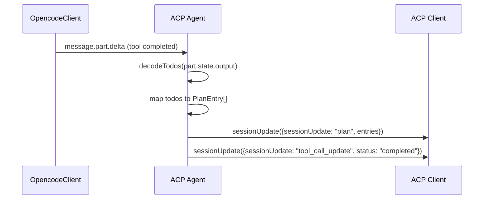
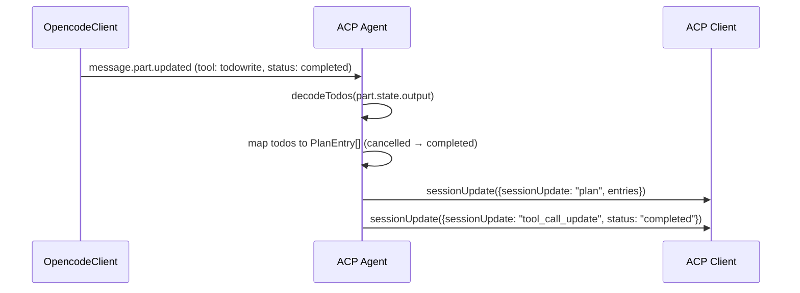
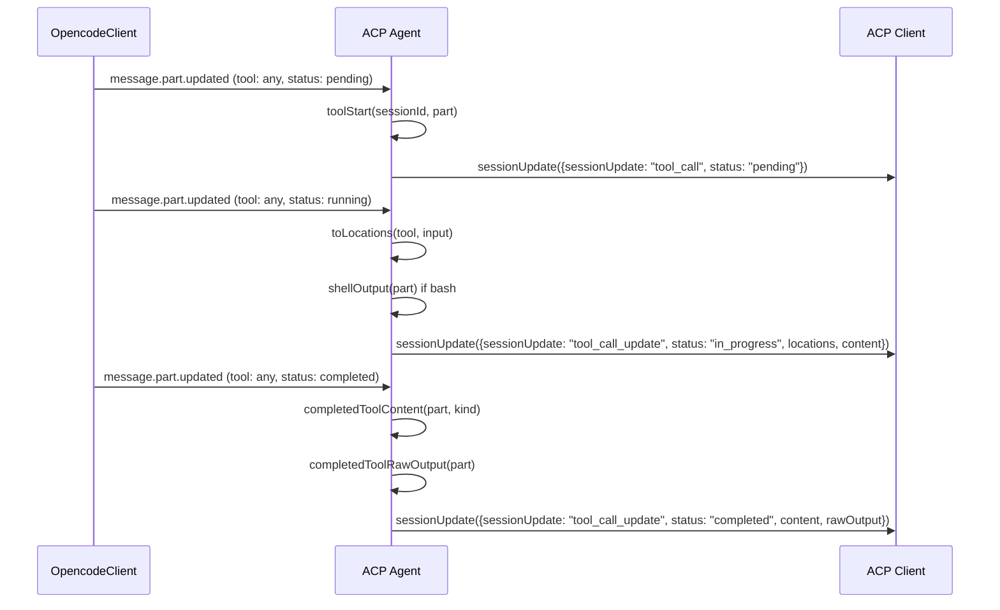

# DeepWiki Q&A with Code Context for Repository: sst/opencode
## Q1
Does opencode support a todo write tool and plan visualization with tasks through ACP?
### Answer
Yes, OpenCode supports the `todowrite` tool and plan visualization with tasks through ACP. opencode:349-374

## Implementation Details

### TodoWrite Tool
The `todowrite` tool is available in OpenCode's tool system and is used to manage task lists during coding sessions. opencode:1-57

### ACP Integration
When the `todowrite` tool completes through ACP, the system:

1. **Parses the output** of the `todowrite` tool using `decodeTodos()` opencode:350-351
2. **Sends a session update** to the ACP client with `sessionUpdate: "plan"` opencode:352-367
3. **Transforms the todos** into plan entries with:
   - `priority`: "medium"
   - `status`: mapped from the todo state (cancelled → completed)
   - `content`: the todo content opencode:357-365

### ACP Support
OpenCode works the same through ACP as in the terminal, including all built-in tools like `todowrite`. opencode:145-156

## Notes
The ACP implementation for `todowrite` is found in two places in `agent.ts` (lines 349-374 and 833-858), suggesting that plan handling is done both in message processing and in tool part processing.

Wiki pages you might want to explore:
- [Tool System (sst/opencode)](/wiki/sst/opencode#5)
- [Command-Line Interface (CLI) (sst/opencode)](/wiki/sst/opencode#6.1)
### Citations
**File:** packages/opencode/src/acp/agent.ts (L349-374)
```typescript
              if (part.tool === "todowrite") {
                const parsedTodos = decodeTodos(part.state.output)
                if (Result.isSuccess(parsedTodos)) {
                  await this.connection
                    .sessionUpdate({
                      sessionId,
                      update: {
                        sessionUpdate: "plan",
                        entries: parsedTodos.success.map((todo) => {
                          const status: PlanEntry["status"] =
                            todo.status === "cancelled" ? "completed" : (todo.status as PlanEntry["status"])
                          return {
                            priority: "medium",
                            status,
                            content: todo.content,
                          }
                        }),
                      },
                    })
                    .catch((error) => {
                      log.error("failed to send session update for todo", { error })
                    })
                } else {
                  log.error("failed to parse todo output", { error: parsedTodos.failure })
                }
              }
```
**File:** packages/opencode/src/tool/registry.ts (L1-57)
```typescript
import { PlanExitTool } from "./plan"
import { Session } from "@/session/session"
import { QuestionTool } from "./question"
import { ShellTool } from "./shell"
import { EditTool } from "./edit"
import { GlobTool } from "./glob"
import { GrepTool } from "./grep"
import { ReadTool } from "./read"
import { TaskTool } from "./task"
import { TaskStatusTool } from "./task_status"
import { TodoWriteTool } from "./todo"
import { WebFetchTool } from "./webfetch"
import { WriteTool } from "./write"
import { InvalidTool } from "./invalid"
import { SkillTool } from "./skill"
import * as Tool from "./tool"
import { Config } from "@/config/config"
import { type ToolContext as PluginToolContext, type ToolDefinition } from "@opencode-ai/plugin"
import type { JSONSchema7, JSONSchema7Definition } from "@ai-sdk/provider"
import { Schema } from "effect"
import z from "zod"
import { Plugin } from "../plugin"
import { Provider } from "@/provider/provider"
import { ProviderID, type ModelID } from "../provider/schema"
import { WebSearchTool } from "./websearch"
import { RepoCloneTool } from "./repo_clone"
import { RepoOverviewTool } from "./repo_overview"
import { RepositoryCache } from "@/reference/repository-cache"
import * as Log from "@opencode-ai/core/util/log"
import { LspTool } from "./lsp"
import * as Truncate from "./truncate"
import { ApplyPatchTool } from "./apply_patch"
import { Glob } from "@opencode-ai/core/util/glob"
import path from "path"
import { pathToFileURL } from "url"
import { Effect, Layer, Context } from "effect"
import { FetchHttpClient, HttpClient } from "effect/unstable/http"
import { ChildProcessSpawner } from "effect/unstable/process/ChildProcessSpawner"
import { CrossSpawnSpawner } from "@opencode-ai/core/cross-spawn-spawner"
import { Ripgrep } from "../file/ripgrep"
import { Format } from "../format"
import { InstanceState } from "@/effect/instance-state"
import { EffectBridge } from "@/effect/bridge"
import { Question } from "../question"
import { Todo } from "../session/todo"
import { LSP } from "@/lsp/lsp"
import { Instruction } from "../session/instruction"
import { AppFileSystem } from "@opencode-ai/core/filesystem"
import { Bus } from "../bus"
import { Agent } from "../agent/agent"
import { Git } from "@/git"
import { Skill } from "../skill"
import { Permission } from "@/permission"
import { Reference } from "@/reference/reference"
import { BackgroundJob } from "@/background/job"
import { SessionStatus } from "@/session/status"
import { RuntimeFlags } from "@/effect/runtime-flags"
```
**File:** packages/web/src/content/docs/es/acp.mdx (L145-156)
```text
OpenCode works the same through ACP as in the terminal. All features are supported:

:::note
Some built-in bar commands like `/undo` and `/redo` are not currently supported.
:::

- Built-in tools (file operations, terminal commands, etc.)
- Custom tools and bar commands
- MCP servers configured in your OpenCode configuration
- Project-specific rules from `AGENTS.md`
- Custom formatters and linters
- Agent and permission system.
```
## Q2
I want you to analyze the format of messages sent via ACP to inform about the plan and its updates to an ACP client. Message by message, show me the flow
### Answer
The ACP message flow for informing about the plan and its updates centers on using `sessionUpdate` with type `"plan"` when the `todowrite` tool completes. opencode:349-374

## ACP Message Flow for Plans

### 1. Detection of completed todowrite tool
When a `todowrite` tool reaches the `"completed"` state, the system detects this and processes the output. opencode:343-374

### 2. Output parsing
The tool output is parsed using `decodeTodos()` which converts the JSON string into an array of Todo.Info objects. opencode:349-351

### 3. Plan update sending
A `sessionUpdate` message is sent to the ACP client with the following structure: opencode:352-367

```typescript
{
  sessionId: string,
  update: {
    sessionUpdate: "plan",
    entries: [
      {
        priority: "medium",
        status: "pending" | "in_progress" | "completed",
        content: string
      }
    ]
  }
}
```

### 4. State transformation
Todo states are mapped: `cancelled` → `completed`, other states are kept as-is. opencode:357-365

## Complete Update Flow



## Other Related Update Types
In addition to `"plan"`, the system sends other `sessionUpdate` types: opencode:324-340

- `"tool_call_update"`: for tool progress (in_progress, completed, failed) opencode:324-340
- `"agent_message_chunk"`: for assistant text chunks opencode:464-480
- `"agent_thought_chunk"`: for agent reasoning opencode:483-499

## Notes
Plan handling is implemented in two places in `agent.ts` (lines 349-374 for delta events and 833-858 for complete message processing), enabling real-time updates and history replay. opencode:833-858

Wiki pages you might want to explore:
- [Configuration System (sst/opencode)](/wiki/sst/opencode#3)
- [Command-Line Interface (CLI) (sst/opencode)](/wiki/sst/opencode#6.1)
### Citations
**File:** packages/opencode/src/acp/agent.ts (L324-340)
```typescript
              await this.connection
                .sessionUpdate({
                  sessionId,
                  update: {
                    sessionUpdate: "tool_call_update",
                    toolCallId: part.callID,
                    status: "in_progress",
                    kind: toToolKind(part.tool),
                    title: part.tool,
                    locations: toLocations(part.tool, part.state.input),
                    rawInput: part.state.input,
                    ...(content.length > 0 && { content }),
                  },
                })
                .catch((error) => {
                  log.error("failed to send tool in_progress to ACP", { error })
                })
```
**File:** packages/opencode/src/acp/agent.ts (L343-374)
```typescript
            case "completed": {
              this.toolStarts.delete(part.callID)
              this.shellSnapshots.delete(part.callID)
              const kind = toToolKind(part.tool)
              const content = completedToolContent(part, kind)

              if (part.tool === "todowrite") {
                const parsedTodos = decodeTodos(part.state.output)
                if (Result.isSuccess(parsedTodos)) {
                  await this.connection
                    .sessionUpdate({
                      sessionId,
                      update: {
                        sessionUpdate: "plan",
                        entries: parsedTodos.success.map((todo) => {
                          const status: PlanEntry["status"] =
                            todo.status === "cancelled" ? "completed" : (todo.status as PlanEntry["status"])
                          return {
                            priority: "medium",
                            status,
                            content: todo.content,
                          }
                        }),
                      },
                    })
                    .catch((error) => {
                      log.error("failed to send session update for todo", { error })
                    })
                } else {
                  log.error("failed to parse todo output", { error: parsedTodos.failure })
                }
              }
```
**File:** packages/opencode/src/acp/agent.ts (L464-480)
```typescript
        if (part.type === "text" && props.field === "text" && part.ignored !== true) {
          await this.connection
            .sessionUpdate({
              sessionId,
              update: {
                sessionUpdate: "agent_message_chunk",
                messageId: props.messageID,
                content: {
                  type: "text",
                  text: props.delta,
                },
              },
            })
            .catch((error) => {
              log.error("failed to send text delta to ACP", { error })
            })
          return
```
**File:** packages/opencode/src/acp/agent.ts (L483-499)
```typescript
        if (part.type === "reasoning" && props.field === "text") {
          await this.connection
            .sessionUpdate({
              sessionId,
              update: {
                sessionUpdate: "agent_thought_chunk",
                messageId: props.messageID,
                content: {
                  type: "text",
                  text: props.delta,
                },
              },
            })
            .catch((error) => {
              log.error("failed to send reasoning delta to ACP", { error })
            })
        }
```
**File:** packages/opencode/src/acp/agent.ts (L833-858)
```typescript
            if (part.tool === "todowrite") {
              const parsedTodos = decodeTodos(part.state.output)
              if (Result.isSuccess(parsedTodos)) {
                await this.connection
                  .sessionUpdate({
                    sessionId,
                    update: {
                      sessionUpdate: "plan",
                      entries: parsedTodos.success.map((todo) => {
                        const status: PlanEntry["status"] =
                          todo.status === "cancelled" ? "completed" : (todo.status as PlanEntry["status"])
                        return {
                          priority: "medium",
                          status,
                          content: todo.content,
                        }
                      }),
                    },
                  })
                  .catch((err) => {
                    log.error("failed to send session update for todo", { error: err })
                  })
              } else {
                log.error("failed to parse todo output", { error: parsedTodos.failure })
              }
            }
```
## Q3
I am also interested in the format of messages used to provide the client with information about tool usage, input parameters, file path in read/write/grep tools, their titles, and in the edit tool the lines being edited...
### Answer
The ACP message format for tool information centers on `sessionUpdate` with type `"tool_call_update"`, which includes input parameters, file paths and content specific to the tool type. opencode:324-340

---

## General Format of tool_call_update

### in_progress State
When a tool is executing, the following is sent: opencode:324-340

```typescript
{
  sessionId: string,
  update: {
    sessionUpdate: "tool_call_update",
    toolCallId: string,
    status: "in_progress",
    kind: string,  // tool type
    title: string,  // tool name
    locations: [{ path: string }],  // file paths
    rawInput: Record<string, any>,  // input parameters
    content?: ToolCallContent[]  // optional content
  }
}
```

### completed State
When a tool finishes, the following is sent: opencode:376-392

```typescript
{
  sessionId: string,
  update: {
    sessionUpdate: "tool_call_update",
    toolCallId: string,
    status: "completed",
    kind: string,
    title: string,  // descriptive tool title
    content: ToolCallContent[],  // includes diff for edit
    rawInput: Record<string, any>,
    rawOutput: any  // raw tool output
  }
}
```

## Location Extraction (toLocations)

The `toLocations` function extracts file paths based on the tool type: opencode:1575-1595

| Tool | Field Used | Example |
|------|-----------|---------|
| `read`, `edit`, `write` | `input.filePath` | `[{ path: "/tmp/example.txt" }]` |
| `glob`, `grep` | `input.path` | `[{ path: "/src" }]` |
| `repo_clone`, `repo_overview` | `input.path` | `[{ path: "/repo" }]` |
| `bash` | - | `[]` (no locations) |

## Tool-Specific Content

### edit Tool
For `edit`, `completedToolContent` adds a `diff` block with edited line information: opencode:1597-1630

```typescript
content.push({
  type: "diff",
  path: filePath,  // file path
  oldText: input.oldString,  // original text
  newText: input.newString || input.content  // new text
})
```

### Other Tools
For tools that are not `edit`, the content is just text: opencode:1600-1608

```typescript
{
  type: "content",
  content: {
    type: "text",
    text: part.state.output  // tool output
  }
}
```

## Examples by Tool Type

### read
```typescript
{
  sessionUpdate: "tool_call_update",
  toolCallId: "call_read",
  status: "in_progress",
  kind: "read",
  title: "read",
  locations: [{ path: input.filePath }],
  rawInput: { filePath: "/tmp/example.txt", offset: 0, limit: 100 }
}
```

### write
```typescript
{
  sessionUpdate: "tool_call_update",
  toolCallId: "call_write",
  status: "completed",
  kind: "write",
  title: "src/main.ts",  // relative file path
  locations: [{ path: input.filePath }],
  rawInput: { filePath: "/src/main.ts", content: "..." },
  rawOutput: { title: "src/main.ts", metadata: { filepath, diagnostics } }
}
```

### grep
```typescript
{
  sessionUpdate: "tool_call_update",
  toolCallId: "call_grep",
  status: "in_progress",
  kind: "grep",
  title: "grep",
  locations: [{ path: input.path }],
  rawInput: { path: "/src", pattern: "function", include: "*.ts" }
}
```

### edit
```typescript
{
  sessionUpdate: "tool_call_update",
  toolCallId: "call_edit",
  status: "completed",
  kind: "edit",
  title: "src/utils.ts",
  locations: [{ path: input.filePath }],
  rawInput: { filePath: "/src/utils.ts", oldString: "...", newString: "..." },
  content: [
    { type: "content", content: { type: "text", text: "Edit successful" } },
    { type: "diff", path: "/src/utils.ts", oldText: "...", newText: "..." }
  ]
}
```

## Notes
The `toToolKind` function converts tool names to standardized ACP types, and `completedToolRawOutput` provides the full raw output including metadata and attachments (images, files). opencode:346-347

Wiki pages you might want to explore:
- [Tool System (sst/opencode)](/wiki/sst/opencode#5)
- [Command-Line Interface (CLI) (sst/opencode)](/wiki/sst/opencode#6.1)
### Citations
**File:** packages/opencode/src/acp/agent.ts (L324-340)
```typescript
              await this.connection
                .sessionUpdate({
                  sessionId,
                  update: {
                    sessionUpdate: "tool_call_update",
                    toolCallId: part.callID,
                    status: "in_progress",
                    kind: toToolKind(part.tool),
                    title: part.tool,
                    locations: toLocations(part.tool, part.state.input),
                    rawInput: part.state.input,
                    ...(content.length > 0 && { content }),
                  },
                })
                .catch((error) => {
                  log.error("failed to send tool in_progress to ACP", { error })
                })
```
**File:** packages/opencode/src/acp/agent.ts (L346-347)
```typescript
              const kind = toToolKind(part.tool)
              const content = completedToolContent(part, kind)
```
**File:** packages/opencode/src/acp/agent.ts (L376-392)
```typescript
              await this.connection
                .sessionUpdate({
                  sessionId,
                  update: {
                    sessionUpdate: "tool_call_update",
                    toolCallId: part.callID,
                    status: "completed",
                    kind,
                    content,
                    title: part.state.title,
                    rawInput: part.state.input,
                    rawOutput: completedToolRawOutput(part),
                  },
                })
                .catch((error) => {
                  log.error("failed to send tool completed to ACP", { error })
                })
```
**File:** packages/opencode/src/acp/agent.ts (L1575-1595)
```typescript
function toLocations(toolName: string, input: Record<string, any>): { path: string }[] {
  const tool = toolName.toLocaleLowerCase()

  switch (tool) {
    case "read":
    case "edit":
    case "write":
      return input["filePath"] ? [{ path: input["filePath"] }] : []
    case "glob":
    case "grep":
      return input["path"] ? [{ path: input["path"] }] : []
    case "repo_clone":
      return input["path"] ? [{ path: input["path"] }] : []
    case "repo_overview":
      return input["path"] ? [{ path: input["path"] }] : []
    case ShellID.ToolID:
      return []
    default:
      return []
  }
}
```
**File:** packages/opencode/src/acp/agent.ts (L1597-1630)
```typescript
function completedToolContent(part: ToolPart, kind: ToolKind): ToolCallContent[] {
  if (part.state.status !== "completed") return []

  const content: ToolCallContent[] = [
    {
      type: "content",
      content: {
        type: "text",
        text: part.state.output,
      },
    },
  ]

  if (kind === "edit") {
    const input = part.state.input
    const filePath = typeof input["filePath"] === "string" ? input["filePath"] : ""
    const oldText = typeof input["oldString"] === "string" ? input["oldString"] : ""
    const newText =
      typeof input["newString"] === "string"
        ? input["newString"]
        : typeof input["content"] === "string"
          ? input["content"]
          : ""
    content.push({
      type: "diff",
      path: filePath,
      oldText,
      newText,
    })
  }

  content.push(...imageContents(part.state.attachments ?? []))
  return content
}
```
## Q4
Generate a complete listing of ACP message types and the format of each one, as well as the call flow for sending the plan and tool call information
### Answer
Based on the code in `packages/opencode/src/acp/agent.ts`, here is the complete listing of ACP message types and their formats:

---

## ACP Message Types

### 1. tool_call
Sent when a tool is first initiated (pending state). opencode:1042-1061

```typescript
{
  sessionId: string,
  update: {
    sessionUpdate: "tool_call",
    toolCallId: string,
    title: string,  // tool name
    kind: string,   // tool type
    status: "pending",
    locations: [],  // always empty at start
    rawInput: {}    // always empty at start
  }
}
```

### 2. tool_call_update
Tool state updates during execution. opencode:324-340

#### in_progress State
```typescript
{
  sessionId: string,
  update: {
    sessionUpdate: "tool_call_update",
    toolCallId: string,
    status: "in_progress",
    kind: string,
    title: string,
    locations: [{ path: string }],  // file paths
    rawInput: Record<string, any>,
    content?: ToolCallContent[]  // optional, for real-time output
  }
}
```

#### completed State
```typescript
{
  sessionId: string,
  update: {
    sessionUpdate: "tool_call_update",
    toolCallId: string,
    status: "completed",
    kind: string,
    title: string,
    content: ToolCallContent[],  // includes diff for edit
    rawInput: Record<string, any>,
    rawOutput: any
  }
}
```

#### failed State
```typescript
{
  sessionId: string,
  update: {
    sessionUpdate: "tool_call_update",
    toolCallId: string,
    status: "failed",
    kind: string,
    title: string,
    rawInput: Record<string, any>,
    content: [{ type: "content", content: { type: "text", text: string } }],
    rawOutput: { error: string, metadata: any }
  }
}
```

### 3. plan
Plan update when the `todowrite` tool completes. opencode:352-367

```typescript
{
  sessionId: string,
  update: {
    sessionUpdate: "plan",
    entries: [
      {
        priority: "medium",
        status: "pending" | "in_progress" | "completed",
        content: string
      }
    ]
  }
}
```

### 4. agent_message_chunk
Assistant text chunks in real time. opencode:464-480

```typescript
{
  sessionId: string,
  update: {
    sessionUpdate: "agent_message_chunk",
    messageId: string,
    content: {
      type: "text",
      text: string  // text delta
    }
  }
}
```

### 5. agent_thought_chunk
Agent reasoning in real time. opencode:483-499

```typescript
{
  sessionId: string,
  update: {
    sessionUpdate: "agent_thought_chunk",
    messageId: string,
    content: {
      type: "text",
      text: string  // reasoning delta
    }
  }
}
```

### 6. user_message_chunk
User text chunks (used in history replay). opencode:914-926

```typescript
{
  sessionId: string,
  update: {
    sessionUpdate: "user_message_chunk",
    messageId: string,
    content: {
      type: "text",
      text: string,
      annotations?: { audience: Role[] }  // optional
    }
  }
}
```

### 7. available_commands_update
Update of available commands after session initialization. opencode:1186-1193

```typescript
{
  sessionId: string,
  update: {
    sessionUpdate: "available_commands_update",
    availableCommands: string[]  // list of available commands
  }
}
```

---

## Call Flow for Plan Sending



The flow is implemented in two places: opencode:349-374 for real-time events and opencode:833-858 for history replay.

---

## Call Flow for Tool Information



### Helper Function Details

**toLocations**: Extracts file paths based on tool type. opencode:1575-1595

**completedToolContent**: Generates tool-specific content (diff for edit). opencode:1597-1630

**toolStart**: Sends the initial `tool_call` message with pending state. opencode:1042-1061

## Notes
Messages of type `resource_link`, `image` and `resource` are sent within `agent_message_chunk` or `user_message_chunk` for file attachments. opencode:931-1010

Wiki pages you might want to explore:
- [Command-Line Interface (CLI) (sst/opencode)](/wiki/sst/opencode#6.1)
### Citations
**File:** packages/opencode/src/acp/agent.ts (L324-340)
```typescript
              await this.connection
                .sessionUpdate({
                  sessionId,
                  update: {
                    sessionUpdate: "tool_call_update",
                    toolCallId: part.callID,
                    status: "in_progress",
                    kind: toToolKind(part.tool),
                    title: part.tool,
                    locations: toLocations(part.tool, part.state.input),
                    rawInput: part.state.input,
                    ...(content.length > 0 && { content }),
                  },
                })
                .catch((error) => {
                  log.error("failed to send tool in_progress to ACP", { error })
                })
```
**File:** packages/opencode/src/acp/agent.ts (L349-374)
```typescript
              if (part.tool === "todowrite") {
                const parsedTodos = decodeTodos(part.state.output)
                if (Result.isSuccess(parsedTodos)) {
                  await this.connection
                    .sessionUpdate({
                      sessionId,
                      update: {
                        sessionUpdate: "plan",
                        entries: parsedTodos.success.map((todo) => {
                          const status: PlanEntry["status"] =
                            todo.status === "cancelled" ? "completed" : (todo.status as PlanEntry["status"])
                          return {
                            priority: "medium",
                            status,
                            content: todo.content,
                          }
                        }),
                      },
                    })
                    .catch((error) => {
                      log.error("failed to send session update for todo", { error })
                    })
                } else {
                  log.error("failed to parse todo output", { error: parsedTodos.failure })
                }
              }
```
**File:** packages/opencode/src/acp/agent.ts (L464-480)
```typescript
        if (part.type === "text" && props.field === "text" && part.ignored !== true) {
          await this.connection
            .sessionUpdate({
              sessionId,
              update: {
                sessionUpdate: "agent_message_chunk",
                messageId: props.messageID,
                content: {
                  type: "text",
                  text: props.delta,
                },
              },
            })
            .catch((error) => {
              log.error("failed to send text delta to ACP", { error })
            })
          return
```
**File:** packages/opencode/src/acp/agent.ts (L483-499)
```typescript
        if (part.type === "reasoning" && props.field === "text") {
          await this.connection
            .sessionUpdate({
              sessionId,
              update: {
                sessionUpdate: "agent_thought_chunk",
                messageId: props.messageID,
                content: {
                  type: "text",
                  text: props.delta,
                },
              },
            })
            .catch((error) => {
              log.error("failed to send reasoning delta to ACP", { error })
            })
        }
```
**File:** packages/opencode/src/acp/agent.ts (L833-858)
```typescript
            if (part.tool === "todowrite") {
              const parsedTodos = decodeTodos(part.state.output)
              if (Result.isSuccess(parsedTodos)) {
                await this.connection
                  .sessionUpdate({
                    sessionId,
                    update: {
                      sessionUpdate: "plan",
                      entries: parsedTodos.success.map((todo) => {
                        const status: PlanEntry["status"] =
                          todo.status === "cancelled" ? "completed" : (todo.status as PlanEntry["status"])
                        return {
                          priority: "medium",
                          status,
                          content: todo.content,
                        }
                      }),
                    },
                  })
                  .catch((err) => {
                    log.error("failed to send session update for todo", { error: err })
                  })
              } else {
                log.error("failed to parse todo output", { error: parsedTodos.failure })
              }
            }
```
**File:** packages/opencode/src/acp/agent.ts (L914-926)
```typescript
          await this.connection
            .sessionUpdate({
              sessionId,
              update: {
                sessionUpdate: message.info.role === "user" ? "user_message_chunk" : "agent_message_chunk",
                messageId: message.info.id,
                content: {
                  type: "text",
                  text: part.text,
                  ...(audience && { annotations: { audience } }),
                },
              },
            })
```
**File:** packages/opencode/src/acp/agent.ts (L931-1010)
```typescript
      } else if (part.type === "file") {
        // Replay file attachments as appropriate ACP content blocks.
        // OpenCode stores files internally as { type: "file", url, filename, mime }.
        // We convert these back to ACP blocks based on the URL scheme and MIME type:
        // - file:// URLs → resource_link
        // - data: URLs with image/* → image block
        // - data: URLs with text/* or application/json → resource with text
        // - data: URLs with other types → resource with blob
        const url = part.url
        const filename = part.filename ?? "file"
        const mime = part.mime || "application/octet-stream"
        const messageChunk = message.info.role === "user" ? "user_message_chunk" : "agent_message_chunk"

        if (url.startsWith("file://")) {
          // Local file reference - send as resource_link
          await this.connection
            .sessionUpdate({
              sessionId,
              update: {
                sessionUpdate: messageChunk,
                messageId: message.info.id,
                content: { type: "resource_link", uri: url, name: filename, mimeType: mime },
              },
            })
            .catch((err) => {
              log.error("failed to send resource_link to ACP", { error: err })
            })
        } else if (url.startsWith("data:")) {
          // Embedded content - parse data URL and send as appropriate block type
          const base64Match = url.match(/^data:([^;]+);base64,(.*)$/)
          const dataMime = base64Match?.[1]
          const base64Data = base64Match?.[2] ?? ""

          const effectiveMime = dataMime || mime

          if (effectiveMime.startsWith("image/")) {
            // Image - send as image block
            await this.connection
              .sessionUpdate({
                sessionId,
                update: {
                  sessionUpdate: messageChunk,
                  messageId: message.info.id,
                  content: {
                    type: "image",
                    mimeType: effectiveMime,
                    data: base64Data,
                    uri: pathToFileURL(filename).href,
                  },
                },
              })
              .catch((err) => {
                log.error("failed to send image to ACP", { error: err })
              })
          } else {
            // Non-image: text types get decoded, binary types stay as blob
            const isText = effectiveMime.startsWith("text/") || effectiveMime === "application/json"
            const fileUri = pathToFileURL(filename).href
            const resource = isText
              ? {
                  uri: fileUri,
                  mimeType: effectiveMime,
                  text: Buffer.from(base64Data, "base64").toString("utf-8"),
                }
              : { uri: fileUri, mimeType: effectiveMime, blob: base64Data }

            await this.connection
              .sessionUpdate({
                sessionId,
                update: {
                  sessionUpdate: messageChunk,
                  messageId: message.info.id,
                  content: { type: "resource", resource },
                },
              })
              .catch((err) => {
                log.error("failed to send resource to ACP", { error: err })
              })
          }
        }
```
**File:** packages/opencode/src/acp/agent.ts (L1042-1061)
```typescript
  private async toolStart(sessionId: string, part: ToolPart) {
    if (this.toolStarts.has(part.callID)) return
    this.toolStarts.add(part.callID)
    await this.connection
      .sessionUpdate({
        sessionId,
        update: {
          sessionUpdate: "tool_call",
          toolCallId: part.callID,
          title: part.tool,
          kind: toToolKind(part.tool),
          status: "pending",
          locations: [],
          rawInput: {},
        },
      })
      .catch((error) => {
        log.error("failed to send tool pending to ACP", { error })
      })
  }
```
**File:** packages/opencode/src/acp/agent.ts (L1186-1193)
```typescript
      void this.connection.sessionUpdate({
        sessionId,
        update: {
          sessionUpdate: "available_commands_update",
          availableCommands,
        },
      })
    }, 0)
```
**File:** packages/opencode/src/acp/agent.ts (L1575-1595)
```typescript
function toLocations(toolName: string, input: Record<string, any>): { path: string }[] {
  const tool = toolName.toLocaleLowerCase()

  switch (tool) {
    case "read":
    case "edit":
    case "write":
      return input["filePath"] ? [{ path: input["filePath"] }] : []
    case "glob":
    case "grep":
      return input["path"] ? [{ path: input["path"] }] : []
    case "repo_clone":
      return input["path"] ? [{ path: input["path"] }] : []
    case "repo_overview":
      return input["path"] ? [{ path: input["path"] }] : []
    case ShellID.ToolID:
      return []
    default:
      return []
  }
}
```
**File:** packages/opencode/src/acp/agent.ts (L1597-1630)
```typescript
function completedToolContent(part: ToolPart, kind: ToolKind): ToolCallContent[] {
  if (part.state.status !== "completed") return []

  const content: ToolCallContent[] = [
    {
      type: "content",
      content: {
        type: "text",
        text: part.state.output,
      },
    },
  ]

  if (kind === "edit") {
    const input = part.state.input
    const filePath = typeof input["filePath"] === "string" ? input["filePath"] : ""
    const oldText = typeof input["oldString"] === "string" ? input["oldString"] : ""
    const newText =
      typeof input["newString"] === "string"
        ? input["newString"]
        : typeof input["content"] === "string"
          ? input["content"]
          : ""
    content.push({
      type: "diff",
      path: filePath,
      oldText,
      newText,
    })
  }

  content.push(...imageContents(part.state.attachments ?? []))
  return content
}
```
