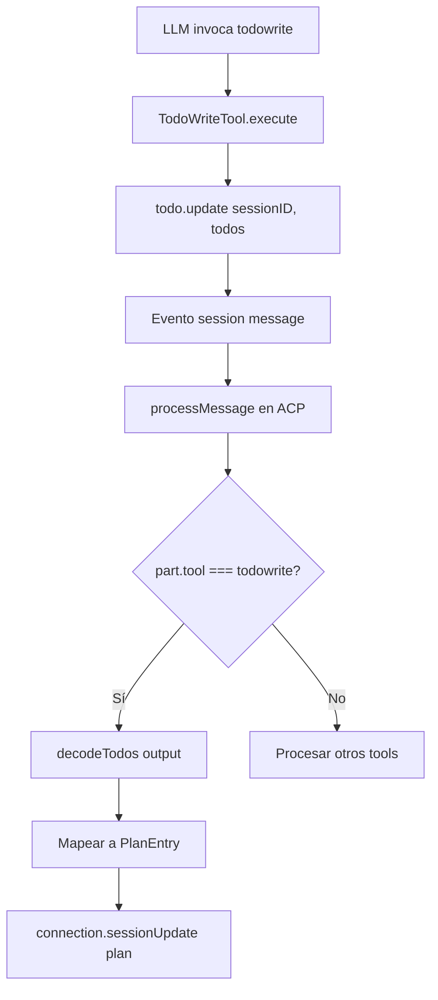
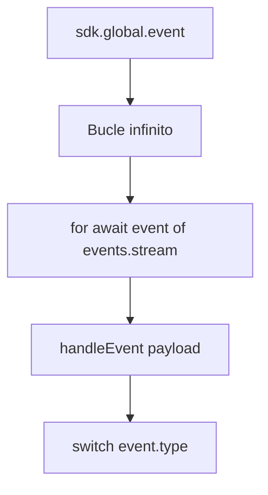
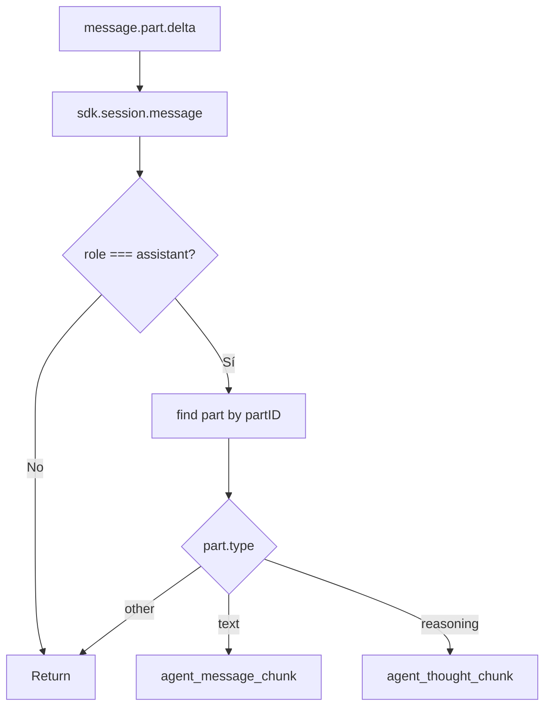
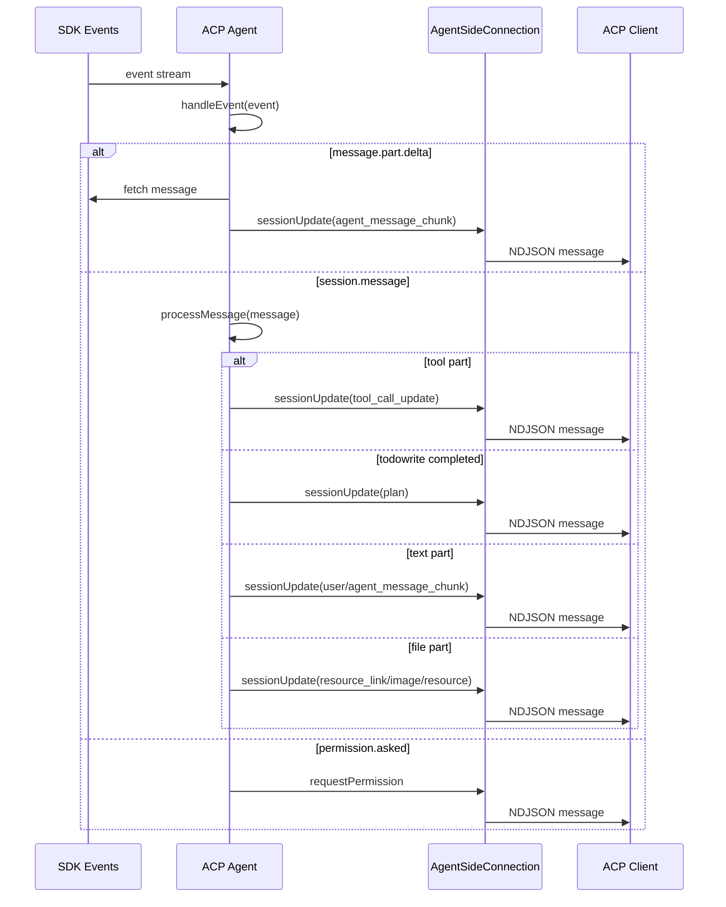

# DeepWiki Q&A with Code Context for Repository: sst/opencode
## Q1
analiza y muéstrame cómo funciona el flujo de la herramienta todowrite y cómo expone el plan y actualizaciones del mismo a través del modo ACP
### Answer
# Flujo de la herramienta todowrite y exposición a través de ACP

## Resumen

La herramienta `todowrite` permite al LLM gestionar listas de tareas durante sesiones de codificación. Cuando se usa en modo ACP (Agent Client Protocol), las tareas se convierten automáticamente en entradas de plan que se exponen al cliente ACP a través de actualizaciones de sesión. opencode:25-57 

## Implementación de la herramienta todowrite

### Definición y parámetros

La herramienta `TodoWriteTool` se define en `packages/opencode/src/tool/todo.ts` y utiliza un esquema de parámetros que incluye un array de items todo con contenido, estado y prioridad. opencode:9-19 

### Ejecución de la herramienta

Cuando el LLM invoca `todowrite`, la herramienta:
1. Solicita permiso con `ctx.ask` para la acción `todowrite` opencode:35-40 
2. Actualiza el estado de todos mediante `todo.update` con el sessionID y los nuevos todos opencode:42-45 
3. Retorna los todos actualizados como metadata opencode:47-53 

## Integración con ACP

### Detección de completación de todowrite

En el agente ACP (`packages/opencode/src/acp/agent.ts`), cuando se procesa un mensaje con partes de tipo `tool`, el sistema verifica si el tool es `todowrite` y si su estado es `completed`. opencode:343-374 

### Conversión a plan ACP

Cuando se detecta un `todowrite` completado:
1. Se parsea el output usando `decodeTodos` opencode:350-351 
2. Se mapea cada todo a una entrada `PlanEntry` con:
   - `priority`: "medium" (fijo)
   - `status`: convertido del estado del todo (cancelled → completed)
   - `content`: el contenido del todo opencode:357-365 
3. Se envía al cliente ACP mediante `connection.sessionUpdate` con tipo `sessionUpdate: "plan"` opencode:352-367 

### Flujo completo en ACP



## Exposición en UI TUI

### Visualización en TUI

En la interfaz TUI, los todos se muestran de dos formas:
1. **Estado completado**: Muestra un bloque con la lista de todos y sus iconos de estado opencode:967-978 
2. **Estado pendiente**: Muestra un indicador inline "Updating todos..." opencode:980-985 

### Instrucciones al LLM

El sistema prompt instruye al LLM a usar `todowrite` frecuentemente para gestionar tareas y dar visibilidad al usuario sobre el progreso. opencode:23-27 

## Notas

- La herramienta `todowrite` está deshabilitada por defecto para subagentes pero puede habilitarse manualmente opencode:232-234 
- En modo ACP, los todos se convierten a planes con prioridad fija "medium" independientemente de la prioridad original opencode:361-364 
- El estado "cancelled" se convierte a "completed" en el plan ACP opencode:358-359 

Wiki pages you might want to explore:
- [Glossary (sst/opencode)](/wiki/sst/opencode#11)
- [Command-Line Interface (CLI) (sst/opencode)](/wiki/sst/opencode#6.1)
- [Shared App Package (sst/opencode)](/wiki/sst/opencode#6.12)
### Citations
**File:** packages/opencode/src/tool/todo.ts (L9-19)
```typescript
const TodoItem = Schema.Struct({
  content: Schema.String.annotate({ description: "Brief description of the task" }),
  status: Schema.String.annotate({
    description: "Current status of the task: pending, in_progress, completed, cancelled",
  }),
  priority: Schema.String.annotate({ description: "Priority level of the task: high, medium, low" }),
})

export const Parameters = Schema.Struct({
  todos: Schema.mutable(Schema.Array(TodoItem)).annotate({ description: "The updated todo list" }),
})
```
**File:** packages/opencode/src/tool/todo.ts (L25-57)
```typescript
export const TodoWriteTool = Tool.define<typeof Parameters, Metadata, Todo.Service>(
  "todowrite",
  Effect.gen(function* () {
    const todo = yield* Todo.Service

    return {
      description: DESCRIPTION_WRITE,
      parameters: Parameters,
      execute: (params: Schema.Schema.Type<typeof Parameters>, ctx: Tool.Context<Metadata>) =>
        Effect.gen(function* () {
          yield* ctx.ask({
            permission: "todowrite",
            patterns: ["*"],
            always: ["*"],
            metadata: {},
          })

          yield* todo.update({
            sessionID: ctx.sessionID,
            todos: params.todos,
          })

          return {
            title: `${params.todos.filter((x) => x.status !== "completed").length} todos`,
            output: JSON.stringify(params.todos, null, 2),
            metadata: {
              todos: params.todos,
            },
          }
        }),
    } satisfies Tool.DefWithoutID<typeof Parameters, Metadata>
  }),
)
```
**File:** packages/opencode/src/acp/agent.ts (L343-374)
```typescript
            case "completed": {
              this.toolStarts.delete(part.callID)
              this.shellSnapshots.delete(part.callID)
              const kind = toToolKind(part.tool)
              const content = completedToolContent(part, kind)

              if (part.tool === "todowrite") {
                const parsedTodos = decodeTodos(part.state.output)
                if (Result.isSuccess(parsedTodos)) {
                  await this.connection
                    .sessionUpdate({
                      sessionId,
                      update: {
                        sessionUpdate: "plan",
                        entries: parsedTodos.success.map((todo) => {
                          const status: PlanEntry["status"] =
                            todo.status === "cancelled" ? "completed" : (todo.status as PlanEntry["status"])
                          return {
                            priority: "medium",
                            status,
                            content: todo.content,
                          }
                        }),
                      },
                    })
                    .catch((error) => {
                      log.error("failed to send session update for todo", { error })
                    })
                } else {
                  log.error("failed to parse todo output", { error: parsedTodos.failure })
                }
              }
```
**File:** packages/opencode/src/cli/cmd/tui/feature-plugins/system/session-v2.tsx (L967-978)
```typescript
      <Match when={todos().length > 0 && props.part.state.status === "completed"}>
        <BlockTool title="# Todos" part={props.part}>
          <box>
            <For each={todos()}>
              {(todo) => (
                <text fg={theme.text}>
                  {todoIcon(stringValue(todo.status))} {stringValue(todo.content)}
                </text>
              )}
            </For>
          </box>
        </BlockTool>
```
**File:** packages/opencode/src/cli/cmd/tui/feature-plugins/system/session-v2.tsx (L980-985)
```typescript
      <Match when={true}>
        <InlineTool icon="⚙" pending="Updating todos..." complete={false} part={props.part}>
          Updating todos...
        </InlineTool>
      </Match>
    </Switch>
```
**File:** packages/opencode/src/session/prompt/anthropic.txt (L23-27)
```text
# Task Management
You have access to the TodoWrite tools to help you manage and plan tasks. Use these tools VERY frequently to ensure that you are tracking your tasks and giving the user visibility into your progress.
These tools are also EXTREMELY helpful for planning tasks, and for breaking down larger complex tasks into smaller steps. If you do not use this tool when planning, you may forget to do important tasks - and that is unacceptable.

It is critical that you mark todos as completed as soon as you are done with a task. Do not batch up multiple tasks before marking them as completed.
```
**File:** packages/web/src/content/docs/tools.mdx (L232-234)
```text
:::note
This tool is disabled for subagents by default, but you can enable it manually. [Learn more](/docs/agents/#permissions)
:::
```
## Q2
Describe también el tipo de mensajes ACP que se envían y el flujo de envío de estos mensajes
### Answer
# Tipos de mensajes ACP y flujo de envío

## Resumen

El sistema ACP envía múltiples tipos de mensajes a través de `connection.sessionUpdate()` para mantener sincronizado al cliente con el estado del agente. Estos mensajes se generan a partir de eventos del SDK y se procesan en el agente ACP antes de ser enviados al cliente. opencode:173-188 

## Tipos de mensajes ACP enviados

### Actualizaciones de sesión

| Tipo de mensaje | Propósito | Ubicación |
|---|---|---|
| `plan` | Actualización del plan de tareas (desde todowrite) | opencode:836-849  |
| `tool_call_update` | Estado de ejecución de herramientas (pending, running, completed, failed) | opencode:809-822  |
| `agent_message_chunk` | Chunks de texto del mensaje del agente | opencode:465-476  |
| `agent_thought_chunk` | Chunks de razonamiento del agente | opencode:484-495  |
| `user_message_chunk` | Chunks de texto del mensaje del usuario | opencode:914-926  |
| `usage_update` | Actualización de uso de tokens y costos | opencode:117-126  |
| `available_commands_update` | Actualización de comandos disponibles | opencode:1186-1192  |

## Flujo de envío de mensajes

### Suscripción a eventos del SDK

El agente ACP se suscribe a eventos globales del SDK mediante `sdk.global.event()` en un bucle infinito que procesa eventos a medida que llegan. opencode:173-188 



### Procesamiento de eventos y envío de actualizaciones

El método `handleEvent` procesa diferentes tipos de eventos y envía las actualizaciones correspondientes al cliente ACP. opencode:190-192 

#### Evento `message.part.delta`

Cuando se recibe un delta de parte de mensaje, el sistema:
1. Obtiene el mensaje completo del SDK
2. Identifica la parte específica que cambió
3. Envía el chunk apropiado según el tipo de parte y campo opencode:438-501 



#### Evento `session.message`

Para mensajes completos, el sistema procesa cada parte del mensaje y envía actualizaciones según el tipo de parte. opencode:785-832 

**Partes de tipo `tool`:**
- Estado `pending`: limpia snapshots de shell
- Estado `running`: envía `tool_call_update` con estado `in_progress` opencode:809-822 
- Estado `completed`: envía `tool_call_update` con estado `completed` o `plan` si es `todowrite` opencode:827-849 
- Estado `failed`: envía `tool_call_update` con estado `failed` opencode:881-905 

**Partes de tipo `text`:**
Envía `user_message_chunk` o `agent_message_chunk` según el rol del mensaje opencode:911-930 

**Partes de tipo `file`:**
Convierte archivos a bloques ACP apropiados (`resource_link`, `image`, `resource`) opencode:931-1010 

**Partes de tipo `reasoning`:**
Envía `agent_thought_chunk` con el texto de razonamiento opencode:1012-1029 

### Envío de actualizaciones de uso

La función `sendUsageUpdate` calcula el uso de tokens y costos, luego envía una actualización al cliente ACP. opencode:82-130 

## Flujo completo de envío de mensajes



## Notas

- Todos los mensajes se envían a través de `connection.sessionUpdate()` que utiliza el protocolo NDJSON sobre stdin/stdout opencode:33-61 
- Los errores de envío se capturan y registran pero no interrumpen el flujo del agente opencode:823-825 
- El sistema maneja múltiples sesiones simultáneamente sin contaminación cruzada de eventos opencode:333-369 

Wiki pages you might want to explore:
- [Command-Line Interface (CLI) (sst/opencode)](/wiki/sst/opencode#6.1)
### Citations
**File:** packages/opencode/src/acp/agent.ts (L82-130)
```typescript
async function sendUsageUpdate(
  connection: AgentSideConnection,
  sdk: OpencodeClient,
  sessionID: string,
  directory: string,
): Promise<void> {
  const messages = await sdk.session
    .messages({ sessionID, directory }, { throwOnError: true })
    .then((x) => x.data)
    .catch((error) => {
      log.error("failed to fetch messages for usage update", { error })
      return undefined
    })

  if (!messages) return

  const assistantMessages = messages.filter(
    (m): m is { info: AssistantMessage; parts: SessionMessageResponse["parts"] } => m.info.role === "assistant",
  )

  const lastAssistant = assistantMessages[assistantMessages.length - 1]
  if (!lastAssistant) return

  const msg = lastAssistant.info
  if (!msg.providerID || !msg.modelID) return
  const size = await getContextLimit(sdk, ProviderID.make(msg.providerID), ModelID.make(msg.modelID), directory)

  if (!size) {
    // Cannot calculate usage without known context size
    return
  }

  const used = msg.tokens.input + (msg.tokens.cache?.read ?? 0)
  const totalCost = assistantMessages.reduce((sum, m) => sum + m.info.cost, 0)

  await connection
    .sessionUpdate({
      sessionId: sessionID,
      update: {
        sessionUpdate: "usage_update",
        used,
        size,
        cost: { amount: totalCost, currency: "USD" },
      },
    })
    .catch((error) => {
      log.error("failed to send usage update", { error })
    })
}
```
**File:** packages/opencode/src/acp/agent.ts (L173-188)
```typescript
  private async runEventSubscription() {
    while (true) {
      if (this.eventAbort.signal.aborted) return
      const events = await this.sdk.global.event({
        signal: this.eventAbort.signal,
      })
      for await (const event of events.stream) {
        if (this.eventAbort.signal.aborted) return
        const payload = event?.payload
        if (!payload) continue
        await this.handleEvent(payload as Event).catch((error) => {
          log.error("failed to handle event", { error, type: payload.type })
        })
      }
    }
  }
```
**File:** packages/opencode/src/acp/agent.ts (L190-192)
```typescript
  private async handleEvent(event: Event) {
    switch (event.type) {
      case "permission.asked": {
```
**File:** packages/opencode/src/acp/agent.ts (L438-501)
```typescript
      case "message.part.delta": {
        const props = event.properties
        const session = this.sessionManager.tryGet(props.sessionID)
        if (!session) return
        const sessionId = session.id

        const message = await this.sdk.session
          .message(
            {
              sessionID: props.sessionID,
              messageID: props.messageID,
              directory: session.cwd,
            },
            { throwOnError: true },
          )
          .then((x) => x.data)
          .catch((error) => {
            log.error("unexpected error when fetching message", { error })
            return undefined
          })

        if (!message || message.info.role !== "assistant") return

        const part = message.parts.find((p) => p.id === props.partID)
        if (!part) return

        if (part.type === "text" && props.field === "text" && part.ignored !== true) {
          await this.connection
            .sessionUpdate({
              sessionId,
              update: {
                sessionUpdate: "agent_message_chunk",
                messageId: props.messageID,
                content: {
                  type: "text",
                  text: props.delta,
                },
              },
            })
            .catch((error) => {
              log.error("failed to send text delta to ACP", { error })
            })
          return
        }

        if (part.type === "reasoning" && props.field === "text") {
          await this.connection
            .sessionUpdate({
              sessionId,
              update: {
                sessionUpdate: "agent_thought_chunk",
                messageId: props.messageID,
                content: {
                  type: "text",
                  text: props.delta,
                },
              },
            })
            .catch((error) => {
              log.error("failed to send reasoning delta to ACP", { error })
            })
        }
        return
      }
```
**File:** packages/opencode/src/acp/agent.ts (L785-849)
```typescript
  private async processMessage(message: SessionMessageResponse) {
    log.debug("process message", message)
    if (message.info.role !== "assistant" && message.info.role !== "user") return
    const sessionId = message.info.sessionID

    for (const part of message.parts) {
      if (part.type === "tool") {
        await this.toolStart(sessionId, part)
        switch (part.state.status) {
          case "pending":
            this.shellSnapshots.delete(part.callID)
            break
          case "running":
            const output = this.shellOutput(part)
            const runningContent: ToolCallContent[] = []
            if (output) {
              runningContent.push({
                type: "content",
                content: {
                  type: "text",
                  text: output,
                },
              })
            }
            await this.connection
              .sessionUpdate({
                sessionId,
                update: {
                  sessionUpdate: "tool_call_update",
                  toolCallId: part.callID,
                  status: "in_progress",
                  kind: toToolKind(part.tool),
                  title: part.tool,
                  locations: toLocations(part.tool, part.state.input),
                  rawInput: part.state.input,
                  ...(runningContent.length > 0 && { content: runningContent }),
                },
              })
              .catch((err) => {
                log.error("failed to send tool in_progress to ACP", { error: err })
              })
            break
          case "completed":
            this.toolStarts.delete(part.callID)
            this.shellSnapshots.delete(part.callID)
            const kind = toToolKind(part.tool)
            const content = completedToolContent(part, kind)

            if (part.tool === "todowrite") {
              const parsedTodos = decodeTodos(part.state.output)
              if (Result.isSuccess(parsedTodos)) {
                await this.connection
                  .sessionUpdate({
                    sessionId,
                    update: {
                      sessionUpdate: "plan",
                      entries: parsedTodos.success.map((todo) => {
                        const status: PlanEntry["status"] =
                          todo.status === "cancelled" ? "completed" : (todo.status as PlanEntry["status"])
                        return {
                          priority: "medium",
                          status,
                          content: todo.content,
                        }
                      }),
```
**File:** packages/opencode/src/acp/agent.ts (L881-905)
```typescript
            await this.connection
              .sessionUpdate({
                sessionId,
                update: {
                  sessionUpdate: "tool_call_update",
                  toolCallId: part.callID,
                  status: "failed",
                  kind: toToolKind(part.tool),
                  title: part.tool,
                  rawInput: part.state.input,
                  content: [
                    {
                      type: "content",
                      content: {
                        type: "text",
                        text: part.state.error,
                      },
                    },
                  ],
                  rawOutput: {
                    error: part.state.error,
                    metadata: part.state.metadata,
                  },
                },
              })
```
**File:** packages/opencode/src/acp/agent.ts (L911-930)
```typescript
      } else if (part.type === "text") {
        if (part.text) {
          const audience: Role[] | undefined = part.synthetic ? ["assistant"] : part.ignored ? ["user"] : undefined
          await this.connection
            .sessionUpdate({
              sessionId,
              update: {
                sessionUpdate: message.info.role === "user" ? "user_message_chunk" : "agent_message_chunk",
                messageId: message.info.id,
                content: {
                  type: "text",
                  text: part.text,
                  ...(audience && { annotations: { audience } }),
                },
              },
            })
            .catch((err) => {
              log.error("failed to send text to ACP", { error: err })
            })
        }
```
**File:** packages/opencode/src/acp/agent.ts (L931-1010)
```typescript
      } else if (part.type === "file") {
        // Replay file attachments as appropriate ACP content blocks.
        // OpenCode stores files internally as { type: "file", url, filename, mime }.
        // We convert these back to ACP blocks based on the URL scheme and MIME type:
        // - file:// URLs → resource_link
        // - data: URLs with image/* → image block
        // - data: URLs with text/* or application/json → resource with text
        // - data: URLs with other types → resource with blob
        const url = part.url
        const filename = part.filename ?? "file"
        const mime = part.mime || "application/octet-stream"
        const messageChunk = message.info.role === "user" ? "user_message_chunk" : "agent_message_chunk"

        if (url.startsWith("file://")) {
          // Local file reference - send as resource_link
          await this.connection
            .sessionUpdate({
              sessionId,
              update: {
                sessionUpdate: messageChunk,
                messageId: message.info.id,
                content: { type: "resource_link", uri: url, name: filename, mimeType: mime },
              },
            })
            .catch((err) => {
              log.error("failed to send resource_link to ACP", { error: err })
            })
        } else if (url.startsWith("data:")) {
          // Embedded content - parse data URL and send as appropriate block type
          const base64Match = url.match(/^data:([^;]+);base64,(.*)$/)
          const dataMime = base64Match?.[1]
          const base64Data = base64Match?.[2] ?? ""

          const effectiveMime = dataMime || mime

          if (effectiveMime.startsWith("image/")) {
            // Image - send as image block
            await this.connection
              .sessionUpdate({
                sessionId,
                update: {
                  sessionUpdate: messageChunk,
                  messageId: message.info.id,
                  content: {
                    type: "image",
                    mimeType: effectiveMime,
                    data: base64Data,
                    uri: pathToFileURL(filename).href,
                  },
                },
              })
              .catch((err) => {
                log.error("failed to send image to ACP", { error: err })
              })
          } else {
            // Non-image: text types get decoded, binary types stay as blob
            const isText = effectiveMime.startsWith("text/") || effectiveMime === "application/json"
            const fileUri = pathToFileURL(filename).href
            const resource = isText
              ? {
                  uri: fileUri,
                  mimeType: effectiveMime,
                  text: Buffer.from(base64Data, "base64").toString("utf-8"),
                }
              : { uri: fileUri, mimeType: effectiveMime, blob: base64Data }

            await this.connection
              .sessionUpdate({
                sessionId,
                update: {
                  sessionUpdate: messageChunk,
                  messageId: message.info.id,
                  content: { type: "resource", resource },
                },
              })
              .catch((err) => {
                log.error("failed to send resource to ACP", { error: err })
              })
          }
        }
```
**File:** packages/opencode/src/acp/agent.ts (L1012-1029)
```typescript
      } else if (part.type === "reasoning") {
        if (part.text) {
          await this.connection
            .sessionUpdate({
              sessionId,
              update: {
                sessionUpdate: "agent_thought_chunk",
                messageId: message.info.id,
                content: {
                  type: "text",
                  text: part.text,
                },
              },
            })
            .catch((err) => {
              log.error("failed to send reasoning to ACP", { error: err })
            })
        }
```
**File:** packages/opencode/src/acp/agent.ts (L1186-1192)
```typescript
      void this.connection.sessionUpdate({
        sessionId,
        update: {
          sessionUpdate: "available_commands_update",
          availableCommands,
        },
      })
```
**File:** packages/opencode/src/cli/cmd/acp.ts (L33-61)
```typescript
    const input = new WritableStream<Uint8Array>({
      write(chunk) {
        return new Promise<void>((resolve, reject) => {
          process.stdout.write(chunk, (err) => {
            if (err) {
              reject(err)
            } else {
              resolve()
            }
          })
        })
      },
    })
    const output = new ReadableStream<Uint8Array>({
      start(controller) {
        process.stdin.on("data", (chunk: Buffer) => {
          controller.enqueue(new Uint8Array(chunk))
        })
        process.stdin.on("end", () => controller.close())
        process.stdin.on("error", (err) => controller.error(err))
      },
    })

    const stream = ndJsonStream(input, output)
    const agent = ACP.init({ sdk })

    new AgentSideConnection((conn) => {
      return agent.create(conn, { sdk })
    }, stream)
```
**File:** packages/opencode/test/acp/event-subscription.test.ts (L333-369)
```typescript
  test("routes message.part.delta by the event sessionID (no cross-session pollution)", async () => {
    await using tmp = await tmpdir()
    await provideTestInstance({
      directory: tmp.path,
      fn: async () => {
        const { agent, controller, updates, stop } = createFakeAgent()
        const cwd = "/tmp/opencode-acp-test"

        const sessionA = await agent.newSession({ cwd, mcpServers: [] } as any).then((x) => x.sessionId)
        const sessionB = await agent.newSession({ cwd, mcpServers: [] } as any).then((x) => x.sessionId)

        controller.push({
          directory: cwd,
          payload: {
            type: "message.part.delta",
            properties: {
              sessionID: sessionB,
              messageID: "msg_1",
              partID: "msg_1_part",
              field: "text",
              delta: "hello",
            },
          },
        } as any)

        await pollUntil(
          () => (updates.get(sessionB) ?? []).includes("agent_message_chunk"),
          "sessionB never received agent_message_chunk",
        )

        expect((updates.get(sessionA) ?? []).includes("agent_message_chunk")).toBe(false)
        expect((updates.get(sessionB) ?? []).includes("agent_message_chunk")).toBe(true)

        stop()
      },
    })
  })
```
