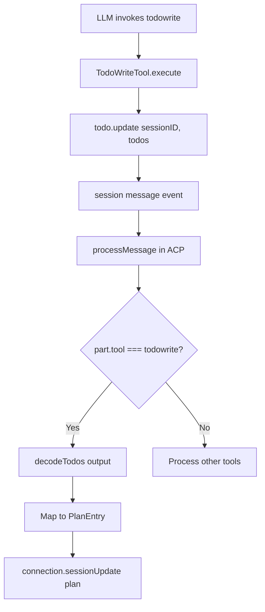
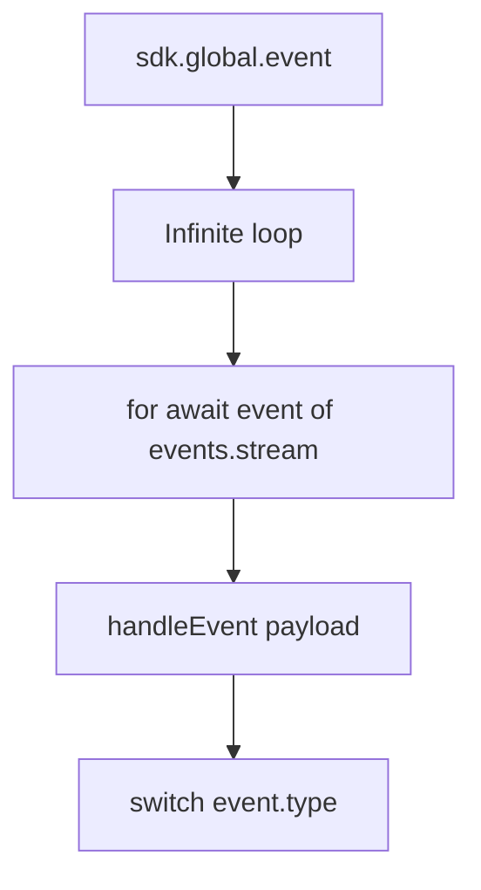
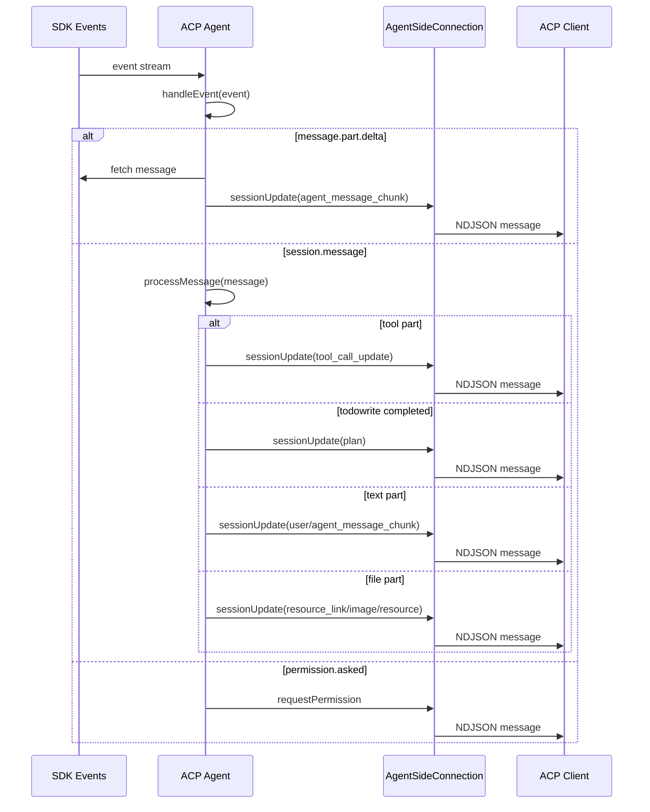

# DeepWiki Q&A with Code Context for Repository: sst/opencode
## Q1
Analyze and show me how the todowrite tool flow works and how it exposes the plan and its updates through ACP mode
### Answer
# Todowrite Tool Flow and ACP Exposure

## Summary

The `todowrite` tool allows the LLM to manage task lists during coding sessions. When used in ACP mode (Agent Client Protocol), tasks are automatically converted into plan entries that are exposed to the ACP client through session updates. opencode:25-57

## Todowrite Tool Implementation

### Definition and Parameters

The `TodoWriteTool` is defined in `packages/opencode/src/tool/todo.ts` and uses a parameter schema that includes an array of todo items with content, status and priority. opencode:9-19

### Tool Execution

When the LLM invokes `todowrite`, the tool:
1. Requests permission with `ctx.ask` for the `todowrite` action opencode:35-40
2. Updates todo state via `todo.update` with the sessionID and new todos opencode:42-45
3. Returns the updated todos as metadata opencode:47-53

## ACP Integration

### Detection of todowrite Completion

In the ACP agent (`packages/opencode/src/acp/agent.ts`), when a message with parts of type `tool` is processed, the system checks if the tool is `todowrite` and if its state is `completed`. opencode:343-374

### Conversion to ACP Plan

When a completed `todowrite` is detected:
1. The output is parsed using `decodeTodos` opencode:350-351
2. Each todo is mapped to a `PlanEntry` with:
   - `priority`: "medium" (fixed)
   - `status`: converted from todo state (cancelled → completed)
   - `content`: the todo content opencode:357-365
3. It is sent to the ACP client via `connection.sessionUpdate` with type `sessionUpdate: "plan"` opencode:352-367

### Complete Flow in ACP



## TUI UI Exposure

### TUI Visualization

In the TUI interface, todos are shown in two ways:
1. **Completed state**: Shows a block with the todo list and their status icons opencode:967-978
2. **Pending state**: Shows an inline "Updating todos..." indicator opencode:980-985

### LLM Instructions

The system prompt instructs the LLM to use `todowrite` frequently to manage tasks and give the user visibility into progress. opencode:23-27

## Notes

- The `todowrite` tool is disabled by default for subagents but can be manually enabled opencode:232-234
- In ACP mode, todos are converted to plans with a fixed "medium" priority regardless of the original priority opencode:361-364
- The "cancelled" state is converted to "completed" in the ACP plan opencode:358-359

Wiki pages you might want to explore:
- [Glossary (sst/opencode)](/wiki/sst/opencode#11)
- [Command-Line Interface (CLI) (sst/opencode)](/wiki/sst/opencode#6.1)
- [Shared App Package (sst/opencode)](/wiki/sst/opencode#6.12)
### Citations
**File:** packages/opencode/src/tool/todo.ts (L9-19)
```typescript
const TodoItem = Schema.Struct({
  content: Schema.String.annotate({ description: "Brief description of the task" }),
  status: Schema.String.annotate({
    description: "Current status of the task: pending, in_progress, completed, cancelled",
  }),
  priority: Schema.String.annotate({ description: "Priority level of the task: high, medium, low" }),
})

export const Parameters = Schema.Struct({
  todos: Schema.mutable(Schema.Array(TodoItem)).annotate({ description: "The updated todo list" }),
})
```
**File:** packages/opencode/src/tool/todo.ts (L25-57)
```typescript
export const TodoWriteTool = Tool.define<typeof Parameters, Metadata, Todo.Service>(
  "todowrite",
  Effect.gen(function* () {
    const todo = yield* Todo.Service

    return {
      description: DESCRIPTION_WRITE,
      parameters: Parameters,
      execute: (params: Schema.Schema.Type<typeof Parameters>, ctx: Tool.Context<Metadata>) =>
        Effect.gen(function* () {
          yield* ctx.ask({
            permission: "todowrite",
            patterns: ["*"],
            always: ["*"],
            metadata: {},
          })

          yield* todo.update({
            sessionID: ctx.sessionID,
            todos: params.todos,
          })

          return {
            title: `${params.todos.filter((x) => x.status !== "completed").length} todos`,
            output: JSON.stringify(params.todos, null, 2),
            metadata: {
              todos: params.todos,
            },
          }
        }),
    } satisfies Tool.DefWithoutID<typeof Parameters, Metadata>
  }),
)
```
**File:** packages/opencode/src/acp/agent.ts (L343-374)
```typescript
            case "completed": {
              this.toolStarts.delete(part.callID)
              this.shellSnapshots.delete(part.callID)
              const kind = toToolKind(part.tool)
              const content = completedToolContent(part, kind)

              if (part.tool === "todowrite") {
                const parsedTodos = decodeTodos(part.state.output)
                if (Result.isSuccess(parsedTodos)) {
                  await this.connection
                    .sessionUpdate({
                      sessionId,
                      update: {
                        sessionUpdate: "plan",
                        entries: parsedTodos.success.map((todo) => {
                          const status: PlanEntry["status"] =
                            todo.status === "cancelled" ? "completed" : (todo.status as PlanEntry["status"])
                          return {
                            priority: "medium",
                            status,
                            content: todo.content,
                          }
                        }),
                      },
                    })
                    .catch((error) => {
                      log.error("failed to send session update for todo", { error })
                    })
                } else {
                  log.error("failed to parse todo output", { error: parsedTodos.failure })
                }
              }
```
**File:** packages/opencode/src/cli/cmd/tui/feature-plugins/system/session-v2.tsx (L967-978)
```typescript
      <Match when={todos().length > 0 && props.part.state.status === "completed"}>
        <BlockTool title="# Todos" part={props.part}>
          <box>
            <For each={todos()}>
              {(todo) => (
                <text fg={theme.text}>
                  {todoIcon(stringValue(todo.status))} {stringValue(todo.content)}
                </text>
              )}
            </For>
          </box>
        </BlockTool>
```
**File:** packages/opencode/src/cli/cmd/tui/feature-plugins/system/session-v2.tsx (L980-985)
```typescript
      <Match when={true}>
        <InlineTool icon="⚙" pending="Updating todos..." complete={false} part={props.part}>
          Updating todos...
        </InlineTool>
      </Match>
    </Switch>
```
**File:** packages/opencode/src/session/prompt/anthropic.txt (L23-27)
```text
# Task Management
You have access to the TodoWrite tools to help you manage and plan tasks. Use these tools VERY frequently to ensure that you are tracking your tasks and giving the user visibility into your progress.
These tools are also EXTREMELY helpful for planning tasks, and for breaking down larger complex tasks into smaller steps. If you do not use this tool when planning, you may forget to do important tasks - and that is unacceptable.

It is critical that you mark todos as completed as soon as you are done with a task. Do not batch up multiple tasks before marking them as completed.
```
**File:** packages/web/src/content/docs/tools.mdx (L232-234)
```text
:::note
This tool is disabled for subagents by default, but you can enable it manually. [Learn more](/docs/agents/#permissions)
:::
```
## Q2
Also describe the ACP message types that are sent and the flow of sending these messages
### Answer
# ACP Message Types and Sending Flow

## Summary

The ACP system sends multiple types of messages through `connection.sessionUpdate()` to keep the client synchronized with the agent state. These messages are generated from SDK events and processed in the ACP agent before being sent to the client. opencode:173-188

## ACP Message Types Sent

### Session Updates

| Message Type | Purpose | Location |
|---|---|---|
| `plan` | Task plan update (from todowrite) | opencode:836-849 |
| `tool_call_update` | Tool execution state (pending, running, completed, failed) | opencode:809-822 |
| `agent_message_chunk` | Agent message text chunks | opencode:465-476 |
| `agent_thought_chunk` | Agent reasoning chunks | opencode:484-495 |
| `user_message_chunk` | User message text chunks | opencode:914-926 |
| `usage_update` | Token usage and cost update | opencode:117-126 |
| `available_commands_update` | Available commands update | opencode:1186-1192 |

## Message Sending Flow

### SDK Event Subscription

The ACP agent subscribes to global SDK events via `sdk.global.event()` in an infinite loop that processes events as they arrive. opencode:173-188



### Event Processing and Update Sending

The `handleEvent` method processes different event types and sends corresponding updates to the ACP client. opencode:190-192

#### `message.part.delta` Event

When a message part delta is received, the system:
1. Gets the complete message from the SDK
2. Identifies the specific part that changed
3. Sends the appropriate chunk based on the part type and field opencode:438-501


#### `session.message` Event

For complete messages, the system processes each message part and sends updates based on the part type. opencode:785-832

**Parts of type `tool`:**
- `pending` state: clears shell snapshots
- `running` state: sends `tool_call_update` with `in_progress` state opencode:809-822
- `completed` state: sends `tool_call_update` with `completed` state or `plan` if it's `todowrite` opencode:827-849
- `failed` state: sends `tool_call_update` with `failed` state opencode:881-905

**Parts of type `text`:**
Sends `user_message_chunk` or `agent_message_chunk` based on the message role opencode:911-930

**Parts of type `file`:**
Converts files to appropriate ACP blocks (`resource_link`, `image`, `resource`) opencode:931-1010

**Parts of type `reasoning`:**
Sends `agent_thought_chunk` with reasoning text opencode:1012-1029

### Usage Update Sending

The `sendUsageUpdate` function calculates token usage and costs, then sends an update to the ACP client. opencode:82-130

## Complete Message Sending Flow



## Notes

- All messages are sent through `connection.sessionUpdate()` which uses the NDJSON protocol over stdin/stdout opencode:33-61
- Sending errors are caught and logged but do not interrupt the agent flow opencode:823-825
- The system handles multiple sessions simultaneously without cross-session event contamination opencode:333-369

Wiki pages you might want to explore:
- [Command-Line Interface (CLI) (sst/opencode)](/wiki/sst/opencode#6.1)
### Citations
**File:** packages/opencode/src/acp/agent.ts (L82-130)
```typescript
async function sendUsageUpdate(
  connection: AgentSideConnection,
  sdk: OpencodeClient,
  sessionID: string,
  directory: string,
): Promise<void> {
  const messages = await sdk.session
    .messages({ sessionID, directory }, { throwOnError: true })
    .then((x) => x.data)
    .catch((error) => {
      log.error("failed to fetch messages for usage update", { error })
      return undefined
    })

  if (!messages) return

  const assistantMessages = messages.filter(
    (m): m is { info: AssistantMessage; parts: SessionMessageResponse["parts"] } => m.info.role === "assistant",
  )

  const lastAssistant = assistantMessages[assistantMessages.length - 1]
  if (!lastAssistant) return

  const msg = lastAssistant.info
  if (!msg.providerID || !msg.modelID) return
  const size = await getContextLimit(sdk, ProviderID.make(msg.providerID), ModelID.make(msg.modelID), directory)

  if (!size) {
    // Cannot calculate usage without known context size
    return
  }

  const used = msg.tokens.input + (msg.tokens.cache?.read ?? 0)
  const totalCost = assistantMessages.reduce((sum, m) => sum + m.info.cost, 0)

  await connection
    .sessionUpdate({
      sessionId: sessionID,
      update: {
        sessionUpdate: "usage_update",
        used,
        size,
        cost: { amount: totalCost, currency: "USD" },
      },
    })
    .catch((error) => {
      log.error("failed to send usage update", { error })
    })
}
```
**File:** packages/opencode/src/acp/agent.ts (L173-188)
```typescript
  private async runEventSubscription() {
    while (true) {
      if (this.eventAbort.signal.aborted) return
      const events = await this.sdk.global.event({
        signal: this.eventAbort.signal,
      })
      for await (const event of events.stream) {
        if (this.eventAbort.signal.aborted) return
        const payload = event?.payload
        if (!payload) continue
        await this.handleEvent(payload as Event).catch((error) => {
          log.error("failed to handle event", { error, type: payload.type })
        })
      }
    }
  }
```
**File:** packages/opencode/src/acp/agent.ts (L190-192)
```typescript
  private async handleEvent(event: Event) {
    switch (event.type) {
      case "permission.asked": {
```
**File:** packages/opencode/src/acp/agent.ts (L438-501)
```typescript
      case "message.part.delta": {
        const props = event.properties
        const session = this.sessionManager.tryGet(props.sessionID)
        if (!session) return
        const sessionId = session.id

        const message = await this.sdk.session
          .message(
            {
              sessionID: props.sessionID,
              messageID: props.messageID,
              directory: session.cwd,
            },
            { throwOnError: true },
          )
          .then((x) => x.data)
          .catch((error) => {
            log.error("unexpected error when fetching message", { error })
            return undefined
          })

        if (!message || message.info.role !== "assistant") return

        const part = message.parts.find((p) => p.id === props.partID)
        if (!part) return

        if (part.type === "text" && props.field === "text" && part.ignored !== true) {
          await this.connection
            .sessionUpdate({
              sessionId,
              update: {
                sessionUpdate: "agent_message_chunk",
                messageId: props.messageID,
                content: {
                  type: "text",
                  text: props.delta,
                },
              },
            })
            .catch((error) => {
              log.error("failed to send text delta to ACP", { error })
            })
          return
        }

        if (part.type === "reasoning" && props.field === "text") {
          await this.connection
            .sessionUpdate({
              sessionId,
              update: {
                sessionUpdate: "agent_thought_chunk",
                messageId: props.messageID,
                content: {
                  type: "text",
                  text: props.delta,
                },
              },
            })
            .catch((error) => {
              log.error("failed to send reasoning delta to ACP", { error })
            })
        }
        return
      }
```
**File:** packages/opencode/src/acp/agent.ts (L785-849)
```typescript
  private async processMessage(message: SessionMessageResponse) {
    log.debug("process message", message)
    if (message.info.role !== "assistant" && message.info.role !== "user") return
    const sessionId = message.info.sessionID

    for (const part of message.parts) {
      if (part.type === "tool") {
        await this.toolStart(sessionId, part)
        switch (part.state.status) {
          case "pending":
            this.shellSnapshots.delete(part.callID)
            break
          case "running":
            const output = this.shellOutput(part)
            const runningContent: ToolCallContent[] = []
            if (output) {
              runningContent.push({
                type: "content",
                content: {
                  type: "text",
                  text: output,
                },
              })
            }
            await this.connection
              .sessionUpdate({
                sessionId,
                update: {
                  sessionUpdate: "tool_call_update",
                  toolCallId: part.callID,
                  status: "in_progress",
                  kind: toToolKind(part.tool),
                  title: part.tool,
                  locations: toLocations(part.tool, part.state.input),
                  rawInput: part.state.input,
                  ...(runningContent.length > 0 && { content: runningContent }),
                },
              })
              .catch((err) => {
                log.error("failed to send tool in_progress to ACP", { error: err })
              })
            break
          case "completed":
            this.toolStarts.delete(part.callID)
            this.shellSnapshots.delete(part.callID)
            const kind = toToolKind(part.tool)
            const content = completedToolContent(part, kind)

            if (part.tool === "todowrite") {
              const parsedTodos = decodeTodos(part.state.output)
              if (Result.isSuccess(parsedTodos)) {
                await this.connection
                  .sessionUpdate({
                    sessionId,
                    update: {
                      sessionUpdate: "plan",
                      entries: parsedTodos.success.map((todo) => {
                        const status: PlanEntry["status"] =
                          todo.status === "cancelled" ? "completed" : (todo.status as PlanEntry["status"])
                        return {
                          priority: "medium",
                          status,
                          content: todo.content,
                        }
                      }),
```
**File:** packages/opencode/src/acp/agent.ts (L881-905)
```typescript
            await this.connection
              .sessionUpdate({
                sessionId,
                update: {
                  sessionUpdate: "tool_call_update",
                  toolCallId: part.callID,
                  status: "failed",
                  kind: toToolKind(part.tool),
                  title: part.tool,
                  rawInput: part.state.input,
                  content: [
                    {
                      type: "content",
                      content: {
                        type: "text",
                        text: part.state.error,
                      },
                    },
                  ],
                  rawOutput: {
                    error: part.state.error,
                    metadata: part.state.metadata,
                  },
                },
              })
```
**File:** packages/opencode/src/acp/agent.ts (L911-930)
```typescript
      } else if (part.type === "text") {
        if (part.text) {
          const audience: Role[] | undefined = part.synthetic ? ["assistant"] : part.ignored ? ["user"] : undefined
          await this.connection
            .sessionUpdate({
              sessionId,
              update: {
                sessionUpdate: message.info.role === "user" ? "user_message_chunk" : "agent_message_chunk",
                messageId: message.info.id,
                content: {
                  type: "text",
                  text: part.text,
                  ...(audience && { annotations: { audience } }),
                },
              },
            })
            .catch((err) => {
              log.error("failed to send text to ACP", { error: err })
            })
        }
```
**File:** packages/opencode/src/acp/agent.ts (L931-1010)
```typescript
      } else if (part.type === "file") {
        // Replay file attachments as appropriate ACP content blocks.
        // OpenCode stores files internally as { type: "file", url, filename, mime }.
        // We convert these back to ACP blocks based on the URL scheme and MIME type:
        // - file:// URLs → resource_link
        // - data: URLs with image/* → image block
        // - data: URLs with text/* or application/json → resource with text
        // - data: URLs with other types → resource with blob
        const url = part.url
        const filename = part.filename ?? "file"
        const mime = part.mime || "application/octet-stream"
        const messageChunk = message.info.role === "user" ? "user_message_chunk" : "agent_message_chunk"

        if (url.startsWith("file://")) {
          // Local file reference - send as resource_link
          await this.connection
            .sessionUpdate({
              sessionId,
              update: {
                sessionUpdate: messageChunk,
                messageId: message.info.id,
                content: { type: "resource_link", uri: url, name: filename, mimeType: mime },
              },
            })
            .catch((err) => {
              log.error("failed to send resource_link to ACP", { error: err })
            })
        } else if (url.startsWith("data:")) {
          // Embedded content - parse data URL and send as appropriate block type
          const base64Match = url.match(/^data:([^;]+);base64,(.*)$/)
          const dataMime = base64Match?.[1]
          const base64Data = base64Match?.[2] ?? ""

          const effectiveMime = dataMime || mime

          if (effectiveMime.startsWith("image/")) {
            // Image - send as image block
            await this.connection
              .sessionUpdate({
                sessionId,
                update: {
                  sessionUpdate: messageChunk,
                  messageId: message.info.id,
                  content: {
                    type: "image",
                    mimeType: effectiveMime,
                    data: base64Data,
                    uri: pathToFileURL(filename).href,
                  },
                },
              })
              .catch((err) => {
                log.error("failed to send image to ACP", { error: err })
              })
          } else {
            // Non-image: text types get decoded, binary types stay as blob
            const isText = effectiveMime.startsWith("text/") || effectiveMime === "application/json"
            const fileUri = pathToFileURL(filename).href
            const resource = isText
              ? {
                  uri: fileUri,
                  mimeType: effectiveMime,
                  text: Buffer.from(base64Data, "base64").toString("utf-8"),
                }
              : { uri: fileUri, mimeType: effectiveMime, blob: base64Data }

            await this.connection
              .sessionUpdate({
                sessionId,
                update: {
                  sessionUpdate: messageChunk,
                  messageId: message.info.id,
                  content: { type: "resource", resource },
                },
              })
              .catch((err) => {
                log.error("failed to send resource to ACP", { error: err })
              })
          }
        }
```
**File:** packages/opencode/src/acp/agent.ts (L1012-1029)
```typescript
      } else if (part.type === "reasoning") {
        if (part.text) {
          await this.connection
            .sessionUpdate({
              sessionId,
              update: {
                sessionUpdate: "agent_thought_chunk",
                messageId: message.info.id,
                content: {
                  type: "text",
                  text: part.text,
                },
              },
            })
            .catch((err) => {
              log.error("failed to send reasoning to ACP", { error: err })
            })
        }
```
**File:** packages/opencode/src/acp/agent.ts (L1186-1192)
```typescript
      void this.connection.sessionUpdate({
        sessionId,
        update: {
          sessionUpdate: "available_commands_update",
          availableCommands,
        },
      })
```
**File:** packages/opencode/src/cli/cmd/acp.ts (L33-61)
```typescript
    const input = new WritableStream<Uint8Array>({
      write(chunk) {
        return new Promise<void>((resolve, reject) => {
          process.stdout.write(chunk, (err) => {
            if (err) {
              reject(err)
            } else {
              resolve()
            }
          })
        })
      },
    })
    const output = new ReadableStream<Uint8Array>({
      start(controller) {
        process.stdin.on("data", (chunk: Buffer) => {
          controller.enqueue(new Uint8Array(chunk))
        })
        process.stdin.on("end", () => controller.close())
        process.stdin.on("error", (err) => controller.error(err))
      },
    })

    const stream = ndJsonStream(input, output)
    const agent = ACP.init({ sdk })

    new AgentSideConnection((conn) => {
      return agent.create(conn, { sdk })
    }, stream)
```
**File:** packages/opencode/test/acp/event-subscription.test.ts (L333-369)
```typescript
  test("routes message.part.delta by the event sessionID (no cross-session pollution)", async () => {
    await using tmp = await tmpdir()
    await provideTestInstance({
      directory: tmp.path,
      fn: async () => {
        const { agent, controller, updates, stop } = createFakeAgent()
        const cwd = "/tmp/opencode-acp-test"

        const sessionA = await agent.newSession({ cwd, mcpServers: [] } as any).then((x) => x.sessionId)
        const sessionB = await agent.newSession({ cwd, mcpServers: [] } as any).then((x) => x.sessionId)

        controller.push({
          directory: cwd,
          payload: {
            type: "message.part.delta",
            properties: {
              sessionID: sessionB,
              messageID: "msg_1",
              partID: "msg_1_part",
              field: "text",
              delta: "hello",
            },
          },
        } as any)

        await pollUntil(
          () => (updates.get(sessionB) ?? []).includes("agent_message_chunk"),
          "sessionB never received agent_message_chunk",
        )

        expect((updates.get(sessionA) ?? []).includes("agent_message_chunk")).toBe(false)
        expect((updates.get(sessionB) ?? []).includes("agent_message_chunk")).toBe(true)

        stop()
      },
    })
  })
```
