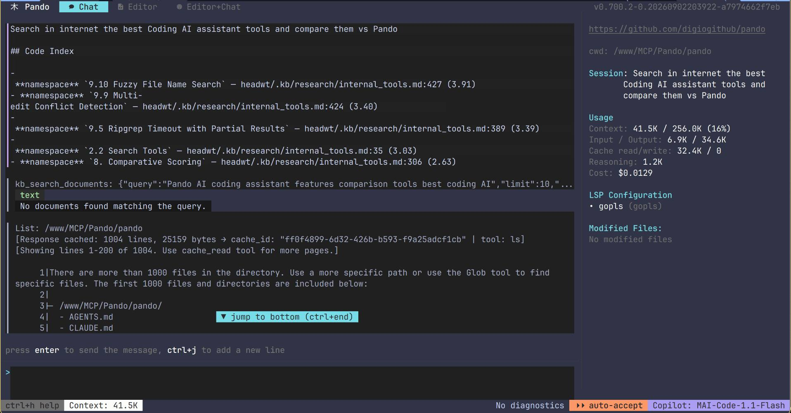
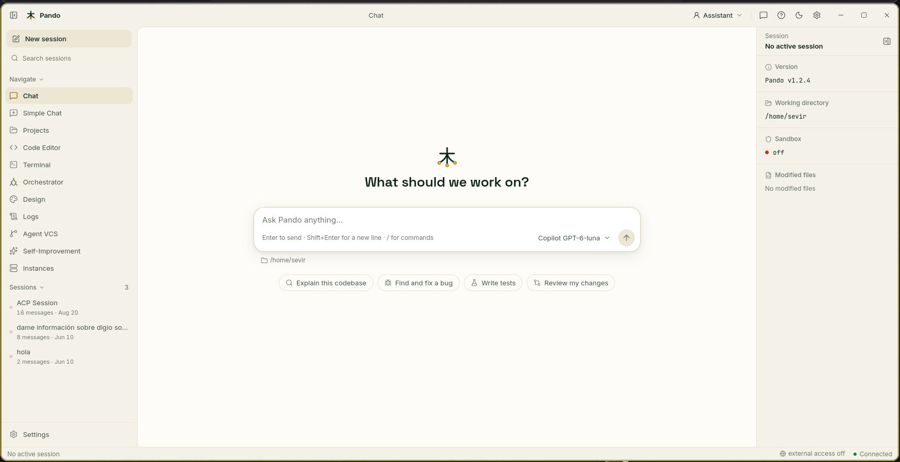

# 木 Pando

> **Fork of [OpenCode](https://github.com/digiogithub/pando)** by Kujtim Hoxha.
> Maintained by **José F. Rives**.


<picture>
  <source media="(prefers-color-scheme: dark)" srcset="assets/pando-brand-v1/png/pando-logo-light.png">
  <source media="(prefers-color-scheme: light)" srcset="assets/pando-brand-v1/png/pando-logo-dark.png">
  
</picture>


A powerful terminal-based AI assistant for developers, providing intelligent coding assistance directly in your terminal.

## Overview

Pando is a Go-based CLI application that brings AI assistance to your terminal. It provides a TUI (Terminal User Interface), PWA WebUI and desktop application for interacting with various AI models to help with coding tasks, debugging, and more.

<div align="center">
  <table>
    <tr>
      <td align="center">
        
      </td>
      <td align="center">
        
      </td>
    </tr>
  </table>
</div>


## Features

- **Terminal UI** — interactive TUI built with [Bubble Tea](https://github.com/charmbracelet/bubbletea), with a vim-like editor, file tree and terminal.
- **Web UI and desktop app** — PWA Web UI embedded in the binary, also packaged as a native Wails desktop app. [More](docs/webui.md)
- **Many AI providers** — GitHub Copilot, OpenAI, Anthropic, Gemini, AWS Bedrock, Groq, Azure OpenAI, Ollama, llama.cpp, OpenRouter and any OpenAI-compatible endpoint.
- **Editor integration (ACP)** — use Pando inside Zed, VS Code or JetBrains IDEs. [More](docs/acp.md)
- **Host command sandbox** — agent commands confined with OS-native mechanisms, on by default. [More](docs/sandbox.md)
- **Token reduction** — output compression filters for noisy commands and opt-in `/caveman` brevity. [More](docs/output-filters.md)
- **Workflow modes** — `/superpowers`, `/learning`, `/goal` and more slash commands, plus your own custom commands. [More](docs/slash-commands.md)
- **Language servers on demand** — 45 LSP presets started and installed only when needed. [More](docs/lsp.md)
- **Knowledge Base** — document conversion and `[[wiki links]]` for persistent project knowledge. [More](docs/knowledge-base.md)
- **Subagent delegation** — orchestrated subagents, warm instance reuse and a durable event log. [More](docs/delegation.md)
- **MCP client and server** — connect authenticated MCP servers, or expose Pando as one. [More](docs/mcp-authentication.md)
- **Desktop Controller** — opt-in accessibility-tree UI automation. [More](docs/desktop-controller.md)
- **AG-UI** — drive Pando from CopilotKit and other Generative-UI frontends. [More](docs/agui.md)
- **Agent self-service** — `pando_setup` lets the agent inspect its own configuration and models. [More](docs/pando-setup.md)
- **LLM proxy and multi-instance IPC** — route LLM requests through Pando; running instances discover and talk to each other.
- **Extensions** — compile-time extensions, Lua hooks and prompt templates. [More](docs/extension-mechanisms.md)

## Installation

Linux:

```bash
curl -fsSL https://raw.githubusercontent.com/digiogithub/pando/main/scripts/install-linux.sh | bash
```

Windows (PowerShell):

```powershell
iex (irm https://raw.githubusercontent.com/digiogithub/pando/main/scripts/install-windows.ps1)
```

macOS: download the `.pkg` for your architecture from the [releases](https://github.com/digiogithub/pando/releases) page.

Go install, building from source and extension builds: see [docs/installation.md](docs/installation.md).

## Quick start

```bash
pando          # terminal UI
pando app      # Web UI in the desktop window
pando acp      # ACP server for editors
pando -p "Explain the use of context in Go"   # one-shot prompt
```

More commands in [docs/usage.md](docs/usage.md).

## Documentation

| Topic | Guide |
| --- | --- |
| Installation and building | [installation.md](docs/installation.md) |
| Configuration files and environment variables | [configuration.md](docs/configuration.md) |
| Command-line usage | [usage.md](docs/usage.md) |
| Web UI and remote access | [webui.md](docs/webui.md) |
| Editor integration (ACP) | [acp.md](docs/acp.md) |
| Slash and custom commands | [slash-commands.md](docs/slash-commands.md) |
| Language servers | [lsp.md](docs/lsp.md) |
| Knowledge Base | [knowledge-base.md](docs/knowledge-base.md) |
| Subagent delegation | [delegation.md](docs/delegation.md) |
| Host command sandbox | [sandbox.md](docs/sandbox.md) · [coverage](docs/sandbox-coverage.md) |
| Output compression filters | [output-filters.md](docs/output-filters.md) |
| MCP server authentication | [mcp-authentication.md](docs/mcp-authentication.md) |
| Model pricing and capabilities | [model-catalog.md](docs/model-catalog.md) |
| Model auto mode (per-prompt routing) | [model-auto-mode.md](docs/model-auto-mode.md) |
| Remote diagnostics (telemetry) | [telemetry.md](docs/telemetry.md) |
| AG-UI / CopilotKit | [agui.md](docs/agui.md) |
| Desktop Controller | [desktop-controller.md](docs/desktop-controller.md) |
| Agent self-service (`pando_setup`) | [pando-setup.md](docs/pando-setup.md) |
| Prompt templates and Lua hooks | [prompt-templates.md](docs/prompt-templates.md) · [lua-hooks-prompts.md](docs/lua-hooks-prompts.md) |
| Extensions | [mechanisms](docs/extension-mechanisms.md) · [authoring](docs/extension-authoring.md) · [builds](docs/extension-builds.md) · [frontend](docs/extension-frontend.md) · [memory](docs/extension-memory.md) |
| Architecture | [architecture.md](docs/architecture.md) |
| Release pipeline | [release-pipeline.md](docs/release-pipeline.md) |

## Acknowledgments

Pando is a fork of [OpenCode](https://github.com/digiogithub/pando), originally created by [Kujtim Hoxha](https://github.com/kujtimiihoxha).

Special thanks to:
- [@isaacphi](https://github.com/isaacphi) - For the [mcp-language-server](https://github.com/isaacphi/mcp-language-server) project
- [@adamdottv](https://github.com/adamdottv) - For the design direction and UI/UX architecture
- The broader open source community

## License

Pando is licensed under the MIT License. See the [LICENSE](LICENSE) file for details.

<!-- Tasks below are run with xc (https://xcfile.dev), which reads them from this README. -->

## Tasks

### tag

Genera una nueva tag

interactive:true

```bash
git tag --sort=creatordate | tail -n 5
git tag $(gum input)
git push origin --tags
```

### build-webui

Compiles the webui

```bash
# Build embedded web-ui assets
cd web-ui && bun install && bun run build:embedded && cd ..
```

### build-desktop

Compiles the desktop wails wrapper

```bash
make desktop-build
make desktop-embed
```

### build

Compiles the binary

requires: build-webui, build-desktop

```bash
export PANDO_BETTERSTACK_TOKEN=$(kvage get pando_betterstack_token)

# Get version from last git tag
VERSION=$(git describe --tags 2>/dev/null || echo "dev")
#go build -ldflags "-X github.com/digiogithub/pando/internal/version.Version=$VERSION" -o pando .
make build
rm -f *.log
```

### build-and-copy

Compile the working binary and copy to the binary path `~/bin/`.

requires: build

```bash
rm -f ~/bin/pando
upx -1 pando
cp pando ~/bin/pando
rm -f *.upx
```

### release

> **Note:** these two tasks are the manual/local path. Pushing a `v*` tag runs
> the whole thing on GitHub Actions — Linux x64/arm64, Windows x64, and the
> signed + notarized macOS `.zip`, `.app` and `.pkg` artifacts — and publishes a
> release with the changes since the previous tag. See
> [docs/release-pipeline.md](docs/release-pipeline.md).

Compiles the binaries for the different platforms (Linux x64, Windows x64, macOS aarch64) and zip them into `dist/`.

interactive:true

```bash
export PANDO_BETTERSTACK_TOKEN=$(kvage get pando_betterstack_token)
# Create dist folder
mkdir -p dist
rm dist/*.zip

# Build embedded web-ui assets
cd web-ui && bun install && bun run build:embedded && cd ..

# Get version from last git tag
VERSION=$(git describe --tags 2>/dev/null || echo "dev")

# Linux x64
make release-linux-amd64
# Linux arm64
make release-linux-arm64

# Windows x64
make release-windows-amd64

# macOS aarch64
make release-darwin-arm64
# macOS x64
make release-darwin-amd64

echo "Run in osx terminal the command:"
echo "    cd ~/www/MCP/Pando/pando && xc release-osx"
echo
bash -c 'read -n 1 -s -r -p "When the command finish, press any key to continue..."'
echo


scp mac-mini-de-digio:~/www/MCP/Pando/pando/dist/*.zip dist/

echo "Release builds completed in dist/"
```


### release-osx

Builds and **notarizes** the macOS artifacts: the embedded desktop wrapper (so
`pando desktop` from a standalone binary is not killed by Gatekeeper), the loose
CLI zips (`pando-darwin-<arch>.zip`, submit-only), the `Pando-<arch>.app` bundles
(notarized + stapled) and the `.pkg` installers (notarized + stapled).

Notarization submits several artifacts to Apple with `--wait`, so this task can
take 10–30 min. Requires network access and the `pando-notary` keychain profile.

interactive:true


```zsh
export PATH=$PATH:/usr/local/bin:~/.bun/bin:/opt/homebrew/bin/:~/go/bin
cd ~/www/MCP/Pando/pando

git pull origin main
git fetch origin --tags
rm -rf dist
mkdir -p dist

# Signing identities, keychain path/password and NOTARY_PROFILE.
eval "$(cat ~/DIGIO_Software_Signing_Keys/kvagerc)"
NOTARYTOOL_STORE_CREDENTIALS=1 bash scripts/setup-macos-signing-keychain

# Ensure notarization env is exported BEFORE `xc build` so `make desktop-embed`
# notarizes the embedded wails wrapper. Defaults match the signing scripts.
export NOTARY_PROFILE="${NOTARY_PROFILE:-pando-notary}"
export MACOS_SIGN_KEYCHAIN_PATH="${MACOS_SIGN_KEYCHAIN_PATH:-$HOME/Library/Keychains/pando-build-db}"

# xc build -> build-desktop -> make desktop-embed: signs AND notarizes the
# embedded desktop wrapper (skipped non-fatally if the notary env is missing).
xc build

# Signs the loose CLI binaries with the hardened runtime (codesign-macos).
make release-darwin-arm64
make release-darwin-amd64

# Notarizes the CLI zips (submit-only) and builds + notarizes + staples the
# .app bundles and .pkg installers.
bash scripts/build-macos-app

# Verify notarization stapling on the distributable bundles/installers.
echo "== Verifying notarization staples =="
for f in dist/Pando-arm64.app dist/Pando-x64.app dist/*.pkg; do
    [ -e "$f" ] && { echo "-- $f"; xcrun stapler validate "$f" || echo "  NOT stapled: $f"; }
done

echo "Release builds completed in dist/"
```

